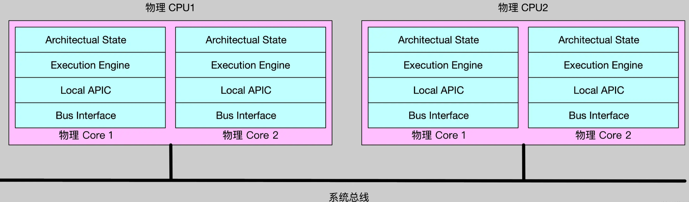
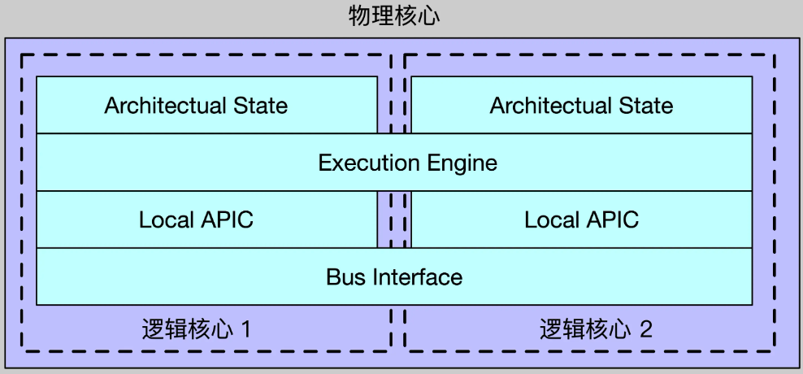
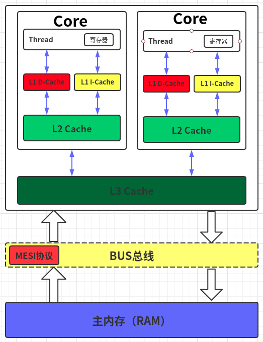

在现代计算机体系结构中，为了提高性能，处理器采用了多种优化技术，如缓存一致性、乱序执行等。这些优化虽然提升了处理器的执行效率，但也给多线程编程带来了一些挑战。

## 1.X86 架构（强内存模型）与 ARM 架构（弱内存模型）
X86 和 ARM 架构在底层的核心区别在于它们对硬件 **指令重排** 的允许程度不同。

X86 属于强**内存模型（TSO，全存储序）**，在硬件层面提供了极高的顺序保证，自带绝大部分读写屏障，编译器无需额外插内存栅栏；仅 seq_cst 的 Store-Load 重排需要加屏障。

ARM 属于**弱内存模型（多拷贝原子模型）**，为了追求极致的能效比，将更多的乱序优化权力交给了硬件，CPU 硬件允许大量读写乱序，不同内存序必须显式通过特殊加载 / 存储指令、内存屏障实现同步语义，开销差距极大。

可以通过最直观的**读写操作组合**，来看两种架构在硬件层面是否允许指令乱序（重排）：

| 原始指令顺序 | X86 架构（TSO 模型） | ARM 架构（弱内存模型） | 解释 |
| :--- | :--- | :--- | :--- |
| **写-写 (Store-Store)** | ❌ **禁止重排** | ⚠️ **允许重排** | ARM 可能会先写第二个变量 |
| **读-写 (Load-Store)** | ❌ **禁止重排** | ⚠️ **允许重排** | ARM 可能会先写后读 |
| **读-读 (Load-Load)** | ❌ **禁止重排** | ⚠️ **允许重排** | ARM 可能会先读取后面的数据 |
| **写-读 (Store-Load)** | ⚠️ **允许重排** | ⚠️ **允许重排** | **唯一相同点**：两者都允许写操作滞后于读操作 |

> **TSO（Total Store Order，全局存储顺序）** 模型。在 X86 上，除了“写-读（Store-Load）”可能会因为 CPU 内部 **Store Buffer（存储缓冲区）** 的存在导致读指令先于写指令执行外，其他所有的读写顺序在硬件层面都是严格保序的。

### 1.1 X86：硬件抗下所有（Strong）
*   **硬件自动保序**：X86 内部有非常复杂的硬件电路（如复杂的监听协议、更庞大的重排缓冲区）来监控和维护内存顺序。如果硬件发现某个乱序可能违反 TSO，它会在底层自动打断并修正。
*   **代价**：硬件设计极其复杂，芯片功耗高，核心面积大。
*   **优点**：对程序员和编译器极其友好。在 X86 上，许多高级语言的内存序（如 `std::memory_order_acquire` / `release`）在编译成汇编时，**不需要插入任何额外的内存屏障指令**，直接编译成普通的 `MOV` 指令即可。


### 1.2 ARM：交给软件和屏障（Weak）
*   **激进的乱序优化**：ARM 认为硬件应该尽可能简单、省电。只要两个内存访问指令之间没有直接的数据依赖关系（例如 `B = A;` 有依赖，但 `A = 1; B = 2;` 没有），硬件就可以随意颠倒它们的执行和刷新到主存的顺序。
*   **优点**：流水线效率极高，芯片省电，这也是 ARM 统治移动端和嵌入式端的核心原因。
*   **代价**：如果需要多线程同步，必须由程序员或编译器在汇编中**显式插入内存屏障指令**（如 `DMB`、`DSB`、`ISB` 或 ARMv8 引入的带有 Acquire/Release 语义的 `LDAR` / `STLR` 指令）来强行阻止硬件乱序。

### 1.3 三大内存序汇编 & 开销对比

**relaxed**：编译器可自由跨原子操作移动普通变量读写、缓存变量到寄存器；

**acquire/release**：编译器禁止跨原子操作重排普通访存，但不生成硬件屏障；

**seq_cst**：编译器强制严格顺序，同时要求后端插入 CPU 全局屏障。

|内存序	| X86 汇编特征	| ARM 汇编特征	| 相对运行开销 |
| :--- | :--- | :--- | :--- |
|relaxed|	纯 MOV，无屏障 / LOCK |	LDR/STR，无 DMB |	最低 |
|acquire / release|	纯 MOV，无硬件屏障|	ARMv7：STR/LDR + DMB；ARMv8：LDAR/STLR|	低 (X86) / 中 (ARM)|
|seq_cst（默认）|	MOV + MFENCE / LOCK 前缀|	LDR/STR + DMB ish 全局屏障|	高 (X86) / 极高 (ARM)|

例：release 写之前的普通赋值，编译器不能挪到原子写后面；但 X86 CPU 不需要额外指令，ARM 必须硬件屏障兜底

X86：seq_cst 相比 acquire/release 有显著性能开销；高频原子场景强烈建议改用 acq_rel；\
ARM：seq_cst 屏障开销进一步放大，多线程高并发下性能断崖下跌。

### 1.4 原子/内存屏障汇编指令
| 指令/前缀 | 指令全称 | 核心原生功能 | 内存序相关语义 | 乱序约束范围 |
| --- | --- | --- | --- | --- |
| mov | Move | 寄存器 ↔ 内存 / 立即数 ↔ 寄存器 数据拷贝 | 无内置同步语义，仅单纯访存 | 无硬件层面乱序限制，仅编译器受原子内存序约束 |
| ldr | Load Register | 从内存读取数据到通用寄存器 | 原生无 acquire 语义，松散读取 | CPU 可自由重排本条 Load 和前后所有访存 |
| str | Store Register | 将寄存器数据写入内存 | 原生无 release 语义，松散写入 | CPU 可自由重排本条 Store 和前后所有访存 |
| ldar | Load-Acquire Register | 带获取语义的内存加载 | 内置 memory_order_acquire | 本条 Load 之后的所有读写，禁止重排到指令之前 |
| stlr | Store-Release Register | 带释放语义的内存存储 | 内置 memory_order_release | 本条 Store 之前的所有读写，禁止重排到指令之后 |
| ldaxr | Load-Acquire Exclusive Register | 获取语义 + 独占标记加载（CAS 配套） | acquire + 独占访问标记 | 同 ldar，同时标记缓存行独占，用于原子比较交换 |
| stlxr | Store-Release Exclusive Register | 释放语义 + 独占存储（CAS 配套） | release + 独占写入校验 | 同 stlr，写入失败会返回非0标记 |
| lock | Bus Lock Prefix | 指令总线锁/缓存行锁前缀 | 隐式全序屏障，等价 seq_cst | 阻断 Load/Store 全部四类跨指令重排，消除 Store-Load 乱序 |
| mfence | Memory Fence | 独立全局内存屏障指令 | 完整顺序一致性屏障 | 屏障前所有访存必须全部完成，才能执行屏障后访存 |
| dmb | Data Memory Barrier | 数据内存屏障 | 手动强制访存顺序隔离 | 按后缀区分约束强度，阻断屏障两侧指定类型访存重排 |
| dmb ishst | DMB Inner Shareable Store | 共享域仅存储屏障 | 轻量 release 辅助屏障 | 仅限制 Store 存储指令，Load 读取不受约束 |
| dmb ish | DMB Inner Shareable Full | 共享域全类型访存屏障 | 全局强屏障，等价全序 | 所有 Load、Store 均不可跨越该指令乱序 |
| xchg | Exchange | 寄存器与内存数据交换 | 单独使用无同步；搭配 lock 具备 seq_cst 屏障 | 无 lock 仅单纯交换；加 lock 附带完整内存屏障 |
| cmpxchg | Compare and Exchange | 比较内存与寄存器值，相等则交换 | 单独无同步；搭配 lock 为 seq_cst 原子 CAS | lock 前缀下，原子交换+全局访存顺序锁定 |

## 2.缓存一致性与指令重排
缓存一致性解决的是“多核看到的数据是否一致”的问题；而指令重排序解决的是“多步操作的执行顺序是否被颠倒”的问题。

### 2.1 缓存一致性问题
缓存一致性（Cache Coherence）问题的底层原理，本质上是由于“私有缓存”与“共享内存”之间的多级结构导致的“单数据多副本”同步问题。

当多个 CPU 核心同时缓存了主内存中的同一个变量，且至少有一个核心对其进行了修改时，如果不进行控制，其他核心就会继续读取自己缓存中的旧数据，从而引发数据不一致。

#### 2.1.1 多 CPU 与 多核 CPU



**Architectual State**: 包括通用数据寄存器、段寄存器、控制寄存器等。\
**Execution Engine**: 执行引擎，用来执行CPU指令，包括算数逻辑单元ALU等。\
**Local APIC**: APIC全称是Advanced Programmable Interrupt Controller，翻译过来就是高级可编程中断控制器，用来处理CPU中断。

每一个物理核心都可以看成是一个逻辑 CPU，**多核 CPU 的性能要高于多 CPU。**

> 多CPU(multi-processor)指的是在计算机主板上有多个物理CPU，每一个物理CPU之间通过系统总线连接。\
> 多核(multi-core processor)指的是在一个物理CPU内部，封装了多个物理核心。这些物理核心可能位于同一个Die上，也可能位于多个Die上。\
> 如果单从性能角度看，**多核CPU内部物理核心之间通过片内总线通信，速度会快于系统总线**。

**超线程**

一个物理核心在同一时刻只能执行一个线程。超线程技术通过复制物理核心内部的“架构状态”（Architectural State），将一个物理核心虚拟成两个逻辑核心（Logical Processor）。
- 复制的部分：寄存器组（Registers）、程序计数器（PC）、高级可编程中断控制器（APIC）等。操作系统会认为存在两个独立的 CPU 核心，并向其分发任务。
- 共享的部分：核心内部最关键的执行资源，包括算术逻辑单元（ALU）、浮点运算单元（FPU）、L1/L2 缓存以及内存接口等。

即：一个物理核心内部，会同时包含2份Architectual State、Local APIC，但是只有1份Execution Engine。



在运行的时候，会同时有2条不同的CPU指令流送入物理核心，因此，一个物理核心内部，就好像有了2个逻辑核心或者逻辑 CPU。虽然同一时刻，有2条不同的CPU指令流送入了物理核，但同一时刻，Execution Engine只能执行1条指令流上的指令。


**本质上：超线程的根本目的不是让 CPU 算得更快，而是提高物理核心内部硬件资源的利用率。**
现代 CPU 是“超标量（Superscalar）”设计的，内部有很多计算单元。但在实际运行单线程时，常常会因为以下原因导致计算单元闲置：
- 缓存未命中（Cache Miss）：CPU 需要花几百个周期去内存存取数据，此时计算单元只能空转。
- 指令依赖：下一条指令必须等待上一条指令的计算结果。

超线程的介入：当逻辑核心 0 因为等待内存数据而停顿（Stall）时，物理核心会立刻切换，让逻辑核心 1 占用那些闲置的 ALU 或 FPU 开始计算。这种在硬件级别的快速交替执行，被称为硬多线程（Hardware Multithreading）。

> 结合多核技术与超线程技术，逻辑CPU的计算公式为:
> $$逻辑CPU个数=物理CPU个数∗物理核心数∗(超线程技术 \space ? \space 2 \space : \space1 )$$


#### 2.1.2 多级 CPU 缓存
多级 CPU 缓存是位于 CPU 和主内存（RAM）之间的高速存储部件。通过设置 L1、L2、L3 等多个层级，它利用“容量小但极快”的物理特性，弥补了 CPU 计算速度与内存读写速度之间的巨大鸿沟，大幅提升了系统整体性能。



- L1 缓存（一级缓存）：离 CPU 核心最近、速度最快，但容量最小（通常几十 KB）。在单核架构中，L1 通常会拆分为独立的 指令缓存（L1i） 和 数据缓存（L1d）。【逻辑核独占】
- L2 缓存（二级缓存）：位于 L1 和 L3 之间，容量适中（几百 KB 到几 MB），速度略慢于 L1。【物理核独占，逻辑核共享】
- L3 缓存（三级缓存）：距离 CPU 最远、容量最大（几 MB 到几十 MB 以上）。通常由一颗 CPU 芯片上的所有核心共享。

**核心工作原理**
缓存命中（Cache Hit）：当 CPU 需要读取数据时，会优先在 L1 查找。如果找到，直接读取，速度极快。\
缓存未命中（Cache Miss）：如果未找到，则逐级向 L2、L3 以及主内存查找，并将对应的数据调入缓存中，以便下次快速访问。\
缓存行（Cache Line）：缓存与内存之间传输数据的最小单位（通常为 64 字节）。当加载一个数据时，相邻区域的数据也会一起被载入（利用空间局部性原理）。

由于每个 CPU 核心都有独立的 L1 和 L2 缓存，当不同核心同时修改同一块内存的数据时，就会产生缓存数据不一致的问题。主流处理器通过 MESI 协议等缓存一致性协议，实时同步各核心缓存中的状态，确保数据准确性。

**MESI 协议是目前最主流的硬件级缓存一致性协议**。它通过定义四个状态，确保多核心 CPU 的独立缓存中，同一份数据永远保持一致。

MESI 由四个状态的首字母命名，每个缓存行（Cache Line）必然处于以下状态之一：
- M (Modified - 已修改)：数据已被当前核心修改，与主内存不一致。该核心拥有该数据的唯一副本。
- E (Exclusive - 独占)：数据与主内存一致。当前核心是唯一拥有该数据的核心。
- S (Shared - 共享)：数据与主内存一致。该数据同时存在于其他核心的缓存中。
- I (Invalid - 无效)：该缓存行的数据已失效，不能使用。核心读取时必须重新从别处获取。

> MESI协议保证了缓存一致性，但它只保证最终一致性，不保证实时性。换句话说，MESI 只是保证了缓存行级别的基础数据正确性（最终一致性），它不管多变量之间的时序。

### 2.2 Store Buffer（存储缓冲区）
Store Buffer（存储缓冲区）是位于 CPU 物理核心内部、介于“计算单元”与“L1 缓存”之间的一块硬件高速缓存（FIFO 队列）。

它是现代多核 CPU 为了防止写操作阻塞流水线而引入的底层硬件优化机制，也是导致多线程中指令重排序（Store-Load 乱序）和内存可见性延迟的根本元凶。

**为什么需要 Store Buffer?**

如果严格遵循缓存一致性协议（如 MESI）：
- 当 CPU 核心 0 想要写入一个变量（假设其在 L1 缓存中处于 Shared 共享状态）时，它必须在总线上广播一个“失效（Invalidate）”消息。
- 核心 0 必须原地立正，挂起流水线（Stall），直到收到其他所有核心返回的“失效确认（Invalidate Acknowledge）”信号。
- 之后核心 0 才能真正将数据写进 L1 缓存。

由于信号在总线上流转并等待响应需要消耗数十个时钟周期，如果不进行硬件优化，CPU 核心的大部分时间都会花在干等上，性能会发生灾难性暴跌。

**为了消灭这种无谓的等待，硬件工程师在 CPU 核心里塞进了一个小巧、极快的缓冲区——Store Buffer。**

    +------------------------------------+
    | 物理核心 (Core 0)                  |
    |  [ 计算单元 (ALU/FPU) ]             |
    |          |                         |
    |          | 1. 写 X=1 (瞬间完成!)   |
    |          v                         |
    |  +-------------------------------+ |
    |  |    Store Buffer (存储缓冲区)   | |
    |  +-------------------------------+ |
    |          |                         |
    |          | 3. 异步排队刷新          |
    +----------|-------------------------+
            v
    +---------------+

    | L1 缓存 (MESI) | <--- 2. 总线广播失效消息 (慢慢传输中...)
    +---------------+

有了它之后，写操作的微观过程变成了这样：
1. 瞬间解放：核心 0 执行 X = 1。它不关心缓存状态，直接把 X = 1 扔进本地的 Store Buffer，然后立刻去执行下一条指令。
2. 后台处理：Store Buffer 接收任务后，在后台异步向总线发送失效消息。
3. 最终归仓：等收到所有核心的确认信号后，Store Buffer 里的 X = 1 才会真正“落地”刷新到本地的 L1 缓存中，此时 MESI 协议层才算真正感知到这个修改。

### 2.2.1 Store Forwarding（存储转发）
引入 Store Buffer 后，带来了一个新问题：
 - 核心 0 把 X = 1 扔进了 Store Buffer（还没进 L1），紧接着下一条指令又是读取 X。如果直接去 L1 读，会读到旧值。
 - 为了解决这个单线程逻辑错误，硬件实现了 Store Forwarding（存储转发）：当 CPU 核心读取一个变量时，它会同时检索本地的 Store Buffer 和 L1 缓存。
 - 如果发现 Store Buffer 里有还没落盘的最新值，就直接从 Store Buffer 里截获并返回。这保证了单线程看自己的代码永远是有序且正确的（As-if 规则）。

 Store Forwarding 保证了单线程的绝对安全，但它对其他 CPU 核心不可见。因为 Store Buffer 是核心完全私有的，其他核心根本无法嗅探。这直接导致了以下两个多线程灾难：
 - ① 内存可见性延迟核心 0 以为自己已经写了 X = 1，但在数据离开 Store Buffer 进入 L1 缓存之前的这段窗口期内，对于核心 1 来说，X 依然是旧值。
 - ② 彻底颠倒的写读顺序（Store-Load Reordering）这就是为什么 X86 和 ARM 都会发生写读乱序 的底层物理原因。

```cpp
// 初始值 X = 0, Y = 0
// 核心 0 执行：              // 核心 1 执行：
X.store(1); // 步骤 1        Y.store(1); // 步骤 3
int r1 = Y.load(); // 步骤 2  int r2 = X.load(); // 步骤 4
```

1. 核心 0 把 X = 1 扔进 Store Buffer，还没进 L1，立刻去读 Y（步骤 2）。此时核心 1 还没动，核心 0 读到 Y = 0。
2. 核心 1 把 Y = 1 扔进 Store Buffer，还没进 L1，立刻去读 X（步骤 4）。此时核心 0 的 X 还在 Store Buffer 里排队，核心 1 读到 X = 0。
3. 最终结果：r1 == 0 且 r2 == 0。
4. 在外界看来，逻辑上根本不可能同时为 0。唯一的合理解释就是：CPU 把步骤 2 挪到了步骤 1 前面，把步骤 4 挪到了步骤 3 前面。这就是硬件重排序的物理真相。

C++ 中的 std::memory_order_seq_cst 在 X86 下编译出的 MFENCE 指令，其核心物理功能就是：**强行挂起当前 CPU 核心，命令其原地立正，直到本地 Store Buffer 中的所有排队数据全部刷新（Flush）到 L1 缓存并获得全宇宙（MESI）确认后，才允许执行后续的 Load 指令**。

### 2.3 指令重排
指令重排是处理器（CPU）和编译器为了提高程序运行效率，在不改变单线程执行结果的前提下，对输入代码的执行顺序进行优化调整的一种机制。

指令重排并不是随机发生的，它主要发生在以下三个阶段：
1. 编译器优化重排：编译器（如 GCC、Clang 或 Java 编译器）在不改变单线程语义的前提下，重新调整汇编指令顺序。
2. 指令级并行重排（处理器）：现代 CPU 采用超标量和乱序执行（Out-of-Order Execution）技术，只要指令间没有数据依赖，就可以并行或错序执行。
3. 内存系统重排（处理器）：由于引入了写缓冲区（Store Buffer）和无效化队列，使得数据刷新到主内存的顺序可能与指令执行顺序不一致，从读写角度看就像是发生了重排。

## 3.内存序

在编写多线程无锁代码的时候，如果需要进行一些数据的同步，就需要内存乱序的情况，就需要根据不同的硬件平台编写适配不同的代码，这会让代码非常繁琐以及难维护。因此，很多编程语言在语言层面上都提供了一些接口，通过这些统一的接口，根据用户的需求来指定对应的内存序。


### 3.1 C++ 内存模型

 sequenced-before（求值顺序）：同一线程内的操作顺序，如果操作 \(A\) sequenced-before 操作 \(B\)，意味着在单个线程的执行流中，操作 \(A\) 的求值和副作用必须在操作 \(B\) 开始之前完成。

synchronizes-with（同步关系）：跨线程的同步关系，如果线程 1 的原子写操作 \(B\) synchronizes-with 线程 2 的原子读操作 \(C\)，意味着 \(B\) 发生后，其产生的数据和所有伴随的内存副作用，都必须对执行 \(C\) 的线程完全可见。

happens-before（发生于...之前）：全局可见的操作顺序，如果操作 \(A\) happens-before 操作 \(D\)，那么在逻辑上，\(A\) 产生的任何内存修改对 \(D\) 来说都是绝对可见的。


### 3.2 C++ 内存序
C++ 内存序定义了一个原子操作周围的其他一些存取操作的访问顺序和规则，包括正常的、非原子的操作。用来控制多线程程序中指令重排和内存可见性的底层机制。

内存序之所以必须依附于“原子操作”，是因为如果一个变量连最基础的“原子性”都没有，它在多线程下会直接发生严重的低级数据损坏，此时再去讨论它的“顺序（有序性）”和“可见性”就彻底失去了意义。


```cpp
typedef enum memory_order {
    memory_order_relaxed,
    memory_order_consume,
    memory_order_acquire,
    memory_order_release,
    memory_order_acq_rel,
    memory_order_seq_cst
} memory_order;
```

#### 3.2.1 memory_order_relaxed （松散顺序）
std::memory_order_relaxed 是 C++ 内存序中约束力最弱、性能最高的一种。

它**只保证操作本身的原子性（不会发生数据撕裂、修改丢失），但不对周围任何指令的执行顺序提供任何保证**。

使用 relaxed 内存序时，编译器和 CPU 在底层会做出如下行为：只保原子性：
- 如果线程 A 对一个 relaxed 的原子变量执行 store(42)，硬件能保证这个写入操作是一体完成的，绝不会出现“写了一半、数据损坏”的情况。
- 不保证可见性时序：它不会生成任何内存屏障指令（Memory Barrier / Fence）。这意味着本地的修改会无限期地滞留在 Store Buffer 中，直到硬件自然刷新，其他线程才会看到。
- 允许极致重排：在这个原子操作前面或后面的任何读写代码（无论是普通变量还是其他原子变量），都可以被编译器或 CPU 随意跨越该原子操作进行重排。

什么时候用？\
当只需要该原子变量自身的并发修改安全（如计数、标志位），且该变量不作为其他普通数据的“守护栅栏”时。

什么时候绝对不能用？\
当需要用这个原子变量的改变，去通知另一个线程读取其他变量时。

#### 3.2.2 memory_order_consume（消费顺序）
是 std::memory_order_acquire 的超弱化版本，同样用于读操作，但它解除重排限制的范围极其狭窄——仅保护那些与当前原子变量有“直接数据依赖关系”的指令，而允许其他无依赖的指令随意重排。

**数据依赖（Data Dependency）**

- 数据依赖（有关系）：int* p = ptr.load(consume); int value = *p;这里 value 依赖 p 的值，如果没有 p 就无法计算出 value。这就是数据依赖。
- 控制依赖（无关系）：if (flag.load(consume)) { x = 42; }这里 x = 42 只是在执行逻辑上受到 flag 的控制（运行分支预测），但在数学计算上，x 的值和 flag 没有任何交集。这不是数据依赖。

当使用 memory_order_consume 时，C++ 建立的不是全局同步（synchronizes-with），而是一种弱同步：dependency-ordered-before（依赖顺序早于）。它只保证：**紧随其后的、带有数据依赖的表达式，绝对不会被重排到该原子读操作之前；而其他没有数据依赖的普通代码，依然可以被随意重排**。

在复杂的真实代码中，编译器很难 100% 精确地跟踪什么叫“数据依赖”，数据依赖链在中间可能被编译器的某个激进优化（如常量折叠）偷偷掐断。

因为精确维护数据依赖树的代价太高，且极易引发灾难性的 Bug，目前的各大主流编译器（GCC、Clang、MSVC）在底层实现上都做了一个偷懒但安全的决定：在内部直接将 std::memory_order_consume 升级为 std::memory_order_acquire 运行。

#### 3.2.3 memory_order_acquire（获取顺序）
std::memory_order_acquire 是无锁编程中读操作（Load）的最核心、最常用的内存序选项。它是一个单向的“入栈栅栏”，用于原子读操作。它规定，所有在代码中排在它后面的读写操作，绝对不能被重排到它的前面去。

acquire 几乎从不孤立存在，它必须与另一个线程的 release（释放）原子写操作配对使用，这就是多线程中著名的 Release-Acquire 语义模型。一旦 acquire 读到了 release 写入的值，两线程成功握手，release 之前的所有内存修改，对 acquire 之后的所有代码完全可见。

```cpp
#include <atomic>
#include <string>

std::string g_data;                  // 普通非原子变量
std::atomic<bool> g_ready{false};    // 关键原子同步信号

// 线程 A：生产者
void provider() {
    g_data = "核心机密数据";           // 1. 准备数据（普通写）
    g_ready.store(true, std::memory_order_release); // 2. 发布信号（Release 写）
}

// 线程 B：消费者
void consumer() {
    // 3. 循环检查信号（Acquire 读）
    while (!g_ready.load(std::memory_order_acquire)) {
        // 信号未就绪，继续等待
    }
    
    // 4. 安全读取数据（普通读）
    // ✅ 绝对安全！由于 Acquire-Release 握手成功，g_data 的修改对此处 100% 可见
    print(g_data); 
}
```

**acquire的边界**：
- 它管不住“上面”：acquire 只能阻止下面的代码往上跑，但允许上面的代码往下跑。如果需要在某个原子操作之前的所有代码都原地立正，应该使用 release。
- 它只能用于读（Load）：不能在一个 store() 操作里指定 memory_order_acquire，如果强行组合，编译器在编译期就会将其直接视作未定义行为或降级处理（标准规定 store 只能接受 relaxed, release, seq_cst）。

memory_order_acquire 通常用于需要确保在读取某个共享变量之前，其他线程对这个变量的写操作已经完成的场景。比如在生产者 - 消费者模型中，消费者在接收数据前使用memory_order_acquire，可以确保看到的数据是生产者发布的最新数据。

#### 3.2.4 memory_order_release（释放顺序）
std::memory_order_release 是一个单向的“出栈栅栏”，用于原子写操作。它规定，所有在代码中排在它前面的读写操作，绝对不能被重排到它的后面去。

> release 无法孤立产生跨线程同步，它必须与另一个线程的 acquire 原子读操作配对：
> - Release（发送端）：确保在它之前的所有内存修改（包括普通变量）都已写入完毕，不允许被重排到 release 之后。
> - Acquire（接收端）：确保在它之后的所有内存读取，都不能被重排到 acquire 之前。

```cpp
// 线程 A：生产者
g_data = "核心机密数据";                           // 1. 普通写
g_ready.store(true, std::memory_order_release); // 2. Release 写（筑墙阻止 1 下滑）

// 线程 B：消费者
while (!g_ready.load(std::memory_order_acquire)); // 3. Acquire 读
print(g_data);                                    // 4. 普通读（筑墙阻止 4 上浮）
```
**release 的边界**：
- 它管不住“下面”：release 只能阻止上面的代码往下跑，但允许下面的代码往上跑。如果希望前后的指令都原地立正，不能发生任何方向的重排，那需要使用默认的最强内存序 seq_cst。
- 它只能用于写（Store）：不能在一个 load() 操作里指定 memory_order_release。如果强行在 load 中填入 release，属于明显的语法逻辑错误，编译器会将其视作未定义行为或降级处理（标准规定 load 只能接受 relaxed, consume, acquire, seq_cst）。

memory_order_release主要用于生产者 - 消费者模型中的生产者端，或者在更新共享数据时，确保之前的写入操作已经完成，以便其他线程能够看到最新的数据。

#### 3.2.5 memory_order_acq_rel（获取 - 释放顺序）
memory_order_acq_rel 兼具 memory_order_acquire和memory_order_release的特性，它既可以用于读操作，也可以用于写操作。它规定：该操作之前的所有读写指令不能重排到它之后（Release 语义）；且该操作之后的所有读写指令不能重排到它之前（Acquire 语义）。

为什么需要 acq_rel？（解决 Read-Modify-Write 的痛点）
- 在无锁编程中，有一类操作必须在一条硬件指令内完成“先读取、再修改、最后写回”的闭环，例如 fetch_add（原子累加）、exchange（原子交换）和 compare_exchange_strong（CAS，比较并交换）。这类操作既包含了“读”，又包含了“写”。
- 如果只给它设置 acquire，那么它只能保护后续的指令不乱序，上游的内存修改可能会滑到它后面。如果只给它设置 release，那么它只能保护前序的指令不乱序，下游的内存读取可能会跑到它前面。

```cpp
#include <atomic>

struct Node {
    Data data;
    Node* next;
};

std::atomic<Node*> g_tail{nullptr}; // 队列尾指针

void push(Data item) {
    Node* new_node = new Node{item, nullptr}; // 1. 准备新节点（普通写）
    
    // 2. 核心 RMW 操作：将旧的尾指针交换出来，并写入新的尾指针
    // ⚠️ 必须使用 acq_rel 内存序
    Node* old_tail = g_tail.exchange(new_node, std::memory_order_acq_rel);
    
    if (old_tail != nullptr) {
        // 3. 将新节点挂在旧尾巴后面
        old_tail->next = new_node; 
    }
}
```

为什么这里非用 acq_rel 不可？
- 作为 Release（看上游）：必须确保步骤 1（新节点数据的初始化）绝对不能被重排到步骤 2 之后。否则，别的线程可能会拿到一个还没初始化完的垃圾节点。
- 作为 Acquire（看下游）：必须确保步骤 2 执行完毕、成功拿到合法的 old_tail 指针后，下游的步骤 3 才能开始执行。否则，如果步骤 3 提前重排到前面，此时 old_tail 还是个未定义的空指针或野指针，直接导致程序崩溃。

memory_order_acq_rel常用于双向同步场景，如锁的实现，它可以在保证同步的同时，减少不必要的同步开销，提高程序的性能。

**acq_rel 与 seq_cst 的关键区别** \
**acq_rel（局部双向保序）**：它只保证当前线程前后的指令不颠倒，并且只在建立了连接的两个线程之间保证同步。它不保证全局所有核心看到的所有原子操作都有一个完全相同的绝对先后顺序。它无法阻止“写-读（Store-Load）”乱序。\
**seq_cst（全局强保序）**：除了具备 acq_rel 的所有功能外，它还在全局拉起了一条绝对的时间线（Total Order）。全局所有的核心看到的 seq_cst 操作顺序都是严格一致的，它通过强制清空 Store Buffer，彻底锁死了“写-读（Store-Load）”重排。


#### 3.2.6 memory_order_seq_cst（顺序一致性）
std::memory_order_seq_cst（Sequential Consistency，顺序一致性）是 C++ std::atomic 操作的默认内存序。是 C++ 中约束力最强、最安全、但同时性能开销也最大的内存序。它不仅包含了 acq_rel 的双向栅栏功能，还在全局拉起了一条绝对的“虚拟时间线”，强制全局所有的 CPU 核心对所有 seq_cst 操作的先后顺序达成百分之百的共识。

- 全局时序一致：所有被标记为 seq_cst 的原子操作，在整个系统所有线程看来，都必须遵循一个一模一样、完全统一的全局执行顺序。
- 消灭写-读（Store-Load）乱序：它是唯一能够阻止 CPU “将写操作滞后于读操作” 的内存序。

```cpp
#include <atomic>
#include <thread>

std::atomic<bool> x{false};
std::atomic<bool> y{false};
std::atomic<int> z{0};

// 线程 A
void write_x_read_y() {
    x.store(true, std::memory_order_seq_cst); // 1. 我已经举手
    if (!y.load(std::memory_order_seq_cst)) { // 2. 检查对方举手没
        z.fetch_add(1);                        // 3. 临界区操作
    }
}

// 线程 B
void write_y_read_x() {
    y.store(true, std::memory_order_seq_cst); // 4. 我已经举手
    if (!x.load(std::memory_order_seq_cst)) { // 5. 检查对方举手没
        z.fetch_add(1);                        // 6. 临界区操作
    }
}
```

**为什么这里非用 seq_cst 不可？**
- 假设我们把这里的内存序降级为 acq_rel：由于 acq_rel 无法阻止“写-读（Store-Load）”重排，线程 A 的 CPU 核心为了性能，可能会把步骤 2（读 y）重排到步骤 1（写 x）之前执行！
- 同理，线程 B 的 CPU 核心也会把步骤 5（读 x）重排到步骤 4（写 y）之前执行。
- 最终惨剧：两边都先读取了对方的初始值 false，认为对方没举手，然后同时进入临界区，导致 z 被累加了 2 次，互斥逻辑彻底崩溃。


**底层硬件是如何编译 seq_cst 的？** \
为了阻止写-读（Store-Load）乱序，CPU 强行把硬件异步优化的核心（Store Buffer）彻底清空（Flush），直到确认数据已经真正写入了全局可见的 L1 缓存层。

    [ 最强安全、最低性能 ]                                            [ 最弱安全、最高性能 ]
    seq_cst  =======>  acq_rel  =======>  release / acquire  =======>  relaxed
    (全局绝对时序)       (复合读写保序)          (局部单向数据发布)         (仅保证原子性)
                                                [consume 处于 acquire 的变种弱化分支]


## 参考文献

[一文搞懂多 CPU、多核 CPU、超线程技术、SMP](https://juejin.cn/post/7317928251855224847)

[CPU多级缓存架构](https://zhuanlan.zhihu.com/p/370057417)

[CPU多级缓存](https://blinkfox.com/2018/11/18/ruan-jian-gong-ju/cpu-duo-ji-huan-cun/)