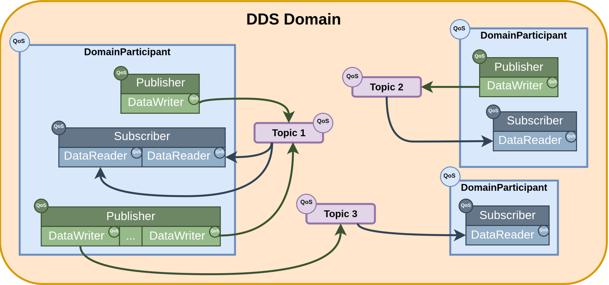
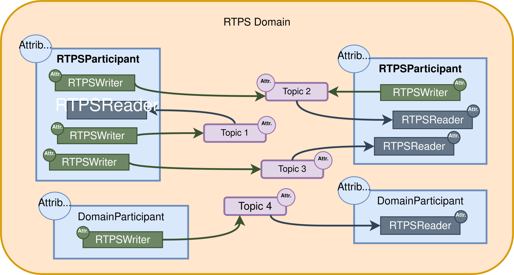

工作的工程中使用到了 DDS，目前只会用，没有进行系统的学习，打算系统的学习一下


## 1.DDS 基本概念
DDS (Data Distribution Service) 数据分发服务 (DDS) 是一种以数据为中心的通信协议，用于分布式软件应用程序通信。它描述了通信应用程序编程接口 (API) 和通信语义，从而实现数据提供者和数据消费者之间的通信。

由于它是一种数据中心发布订阅（DCPS）模型，因此在其实现中定义了三个关键应用程序实体：
- **发布实体**，用于定义信息生成对象及其属性；
- **订阅实体**，用于定义信息消费对象及其属性；
- **配置实体**，用于定义作为主题传输的信息类型，并创建具有服务质量（QoS）属性的发布者和订阅者，用来确保发布者和订阅者之间正确的数据传输。


DDS 使用 QoS 来定义 DDS 实体的行为特征。QoS是由单个的QoS策略组成的（QoSPolicy类的子类的对象）。


### 1.2.DCPS 的概念模型
Data-Centric Publish Subscribe (DCPS) 模型：
- **发布者 Publisher**。它是负责创建和配置其所实现的 DataWriter 的 DCPS 实体。每个DataWriter都被指定了一个Topic，而消息就是通过这个Topic进行发布的。
- **订阅者 Subscriber**。它是负责接收自己订阅的 topic 中的消息的实体。它服务于一个或者多个DataReader对象，DataReader对象是负责为应用程序读取数据的。
- **主题 Topic**。它将发布和订阅连接起来，在一个 domain 中它是唯一的。通过TopicDescription，可以让发布和订阅的数据统一。
- **域 Domain**。这是把所有的 publisher 和 subscriber 连接起来的概念，属于一个或者多个应用程序，这些应用程序在多个topic下交换数据。这些处在一个domain中的应用程序被称为DomainParticipant。Domain 是被 domainid 唯一标识的。DomainParticipant 通过定义 domainId 来指定 DDS 域。两个不同的 domainparticipant 即时在同一个网络中，也是不知道彼此的。因此，多个通信通道都可以被创建。domainparicipant 是其他 DCPS 实体的容器，是 publisher、subscriber 和 topc 等实体的创建者，而且在 domain 中提供管理服务。

DCPS 模型实体在 DDS 域中 架构图如图：


### 1.3 实时发布/订阅协议 RTPS

实时发布/订阅 (Real-Time Publish Subscribe, RTPS)协议 开发出来是为了支撑DDS应用程序，它是一个发布订阅通信中间件，构建在尽力交付的运输层UDP/IP之上。而且，FastDDS 也支持 TCP 和 共享内存（SHM Shared Memory）运输层。

RTPS既可以支持单播通信，也可以支持多播通信。

在RTPS的上层，可以看到有 Domain，这个 domain 是从 dds 继承而来的，它定义了一个隔离的通信平面。同一时刻多个domain可以独立存在。一个 domain 中可以包含任意数量的 RTPSParticipant，RTPSParticipant是能够发送和接收数据的元素。为此，RTPSParticipant 使用它们的 Endpoint：
- **RTPSWriter**：发送数据的 Endpoint。
- **RTPSReader**：接收数据的 Endpoint。

一个 RTPSParticipant 可以包含任意多个 writer 和reader endpoint



通信围绕 topic 展开，topic 定义并标记正在交换的数据。topic 不属于任何特定参与者。参与者通过 RTPSWriter 修改 topic 下发布的数据，并通过 RTPSReader 接收与其订阅的 topic 关联的数据。通信单元称为“变更”，它表示对 topic 下写入的数据的更新。RTPSReader /RTPSWriter 将这些变更记录到其历史记录中，历史记录是一种用作最近变更缓存的数据结构。

在 eProsima Fast DDS 的默认配置中，当通过 RTPSWriter 端点发布更改时，后台会执行以下步骤：
- 该更改已添加到 RTPSWriter 的历史缓存中。
- RTPSWriter 将更改发送给它所知道的所有 RTPSReader。
- RTPSReaders 接收到数据后，会将新的更改更新到其历史缓存中。

Fast DDS 支持多种配置，允许更改 RTPSWriter/RTPSReader 的行为。修改 RTPS 实体的默认配置意味着 RTPSWriter 和 RTPSReader 之间的数据交换流程也会发生变化。此外，通过选择服务质量 (QoS) 策略，可以从多个方面影响这些历史缓存的管理方式，但通信回路保持不变。


## 2.简单的 C++ 发布者和订阅者应用程序
按照教程使用 C++ API 逐步创建了简单的 Fast DDS 应用程序，该应用程序包含发布者和订阅者。

### 2.1 构建发布/订阅应用程序
Fast DDS-Gen可用于根据 IDL 文件构建功能齐全的发布/订阅应用程序。该文件定义了用于发布和接收消息的主题。生成的应用程序允许创建任意数量的发布者和订阅者，所有发布者和订阅者都属于同一个域，并使用同一个主题进行通信。

> 在Linux系统上： Fast DDS/usr/include/fastdds/和 Fast CDR/usr/include/fastcdr/的头文件分别位于目录中。两者的编译库位于目录中。/usr/lib/


`<path/to/Fast DDS-Gen>/scripts/fastddsgen HelloWorld.idl` 生产后的目录结构：

    HelloWorld.hpp：HelloWorld 类型定义。

    HelloWorldPubSubTypes.cxx：Fast DDS 用于支持 HelloWorld 类型的接口。

    HelloWorldPubSubTypes.hpp：HelloWorldPubSubTypes.cxx 的头文件。

    HelloWorldCdrAux.ipp：HelloWorld 类型的序列化和反序列化代码。

    HelloWorldCdrAux.hpp：HelloWorldCdrAux.ipp 的头文件。

    HelloWorldTypeObjectSupport.cxx：TypeObject 表示注册代码。

    HelloWorldTypeObjectSupport.hpp：HelloWorldTypeObjectSupport.cxx 的头文件。


#### 2.1.1 发布应用程序

```cpp
#include "HelloWorldPubSubTypes.hpp"

#include <chrono>
#include <thread>

#include <fastdds/dds/domain/DomainParticipant.hpp>
#include <fastdds/dds/domain/DomainParticipantFactory.hpp>
#include <fastdds/dds/publisher/DataWriter.hpp>
#include <fastdds/dds/publisher/DataWriterListener.hpp>
#include <fastdds/dds/publisher/Publisher.hpp>
#include <fastdds/dds/topic/TypeSupport.hpp>

using namespace eprosima::fastdds::dds;

class HelloWorldPublisher
{
private:

    HelloWorld hello_;

    DomainParticipant* participant_;

    Publisher* publisher_;

    Topic* topic_;

    DataWriter* writer_;

    TypeSupport type_;

    class PubListener : public DataWriterListener
    {
    public:

        PubListener()
            : matched_(0)
        {
        }

        ~PubListener() override
        {
        }

        void on_publication_matched(
                DataWriter*,
                const PublicationMatchedStatus& info) override
        {
            if (info.current_count_change == 1)
            {
                matched_ = info.total_count;
                std::cout << "Publisher matched." << std::endl;
            }
            else if (info.current_count_change == -1)
            {
                matched_ = info.total_count;
                std::cout << "Publisher unmatched." << std::endl;
            }
            else
            {
                std::cout << info.current_count_change
                        << " is not a valid value for PublicationMatchedStatus current count change." << std::endl;
            }
        }

        std::atomic_int matched_;

    } listener_;

public:

    HelloWorldPublisher()
        : participant_(nullptr)
        , publisher_(nullptr)
        , topic_(nullptr)
        , writer_(nullptr)
        , type_(new HelloWorldPubSubType())
    {
    }

    virtual ~HelloWorldPublisher()
    {
        if (writer_ != nullptr)
        {
            publisher_->delete_datawriter(writer_);
        }
        if (publisher_ != nullptr)
        {
            participant_->delete_publisher(publisher_);
        }
        if (topic_ != nullptr)
        {
            participant_->delete_topic(topic_);
        }
        DomainParticipantFactory::get_instance()->delete_participant(participant_);
    }

    //!Initialize the publisher
    bool init()
    {
        hello_.index(0);
        hello_.message("HelloWorld");

        DomainParticipantQos participantQos;
        participantQos.name("Participant_publisher");
        participant_ = DomainParticipantFactory::get_instance()->create_participant(0, participantQos);

        if (participant_ == nullptr)
        {
            return false;
        }

        // Register the Type
        type_.register_type(participant_);

        // Create the publications Topic
        topic_ = participant_->create_topic("HelloWorldTopic", "HelloWorld", TOPIC_QOS_DEFAULT);

        if (topic_ == nullptr)
        {
            return false;
        }

        // Create the Publisher
        publisher_ = participant_->create_publisher(PUBLISHER_QOS_DEFAULT, nullptr);

        if (publisher_ == nullptr)
        {
            return false;
        }

        // Create the DataWriter
        writer_ = publisher_->create_datawriter(topic_, DATAWRITER_QOS_DEFAULT, &listener_);

        if (writer_ == nullptr)
        {
            return false;
        }
        return true;
    }

    //!Send a publication
    bool publish()
    {
        if (listener_.matched_ > 0)
        {
            hello_.index(hello_.index() + 1);
            writer_->write(&hello_);
            return true;
        }
        return false;
    }

    //!Run the Publisher
    void run(
            uint32_t samples)
    {
        uint32_t samples_sent = 0;
        while (samples_sent < samples)
        {
            if (publish())
            {
                samples_sent++;
                std::cout << "Message: " << hello_.message() << " with index: " << hello_.index()
                            << " SENT" << std::endl;
            }
            std::this_thread::sleep_for(std::chrono::milliseconds(1000));
        }
    }
};

int main(
        int argc,
        char** argv)
{
    std::cout << "Starting publisher." << std::endl;
    uint32_t samples = 10;

    HelloWorldPublisher* mypub = new HelloWorldPublisher();
    if(mypub->init())
    {
        mypub->run(samples);
    }

    delete mypub;
    return 0;
}
```

    DomainParticipantFactory允许创建和销毁 DomainParticipant 对象。

    DomainParticipant. 充当所有其他实体对象的容器，并充当发布者、订阅者和主题对象的工厂。

    TypeSupport为参与者提供序列化、反序列化和获取特定数据类型的键的功能。

    Publisher它是负责创建数据写入器的对象。

    DataWriter允许应用程序设置要在给定主题下发布的数据值。

    DataWriterListener允许重新定义 DataWriterListener 的功能

### 2.2 编译问题记录

#### 问题1：`find_package(fastcdr 2)` 找不到 Fast-CDR 2.x

##### 现象

在 `dds_helloword/` 下执行 cmake 配置时报错：

```text
CMake Error at CMakeLists.txt:7 (find_package):
  Could not find a configuration file for package "fastcdr" that is
  compatible with requested version "2".

  The following configuration files were considered but not accepted:

    /usr/lib/x86_64-linux-gnu/cmake/fastcdr/fastcdr-config.cmake, version: 1.1.0
    /lib/x86_64-linux-gnu/cmake/fastcdr/fastcdr-config.cmake, version: 1.1.0
```

##### 原因

- 项目依赖 Fast-DDS 3.x 与 Fast-CDR 2.x，但系统中通过 apt 安装的 `libfastcdr-dev` 只有 **1.1.0** 版本。
- Fast-DDS 3.x 需要 Fast-CDR 2.x（本仓库 `.repos` 要求 v2.3.5），旧版缺少 `fixed_size_string.hpp` 等新头文件，且版本不满足 `find_package(fastcdr 2 REQUIRED)`。

##### 解决

1. 将编译好的 Fast-DDS（含内置 Fast-CDR 2.3.5）安装到本地前缀：

   ```bash
   cmake --install /mnt/feidisk2/workspace/Fast-DDS/build \
     --prefix /mnt/feidisk2/workspace/fastdds-install
   ```

   安装产物：
   - `fastdds-install/lib/libfastdds.so.3.6.1.0`、`libfastcdr.so.2.3.5`
   - `fastdds-install/lib/cmake/fastcdr/fastcdr-config.cmake`
   - `fastdds-install/share/fastdds/cmake/fastdds-config.cmake`

   > 备注：安装结束时 `fast-discovery-server` 符号链接与 `tools/fastdds` 报错（硬编码 `/usr/local` 路径 + 权限），属于可选工具，不影响本工程。

2. 配置工程时用 `CMAKE_PREFIX_PATH` 指向安装前缀（同时还要指向 foonathan_memory 的安装目录，因为 `fastdds-config.cmake` 会 `find_dependency(foonathan_memory)`）：

   ```bash
   cd /mnt/feidisk2/workspace/Fast-DDS/myDDSTest/dds_helloword/build
   cmake -DCMAKE_PREFIX_PATH="/mnt/feidisk2/workspace/fastdds-install;/mnt/feidisk2/workspace/foonathan_memory_vendor/install" ..
   cmake --build .
   ```

3. 运行时指定库路径：

   ```bash
   LD_LIBRARY_PATH=/mnt/feidisk2/workspace/fastdds-install/lib ./DDSHelloWorldPublisher
   ```

---

#### 问题 2：生成的类型代码与 Fast-DDS 3.x 不兼容
##### 现象

编译时报错（在问题 1 解决之后出现）：

```text
In file included from .../HelloWorld.cxx:29:
.../HelloWorld.h:26:10: fatal error: fastrtps/utils/fixed_size_string.hpp: 没有那个文件或目录
In file included from .../HelloWorldPubSubTypes.cxx:26:
.../HelloWorldPubSubTypes.h:27:10: fatal error: fastrtps/utils/md5.h: 没有那个文件或目录
```

同时 `HelloWorldPubSubTypes.h` 内已有告警宏：

```cpp
#if !defined(GEN_API_VER) || (GEN_API_VER != 1)
#error \
    Generated HelloWorld is not compatible with current installed Fast DDS. Please, regenerate it with fastddsgen.
#endif  // GEN_API_VER
```

##### 原因

- 类型代码（`HelloWorld.h/.cxx`、`HelloWorldPubSubTypes.h/.cxx`）由系统中的 `fastddsgen`（apt 版 **2.3.0**）生成，使用的是 **Fast-DDS 2.x 的 `fastrtps/` API**。
- 本机安装的 Fast-DDS 是 **3.6.1**，v3 已移除 `fastrtps/` 兼容头（`fixed_size_string.hpp`、`md5.h` 等），且 `TopicDataType` 接口也已升级（`FASTDDS_GEN_API_VER != 3` 会报错）。
- `HelloWorldPublisher.cpp` 本身已是 v3 API（`#include <fastdds/dds/...>`），只需替换生成的类型文件。

##### 解决
安装 Fast-DDS-Gen 3.x 后用 `fastddsgen <file>.idl` 重新生成。


## 参考

[什么是DDS](https://fast-dds.docs.eprosima.com/en/latest/fastdds/getting_started/definitions.html)