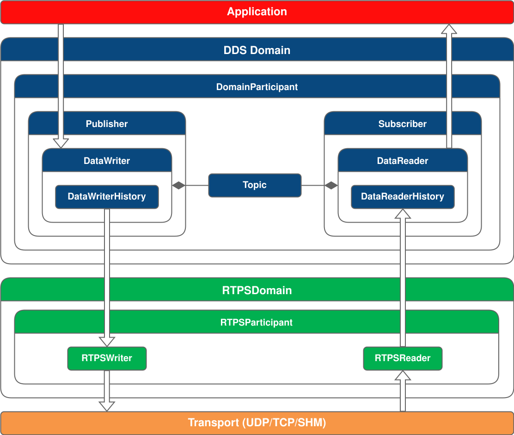

Fast DDS（前身为 Fast RTPS）是 DDS 规范的高效高性能实现，DDS 规范是一种用于分布式应用软件的以数据为中心的通信中间件（DCPS）。

> DDS 是一套通信协议和API标准，它提供了以数据为中心的连接服务。Fast-RTPS 是 DDS 的开源实现，借助它可以方便的开发出高效，可靠的分布式系统。

## 1.架构
Fast DDS的架构如下图所示

- **Application layer 应用层**。使用Fast DDS API 在分布式系统中实现通信的用户应用程序。
- **Fast DDS layer**。DDS通信中间件的实现。它允许部署一个或多个DDS域，同一域内的 DomainParticlpant 可以通过在 Domain Topic 下发布/订阅来交换消息。
- **RTPS 层**。实现实时发布/订阅（RTPS）协议， 以实现与 DDS 应用程序的互操作性。该层充当传输层的抽象层。
- **Transport Laye 传输层**。 Fast DDS可用于各种传输协议，例如不可靠传输协议 (UDP)、可靠传输协议 (TCP) 或共享内存传输协议 (SHM)。

### 1.1 DDS 层
在 DDS 层中定义了通信的几个关键元素。用户将在其应用程序中创建这些元素，从而合并 DDS 应用程序元素并创建以数据为中心的通信系统。Fast DDS 遵循 DDS 规范，将通信中涉及的这些元素定义为实体 Entities。DDS 实体 Entities 是支持服务质量配置（Quality of Service configuration, QoS）并实现侦听器的任何对象。

QoS：定义每个实体 entities 行为的机制。

Listener：向实体通知应用程序执行期间可能发生的事件的机制。

DDS实体及其描述和功能，详细的会在后面章节中介绍：

1. Domain：标识 DDS 域的正整数。每个 DomainParticipant 都将分配一个DDS域，以便同一域中的DomainParticipants 可以进行通信，并隔离 DDS 域之间的通信。此值必须由应用程序开发人员在创建DomainParticipant 时提供。

2. DomainParticipant：包含其他 DDS实体（如发布者、订阅者、主题和多主题）的对象。它可以创建包含在自己中的实体以及实体的配置。

3. Publisher：发布服务器使用 DataWriter 发布主题下的数据，DataWriter 将数据写入传输。它是创建和配置其包含的 DataWriter 实体的实体，并且可能包含一个或多个 DataWriter 实体。

4. DataWriter：它是负责发布消息的实体。用户在创建此实体时必须提供一个主题，该主题将是发布数据的主题。发布是通过将数据对象作为更改写入 DataWriterHistory 来完成的。

5. DataWriterHistory：这是对数据对象的更改列表。当DataWriter继续发布特定主题下的数据时，它实际上会对该数据进行更改。历史记录中记录的正是这一更改。然后将这些更改发送到订阅该特定主题的DataReader。

6. Subscriber：订阅服务器使用DataReader订阅主题，DataReader从传输中读取数据。它是创建和配置其包含的DataReader实体的实体，可以包含一个或多个DataReader实体。

7. DataReader：It is the entity that subscribes to the topics for the reception of publications。创建此实体时，用户必须提供订阅主题。DataReader接 收消息作为其 HistoryDataReader 中的更改。

8. DataReaderHistory：它包含DataReader由于订阅某个主题而接收的数据对象中的更改。

9. Topic：将发布服务器的DataWriter与订阅服务器的DataReader绑定的实体。

### 1.2 RTPS 层
Fast DDS 中的 RTPS 协议允许将 DDS 应用实体从传输层抽象出来。根据上图所示，RTPS 层有四个主要实体。

1. RTPSDomain：它是RTPS协议对DDS域的扩展。

2. RTPSParticipant：包含其他RTPS实体的实体。它允许配置和创建包含的实体。

3. RTPSWriter：消息的来源。它读取写入 DataWriterHistory 中的更改，并将其传输到先前匹配的所有 RTPSReader。

4. RTPSReader：消息的接收实体。它将 RTPSWriter 报告的更改写入 DataReaderHistory。

### 1.3 Transport 层
Fast DDS支持通过各种传输协议实现应用程序。这些是UDPv4、UDPv6、TCPv4、TCPv6和共享内存传输（SHM）。默认情况下，DomainParticipant实现UDPv4和SHM传输协议。 后面会详细介绍这些。

## 2.Programming  和执行模型
Fast DDS是并发的和基于事件的。以下说明了控制Fast DDS操作的多线程模型以及可能的事件。

### 2.1 并发和多线程
Fast DDS实现了并发多线程系统。每个 DomainParticipant 都会生成一组线程来处理后台任务，例如日志记录、消息接收和异步通信。也就是说，Fast DDS API 是线程安全的。

但是，当外部函数访问库内部线程修改的资源时，必须考虑这种多线程实现。例如，实体监听器回调中修改的资源就是这种情况。

以下显示了 Fast DDS 生成的所有线程。传输相关的线程（标记为 UDP、TCP 和 SHM 类型）仅在使用相应的传输协议时才会创建：

| 名称 | 类型 | 数量 | 系统线程名 | 说明 |
| ---- | ---- | ---- | ---- | ---- |
| Event 事件线程 | General 通用线程 | 每个DomainParticipant 1条 | dds.ev.\<participant_id\> | 处理周期性事件与触发式定时事件，相关配置见 DomainParticipantQos |
| Discovery Server Event 发现服务事件线程 | General 通用线程 | 每个DomainParticipant 1条 | dds.ds_ev.\<participant_id\> | 实现对发现服务数据库的访问同步，相关配置见 DomainParticipantQos |
| Asynchronous Writer 异步写线程 | General 通用线程 | 每个启用的异步流控制器对应1条；最少1条 | dds.asyn.\<participant_id\>.\<async_flow_controller_index\> | 管理异步数据写入。即使是同步Writer，部分通信也需要后台发起。相关配置见 DomainParticipantQos、FlowControllersQos |
| Datasharing Listener 数据共享监听器线程 | General 通用线程 | 每个DataReader 1条 | dds.dsha.\<reader_id\> | 处理通过共享内存数据共享通道收到的消息，相关配置见 DataReaderQos |
| Reception UDP接收线程 | UDP | 每个端口1条 | dds.udp.\<port\> | 监听并处理UDP传入消息，相关配置见 TransportConfigQos、UDPTransportDescriptor |
| Reception TCP接收线程 | TCP | 每条TCP连接1条 | dds.tcp.\<port\> | 监听并处理TCP连接上的传入消息，相关配置见 TCPTransportDescriptor |
| Accept TCP连接接受线程 | TCP | 每套TCP传输实例1条 | dds.tcp_accept | 处理TCP接入连接请求，相关配置见 TCPTransportDescriptor |
| Keep Alive TCP保活线程 | TCP | 每套TCP传输实例1条 | dds.tcp_keep | TCP连接保活管理线程，相关配置见 TCPTransportDescriptor |
| Reception SHM接收线程 | SHM（共享内存） | 每个端口1条 | dds.shm.\<port\> | 处理经由共享内存段传入的消息，相关配置见 TransportConfigQos、SharedMemTransportDescriptor |
| Logging SHM日志线程 | SHM（共享内存） | 每个端口1条 | dds.shmd.\<port\> | 将共享内存传输数据包缓存并转储至文件，相关配置见 TransportConfigQos、SharedMemTransportDescriptor |
| Watchdog SHM看门狗线程 | SHM（共享内存） | 全局1条 | dds.shm.wdog | 监控所有已打开共享内存段健康状态，相关配置见 TransportConfigQos、SharedMemTransportDescriptor |
| General Logging 通用日志线程 | Log | 全局1条 | dds.log | 汇总日志条目并输出至对应日志消费端，参考日志线程文档 |
| Security Logging 安全日志线程 | Log | 每个DomainParticipant 1条 | dds.slog.\<participant_id\> | 汇总并输出安全模块日志条目，相关配置见 DomainParticipantQos |
| Watchdog 文件监控看门狗线程 | Filewatch | 全局1条 | dds.fwatch | 持续监视指定文件，检测文件修改事件，相关配置见 DomainParticipantFactoryQos |
| Callback 文件监控回调线程 | Filewatch | 全局1条 | dds.fwatch.cb | 被监视文件发生变更时，执行注册的回调函数 |
| Reception 类型查找服务接收线程 | TypeLookup Service | 每个DomainParticipant 2条 | dds.tls.replies.\<participant_id\> dds.tls.requests.\<participant_id\> | 当收到远端端点发现信息，但消息数据类型未知时执行类型查询处理 |

有些线程只有在满足特定条件时才会生成：
- 仅启用数据共享（Datasharing）功能时，才会创建数据共享监听器线程。
- 只有将域参与者（DomainParticipant）配置为**发现服务器服务端（Discovery Server SERVER）**时，才创建发现服务事件线程。
- TCP 保活线程生效条件：保活周期配置值必须大于 0。
- 安全日志线程、共享内存数据包日志线程，均需要开启对应的配置选项才会创建。
- 仅当启用环境配置文件 `FASTDDS_ENVIRONMENT_FILE` 时，才会生成文件监控线程。

关于传输层线程：Fast DDS 默认同时启用 **UDP 传输**与**共享内存（SHM）传输**。端口配置可根据部署场景的具体需求调整，但默认配置会始终使用**元流量端口（metatraffic port）**与**单播用户业务流量端口（unicast user traffic port）**。
该规则同时适用于 UDP 和共享内存；TCP 协议不支持组播，因此不受此规则约束。

### 2.2 事件驱动架构
Fast DDS拥有一个时间事件系统，该系统能够响应特定条件并调度周期性操作。由于大多数时间事件与 DDS 和 RTPS 元数据相关，因此用户无法直接查看这些事件。但是，用户可以通过继承该类，在其应用程序中定义周期性时间事件TimedEvent。

Fast DDS的事件驱动原理是基于回调函数的。当某个事件(如数据到达)发生时，系统会触发相应的回调函数来执行相应的处理逻辑。Fast DDS依赖于Boost ASIO库来实现事件驱动，采用异步I/O机制，使得Fast DDS能够高效地进行数据传输和交换。

## 3 功能
Fast DDS具有一些附加功能，用户可以在自己的应用程序中实现和配置这些功能。

### 3.1 发现协议
发现协议定义了一套机制：发布指定主题的**数据写入器（DataWriter）**与订阅同一主题的**数据读取器（DataReader）**通过该机制完成匹配，进而建立数据交互。该匹配过程可发生在通信生命周期内任意时刻。Fast DDS 提供以下几种发现机制：
1. **Simple Discovery（简易发现）**
这是默认的发现机制，遵循 RTPS 标准定义，能够与其他 DDS 实现版本互通。该模式下会先逐一发现各个域参与者（DomainParticipant），后续再完成其内部 DataWriter 与 DataReader 的匹配。
2. **Discovery Server（发现服务器）**
该发现机制采用集中式发现架构，服务器作为枢纽承载元流量（meta traffic）的发现交互。
3. **Static Discovery（静态发现）**
该机制实现域参与者之间的互相发现；若远端域参与者预先知晓对方内部实体信息，可以跳过内部实体（DataReader / DataWriter）的发现流程。
4. **Manual Discovery（手动发现）**
该机制仅兼容 RTPS 层。用户可借助任意自选的外部元信息通道，手动完成 RTPSParticipant、RTPSWriter、RTPSReader 的匹配与解除匹配。

### 3.2 安全
Fast DDS 可配置为通过在三个级别实现可插拔安全性来提供安全通信：
- Authentication of remote DomainParticipants：DDS:Auth:PKI-DH插件使用可信证书颁发机构（CA）和ECDSA数字签名算法提供认证，以执行相互认证。它还使用椭圆曲线Diffie-Hellman（ECDH）密钥协议建立共享密钥。
- Access control of entities：DDS:Access:Permissions插件在DDS域和主题级别为域参与者提供访问控制。
- Encryption of data：DDS:Crypto:AES-GCM-GMAC插件在伽罗瓦计数器模式（AES-GCM）中使用高级加密标准（AES）提供认证加密。

### 3.3 日志
Fast DDS 提供一套可扩展的日志系统。`Log` 类是日志系统的入口，对外暴露三个宏定义方便开发者使用：`EPROSIMA_LOG_INFO`、`EPROSIMA_LOG_WARNING`、`EPROSIMA_LOG_ERROR`。
除此之外，除了已内置的日志类别（`INFO_MSG`、`WARN_MSG`、`ERROR_MSG`），开发者还可以自定义新的日志分类。
日志系统支持通过正则表达式按照日志类别进行过滤，同时能够控制日志输出详细级别（日志冗长程度）。

### 3.4 Xml 配置
Fast DDS 支持通过 **XML 配置模板文件** 修改默认参数。开发者无需编写业务代码、也不用重新编译应用程序，即可调整各类 DDS 实体的运行行为。

API 提供的各项功能均配套对应的 XML 标签。因此，可以通过 `<participant>` 标签创建并配置域参与者模板；也可以分别使用 `<data_writer>`、`<data_reader>` 标签配置数据写入器、数据读取器模板。

### 3.5 环境变量
环境变量是依托操作系统能力、在程序作用域之外定义的变量。Fast DDS 借助环境变量机制，让用户能够便捷地自定义 DDS 应用的默认参数。

---

这里就是简单的概述了解，后面详细展开

## 参考文献

[fastdds学习之3——库概览 ](https://www.cnblogs.com/xingyuchen/p/17321998.html)
[DDS libraray 总览](https://fast-dds.docs.eprosima.com/en/latest/fastdds/library_overview/library_overview.html)
