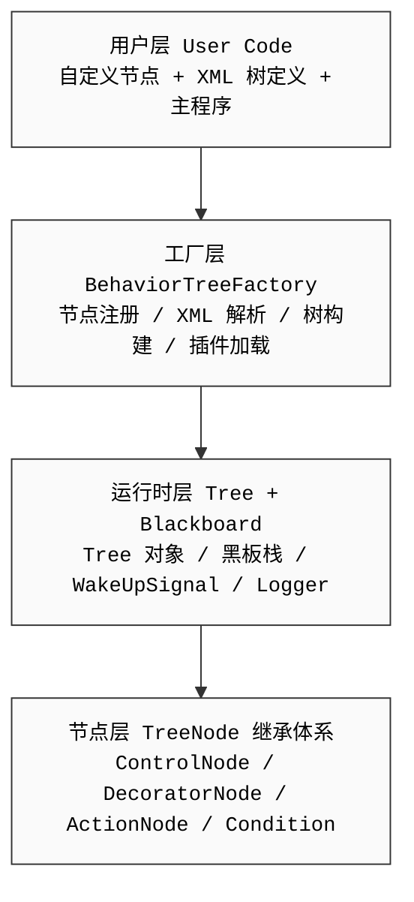

行为树（Behavior Tree）是一种**节点的层次化树结构**，用于控制任务的执行流程。与有限状态机（FSM）相比，行为树更加模块化、易于组合和扩展。

- **模块化与复用**：状态机通常使用图结构，状态之间的跳转容易形成复杂的“面条代码”，难以维护；行为树的子树可作为独立模块随时添加、删除或复用。
- **扩展性**：面对新加入的行为，FSM 需要重构状态流转路径，而行为树只需在对应节点下挂载新的子树即可完成扩展。
- **调试与可视化**：由于其清晰的父子级层次结构，行为树非常适合搭配可视化编辑器进行直观调试。

**开源仓库：**[BehaviorTree.CPP](https://github.com/BehaviorTree/BehaviorTree.CPP)

## 1.论文核心内容解读

**论文：**[**MOOD2Be**（Model-Driven Development for Robotics）](https://ieeexplore.ieee.org/document/7789849)

整体核心主线：
机器人开发传统用有限状态机 FSM/HFSM描述行为，但存在耦合、复杂度爆炸、难复用缺陷；行为树 BT是更优替代。
两大核心设计思想：
- 软件工程层面：基于组件、职责分离、五大解耦维度（计算 / 配置 / 通信 / 协调 / 组合）；
- 数据交互层面：摒弃全局黑板，改用强类型输入输出端口 + 子树独立命名空间，解决全局变量污染、命名冲突、无法静态校验问题

### 1.1 机器人领域面向组件开发的优势
面向模型的开发为机器人领域带来了诸多优势，而基于组件的软件工程（CBSE）已成为大多数机器人中间件和框架的业界标准。

组件化开发优势：
1. **更高的可组合性**：组件可以重新排列成不同的配置
2. **可替换组件**：可以将一个组件替换为具有相同契约和接口的其他实现
3. **更高的可复用性**：同一组件可在不同项目或场景中轻松重复使用，所需改动极少
4. **缩短开发与运维周期**：综合降低开发、部署、维护全流程成本
5. **可预测性**：机器人实体落地场景的基础硬性要求
6. **标准化**
    - 模型和接口的标准化：与可重用性、可组合性强相关
    - 基础组件统一标准化

### 1.2 核心架构原则：职责分离
良好的软件设计、系统架构都应实现职责分离。

#### 1.2.1 CBSE 语境下：五C解耦
“职责分离”是软件开发经典原则。在基于组件软件工程中，指将 **Five Cs** 互相解耦：
- 计算（Calculation）
- 配置（Configuration）
- 通信（Communication）
- 协调（Coordination）
- 组合（Composition）

#### 1.2.2 角色分离
清晰区分、解耦不同人员角色的工作活动：
- 领域专家
- 系统集成人员
- 组件开发者

**机器人行为本质只是一套协调、统筹管理各个软件组件运行状态的机制。**

### 1.3 技能（Skill）与面向服务架构适配
1. **技能（Skills）概念**
从行为设计师视角，Skill 描述机器人系统具备的功能能力；一台机器人全部可用技能汇总于数字数据表（Digital Datasheet）。

2. 面向服务组件与行为树结合规范
若系统由面向服务组件构成，所有服务调用、远程过程RPC客户端逻辑，统一封装在行为树（BT）的动作节点内部。


### 1.4 有限状态机 FSM / HFSM 缺陷 & 行为树 BT 优势对比
FSM 是描述智能体行为经典范式（如游戏NPC），但状态、跳转条件增多后会暴露大量工程问题：
- N个状态的FSM最多存在 N×N 条状态转移边；
- 状态数量随业务上下文快速膨胀；
- 增删任意状态，所有关联跳转条件都需要同步修改；
- 状态间强耦合，严重限制逻辑片段复用；
- 状态规模庞大后，图形、文本逻辑可读性极差，设计者难以理解整体行为。

上述问题对计算机执行无压力，但会极大提升**人类开发者的认知负担**，状态越多越难以维护、预判系统行为。

#### 1.4.1 层次有限状态机（HFSM）改良局限
HFSM 通过分层嵌套缓解了部分复用、状态转移爆炸问题，但仍存在两大短板：
1. 状态之间耦合度依旧很高；
2. 内置语法表达能力受限，复杂响应式行为难以描述。

#### 1.4.2 行为树 BT 的核心优势，解决FSM全部痛点
1. 天然层级结构，任意一段子树都是独立可复用的行为单元；
2. 语法丰富且支持自定义扩展，便于实现各类机器人通用设计模式；
3. 可视化/文本可读性强：自上而下执行，节点优先级从左至右，符合人类阅读习惯；
4. 核心单元为动作（Action）而非状态（State），贴合人类任务描述思维，完美适配面向服务架构的软件接口。

### 1.5 行为树数据流：黑板方案缺陷 & 强类型端口元模型方案
**协调逻辑与数据通信解耦，行为执行依赖数据**：输入数据是动作执行前置条件；动作执行完成输出数据作为后置结果，两类逻辑需要分开设计。

#### 1.5.1  传统方案：全局黑板 Blackboard
多数行为树实现采用黑板在节点间传递数据；黑板本质是全局可访问的字符串键值存储。

黑板三大核心缺陷
1. 数据流无显式建模，代码硬编码读写键值，静态分析工具无法校验数据合法性，错误仅运行时暴露；
2. 等价于全局变量池，破坏组件封装性，一处数据修改会全局污染；
3. 通用键名（`target`/`goal`/`result`/`pose`）易冲突，子树复用存在严重数据串扰风险。

#### 1.5.2 优化方案：端口数据流元模型（替代黑板）
用输入/输出端口规范化数据流，6条核心规则：
1. 移除全局黑板，每个节点必须显式定义输入端口、输出端口；
2. 每个端口绑定唯一字符串标识「键（key）」；
3. **同一子树内部**：相同键的端口自动建立数据连接；
4. 端口强制强类型约束，仅同类型端口可连通，部署/静态阶段即可校验类型一致性；
5. **不同子树之间**：同名键端口相互隔离，自带独立命名空间，不会自动连通；
6. 父子树跨层级数据交互，必须手动显式建立端口连接。


## 2.BehaviorTreeCpp 总体架构



## 3.基本设计模式

| 模式 | 实现位置 | 说明 |
|------|---------|------|
| **组合模式** | TreeNode → ControlNode/DecoratorNode/LeafNode | 树状递归结构，ControlNode 持有多子节点，DecoratorNode 持有单子节点 |
| **模板方法** | `executeTick()` → `tick()` | `executeTick()` 定义骨架（前后回调 + 状态设置），`tick()` 由子类实现具体逻辑 |
| **工厂模式** | `BehaviorTreeFactory` | 注册 NodeBuilder，根据 ID 查找并实例化节点 |
| **观察者模式** | `Signal<T>` + `StatusChangeLogger` | 节点状态变更时通知所有订阅者 |
| **构建者模式** | `NodeBuilder = std::function<unique_ptr<TreeNode>(...)>` | 延迟节点构造，由工厂统一调度 |
| **Pimpl 惯用法** | `XMLParser::Pimpl`、`CoroActionNode::Pimpl` | 隐藏实现细节，减少头文件依赖，保持 ABI 稳定 |
| **类型擦除** | `Any`（safe_any.hpp） | 黑板存储任意类型值，运行时安全类型转换 |
| **RAII** | `StatusChangeSubscriber = shared_ptr<CallableFunction>` | 订阅者生命周期管理：析构自动取消订阅 |


## 4.源文件目录结构
```
include/behaviortree_cpp_v3/
├── tree_node.h            ← TreeNode 基类
├── action_node.h          ← 4种 ActionNode
├── control_node.h         ← ControlNode 基类
├── decorator_node.h       ← DecoratorNode 基类
├── leaf_node.h            ← LeafNode 标记基类
├── condition_node.h       ← ConditionNode
├── blackboard.h           ← 黑板系统
├── basic_types.h          ← NodeStatus/PortInfo/convertFromString
├── bt_factory.h           ← 工厂 + Tree 类
├── xml_parsing.h          ← XML 解析接口
├── controls/              ← 各控制节点头文件
├── decorators/            ← 各装饰节点头文件
├── loggers/               ← 日志系统
├── utils/                 ← Signal、WakeUpSignal、Any 等工具
└── behavior_tree.h        ← 汇总头文件（包含所有内置节点）

src/
├── tree_node.cpp          ← TreeNode 实现
├── action_node.cpp        ← 4种 ActionNode 实现
├── control_node.cpp       ← ControlNode 基类实现
├── decorator_node.cpp     ← DecoratorNode 基类实现
├── blackboard.cpp         ← 黑板实现
├── bt_factory.cpp         ← 工厂实现
├── xml_parsing.cpp        ← XML 解析核心
├── controls/              ← 各控制节点实现
├── decorators/            ← 各装饰节点实现
└── loggers/               ← 各日志实现
```
