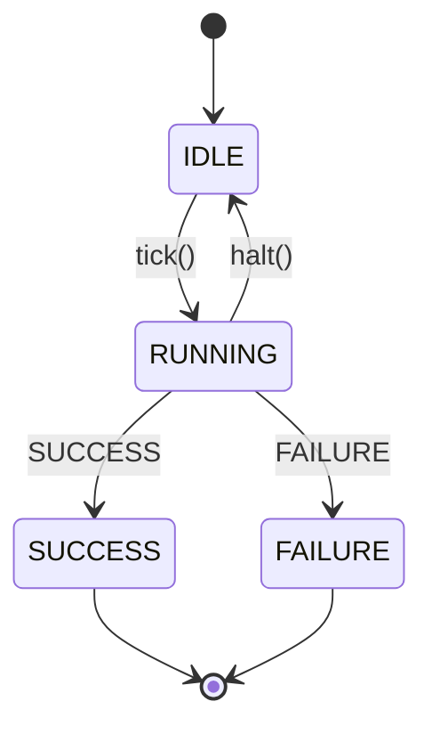

本章主要学习 TreeNode 基类，源代码在 tree_node.h 当中。

---

## 1.公共数据类型

```cpp
struct TreeNodeManifest {
  NodeType type;             ///< 节点类型（ACTION/CONDITION/CONTROL/DECORATOR/SUBTREE）
  std::string registration_ID; ///< 在工厂注册时使用的唯一标识符
  PortsList ports;           ///< 节点声明的所有端口（输入/输出）
  std::string description;   ///< 节点的可读描述信息
};
```

```cpp
/// 端口重映射表：将本地端口名映射到黑板键名或具体字符串值
typedef std::unordered_map<std::string, std::string> PortsRemapping;
```


## 2.TreeNode 基类

```cpp
/// 行为树节点的抽象基类
class TreeNode
{
public:
  typedef std::shared_ptr<TreeNode> Ptr;

  /**
     * @brief TreeNode 主构造函数。
     *
     * @param name     节点实例名称（非类型名称）。
     * @param config   输入/输出端口配置信息，参见 NodeConfiguration。
     *
     * 注意：若自定义节点有端口，派生类必须实现静态方法：
     *
     *     static PortsList providedPorts();
     */
  TreeNode(std::string name, NodeConfiguration config);

  virtual ~TreeNode() = default;

  /// 推荐使用此方法触发 tick() 并更新状态；而非直接调用 tick()
  virtual BT::NodeStatus executeTick();

  /// 用于中断正在 RUNNING 的节点执行。
  /// 只有可能返回 RUNNING 的异步节点才需要实现此方法。
  virtual void halt() = 0;

  /// 节点是否已被 halt
  bool isHalted() const;

  /// 获取当前节点状态
  NodeStatus status() const;

  /// 节点的实例名称（非类型名）
  const std::string& name() const;

  /// 阻塞等待，直到 setStatus() 被调用并传入 RUNNING、FAILURE 或 SUCCESS
  BT::NodeStatus waitValidStatus();

  virtual NodeType type() const = 0;

  using StatusChangeSignal = Signal<TimePoint, const TreeNode&, NodeStatus, NodeStatus>;
  using StatusChangeSubscriber = StatusChangeSignal::Subscriber;
  using StatusChangeCallback = StatusChangeSignal::CallableFunction;

  using PreTickOverrideCallback =
      std::function<Optional<NodeStatus>(TreeNode&, NodeStatus)>;
  using PostTickOverrideCallback =
      std::function<Optional<NodeStatus>(TreeNode&, NodeStatus, NodeStatus)>;

  /**
     * @brief subscribeToStatusChange 用于注册节点状态变化回调。
     * 当 StatusChangeSubscriber（shared_ptr）离开作用域时，回调自动注销。
     *
     * @param callback 状态变化时执行的回调函数。
     * @return 订阅者句柄（shared_ptr，需保持存活以维持订阅）。
     */
  StatusChangeSubscriber subscribeToStatusChange(StatusChangeCallback callback);

  /** 挂接 Pre-Tick 回调，签名为：
     *
     *     Optional<NodeStatus> myCallback(TreeNode& node, NodeStatus current_status)
     *
     * 该回调在 tick() **之前**执行。若返回有效的 Optional<NodeStatus>，
     * 则实际 tick() 不会被调用，直接返回回调结果。
     *
     * 适用于运行时注入"mock"实现。
     */
  void setPreTickOverrideFunction(PreTickOverrideCallback callback);

  /**
     * 挂接 Post-Tick 回调，签名为：
     *
     *     Optional<NodeStatus> myCallback(TreeNode& node, NodeStatus prev_status, NodeStatus tick_status)
     *
     * 该回调在 tick() **之后**执行。若返回有效的 Optional<NodeStatus>，
     * 则 tick() 的实际返回值会被此值覆盖。
     */
  void setPostTickOverrideFunction(PostTickOverrideCallback callback);

  /// 获取此节点实例的唯一标识符（全局唯一）
  uint16_t UID() const;

  /// registrationName 是 BehaviorTreeFactory 创建实例时使用的 ID
  const std::string& registrationName() const;

  /// 构造时传入的配置信息，创建后不可更改
  const NodeConfiguration& config() const;

  /** 从输入端口读取值，实际上是从黑板中读取对应条目。
     * 若黑板中存储的是 std::string 而 T 不是 string，
     * 则自动调用 convertFromString<T>() 进行解析。
     *
     * @param key   端口标识符（重映射前的名称）。
     * @return      Optional，失败时包含错误信息。
     */
  template <typename T>
  Result getInput(const std::string& key, T& destination) const;

  /// 与上方 getInput 等价，但返回 Optional<T>
  template <typename T>
  Optional<T> getInput(const std::string& key) const
  {
    T out;
    auto res = getInput(key, out);
    return (res) ? Optional<T>(out) : nonstd::make_unexpected(res.error());
  }

  /// 将值写入输出端口（即写入黑板对应条目）
  template <typename T>
  Result setOutput(const std::string& key, const T& value);

  /// 调试用：直接读取端口的原始字符串值（不做重映射和类型转换）
  StringView getRawPortValue(const std::string& key) const;

  /// 检查字符串是否是黑板指针格式（{...} 或 ${...}）
  static bool isBlackboardPointer(StringView str);

  /// 去除黑板指针格式的包装符号，返回内部键名
  static StringView stripBlackboardPointer(StringView str);

  /// 获取端口在重映射后实际对应的黑板键名
  static Optional<StringView> getRemappedKey(StringView port_name,
                                             StringView remapping_value);

  /// 通知树需要再次被 tick（用于异步节点完成时唤醒等待中的树）
  void emitStateChanged();

protected:
  /// 子类必须实现的核心逻辑方法
  virtual BT::NodeStatus tick() = 0;

  friend class BehaviorTreeFactory;
  friend class DecoratorNode;
  friend class ControlNode;
  friend class Tree;

  // 仅 BehaviorTreeFactory 应调用此方法
  void setRegistrationID(StringView ID);

  void setWakeUpInstance(std::shared_ptr<WakeUpSignal> instance);

  void modifyPortsRemapping(const PortsRemapping& new_remapping);

  void setStatus(NodeStatus new_status);

  /// 等价于 setStatus(NodeStatus::IDLE)
  void resetStatus();

private:
  const std::string name_;

  NodeStatus status_;

  std::condition_variable state_condition_variable_;

  mutable std::mutex state_mutex_;

  StatusChangeSignal state_change_signal_;

  const uint16_t uid_;

  NodeConfiguration config_;

  std::string registration_ID_;

  PreTickOverrideCallback pre_condition_callback_;

  PostTickOverrideCallback post_condition_callback_;

  std::shared_ptr<WakeUpSignal> wake_up_;
};
```

### 2.1 构造与唯一 ID 生成

```cpp
// tree_node.cpp
static uint16_t getUID()
{
    static uint16_t uid = 1;   // 静态变量，进程内唯一
    return uid++;
}

TreeNode::TreeNode(std::string name, NodeConfiguration config) :
    name_(std::move(name)),
    status_(NodeStatus::IDLE),    // 初始状态为 IDLE
    uid_(getUID()),               // 构造时分配全局唯一 ID
    config_(std::move(config))
{}
```

- uid_ 是 const 的，一旦构造不可变
- 使用静态计数器生成 ID，简单高效（上限 65535 个节点）
- NodeConfiguration 包含黑板指针和端口重映射表，在构造时绑定

### 2.2 NodeConfiguration：节点的唯一标识

```cpp
/// 节点配置：在构造节点时传入，包含黑板指针和端口重映射信息
struct NodeConfiguration
{
  NodeConfiguration()
  {}

  Blackboard::Ptr blackboard;       ///< 节点所使用的黑板实例
  PortsRemapping input_ports;       ///< 输入端口的重映射配置
  PortsRemapping output_ports;      ///< 输出端口的重映射配置
};
```

每个节点在构造时获得自己的 NodeConfiguration，其中包含了它与外界通信的全部信息。这个对象在整个节点生命周期中不可更改。


## 3.executeTick 函数

### 3.1 executeTick 的完整流程

这是整个库最核心的函数，理解它就理解了行为树的执行本质：

```cpp
// tree_node.cpp
NodeStatus TreeNode::executeTick() {
    NodeStatus new_status = status_;

    // 阶段1：前置回调（可选）
    // 若设置了 pre_condition_callback_，它在 tick() 之前执行
    // 若返回有效值，直接跳过 tick()
    if (pre_condition_callback_) {
        if (auto res = pre_condition_callback_(*this, status_)) {
            new_status = res.value();
        }
    } else {
        // 阶段2：调用子类实现的 tick()
        new_status = tick();
    }

    // 阶段3：后置回调（可选）
    // 若设置了 post_condition_callback_，可覆盖 tick() 的返回值
    if (post_condition_callback_) {
        if (auto res = post_condition_callback_(*this, status_, new_status)) {
            new_status = res.value();
        }
    }

    // 阶段4：更新状态并触发通知
    setStatus(new_status);
    return new_status;
}
```

**流程图解**：

```
executeTick()
    │
    ├── pre_condition_callback_ 存在？
    │   ├── YES → 调用回调 → 返回有效值？
    │   │                       ├── YES → 跳过 tick()，使用回调结果
    │   │                       └── NO  → 继续执行 tick()
    │   └── NO → 直接执行 tick()
    │
    ├── tick() → 返回 new_status
    │
    ├── post_condition_callback_ 存在？
    │   ├── YES → 调用回调 → 返回有效值？覆盖 new_status
    │   └── NO  → 保持 tick() 的结果
    │
    └── setStatus(new_status) → 更新状态 + 通知观察者
```

### 3.2 Pre/Post Tick 回调的设计意图

```cpp
// 前置回调：在 tick() 之前拦截
// 签名：Optional<NodeStatus>(TreeNode& node, NodeStatus current_status)
void setPreTickOverrideFunction(PreTickOverrideCallback callback);

// 后置回调：在 tick() 之后覆盖结果
// 签名：Optional<NodeStatus>(TreeNode& node, NodeStatus prev_status, NodeStatus tick_status)
void setPostTickOverrideFunction(PostTickOverrideCallback callback);
```

**使用场景**：
- **Mock 测试**：注入假行为，无需真正执行节点逻辑
- **调试**：拦截特定节点的执行，打印调试信息
- **运行时覆盖**：动态修改某些节点的行为

### 3.2 Pre/Post Tick 回调的设计意图

```cpp
// 前置回调：在 tick() 之前拦截
// 签名：Optional<NodeStatus>(TreeNode& node, NodeStatus current_status)
void setPreTickOverrideFunction(PreTickOverrideCallback callback);

// 后置回调：在 tick() 之后覆盖结果
// 签名：Optional<NodeStatus>(TreeNode& node, NodeStatus prev_status, NodeStatus tick_status)
void setPostTickOverrideFunction(PostTickOverrideCallback callback);
```

**使用场景**：
- **Mock 测试**：注入假行为，无需真正执行节点逻辑
- **调试**：拦截特定节点的执行，打印调试信息
- **运行时覆盖**：动态修改某些节点的行为

### 3.3 状态转换规则



**关键约束**：
- 节点不应主动返回 `IDLE`，`IDLE` 只能通过 `resetStatus()` 或 `halt()` 设置
- `SyncActionNode` 的 `executeTick()` 会检查并禁止返回 `RUNNING`
- `StatefulActionNode` 的 `onStart()`/`onRunning()` 不允许返回 `IDLE`

---

## 4.NodeStatus 节点状态
一共有四种节点状态：
```cpp
/// 枚举节点在每次 tick 后可能处于的状态。
/// 重要：自定义节点不应主动返回 IDLE。
enum class NodeStatus
{
  IDLE = 0,  ///< 空闲：节点尚未被 tick，或已完成后被重置
  RUNNING,   ///< 运行中：节点正在执行异步操作，需要继续 tick
  SUCCESS,   ///< 成功：节点执行完毕，结果为成功
  FAILURE    ///< 失败：节点执行完毕，结果为失败
};
```

### 4.1 SetStatus 函数
```cpp
void TreeNode::setStatus(NodeStatus new_status)
{
    NodeStatus prev_status; {
        std::unique_lock<std::mutex> UniqueLock(state_mutex_);
        prev_status = status_;
        status_ = new_status;
    }
    // 状态发生变化时，通知等待的条件变量并触发状态变化信号
    if (prev_status != new_status) {
        state_condition_variable_.notify_all();
        state_change_signal_.notify(std::chrono::high_resolution_clock::now(), *this,
                                    prev_status, new_status);
    }
}
```

```cpp
// 重置为 IDLE 状态，等价于 setStatus(NodeStatus::IDLE)
void TreeNode::resetStatus() {
    setStatus(NodeStatus::IDLE);
}

// 获取当前节点状态 
NodeStatus TreeNode::status() const {
    std::lock_guard<std::mutex> lock(state_mutex_);
    return status_;
}
```

```cpp
// 阻塞等待，直到 setStatus() 被调用并传入 RUNNING、FAILURE 或 SUCCESS
NodeStatus TreeNode::waitValidStatus() {
    std::unique_lock<std::mutex> lock(state_mutex_);

    while (isHalted()) {
        state_condition_variable_.wait(lock);
    }
    return status_;
}
```

## 5.端口函数

```
┌──────────────┐          ┌──────────────┐
│   Node A     │          │   Node B     │
│              │          │              │
│ OutputPort   │───┐  ┌───│ InputPort    │
│ "result"     │   │  │   │ "message"    │
└──────────────┘   │  │   └──────────────┘
                   ▼  ▼
              ┌──────────────┐
              │  Blackboard  │
              │              │
              │ "the_answer" │
              │  = "hello"   │
              └──────────────┘
```

- **Blackboard（黑板）**：键值存储，所有节点共享
- **InputPort（输入端口）**：从黑板读取数据，类似函数参数
- **OutputPort（输出端口）**：向黑板写入数据，类似返回值

### 5.1 输入端口

```cpp
/** 从输入端口读取值，实际上是从黑板中读取对应条目。
    * 若黑板中存储的是 std::string 而 T 不是 string，
    * 则自动调用 convertFromString<T>() 进行解析。
    *
    * @param key   端口标识符（重映射前的名称）。
    * @return      Optional，失败时包含错误信息。
    */
template <typename T>
Result getInput(const std::string& key, T& destination) const {
    auto remap_it = config_.input_ports.find(key);
    if (remap_it == config_.input_ports.end()) {
        return nonstd::make_unexpected(StrCat("getInput() failed because "
                                                "NodeConfiguration::input_ports "
                                                "does not contain the key: [",
                                                key, "]"));
    }
    auto remapped_res = getRemappedKey(key, remap_it->second);
    try {
        if (!remapped_res) {
            destination = convertFromString<T>(remap_it->second);
            return {};
        }
        const auto& remapped_key = remapped_res.value();

        if (!config_.blackboard) {
            return nonstd::make_unexpected("getInput() trying to access a Blackboard(BB) "
                                            "entry, "
                                            "but BB is invalid");
        }

        std::unique_lock<std::mutex> entry_lock(config_.blackboard->entryMutex());
        const Any* val = config_.blackboard->getAny(static_cast<std::string>(remapped_key));

        if(!val) {
            return nonstd::make_unexpected(StrCat("getInput() failed because it was unable to "
                                            "find the port [", key,
                                            "] remapped to BB [", remapped_key, "]"));
        }

        if(val->empty()) {
            return nonstd::make_unexpected(StrCat("getInput() failed because the port [", key,
                                                "] remapped to BB [", remapped_key, "] was found,"
                                                "but its content was not initialized correctly"));
        }

        if (!std::is_same<T, std::string>::value && val->type() == typeid(std::string)) {
            destination = convertFromString<T>(val->cast<std::string>());
        }
        else  {
            destination = val->cast<T>();
        }
        return {};
    }
    catch (std::exception& err) {
        return nonstd::make_unexpected(err.what());
    }
}

/// 与上方 getInput 等价，但返回 Optional<T>
template <typename T>
Optional<T> getInput(const std::string& key) const   {
    T out;
    auto res = getInput(key, out);
    return (res) ? Optional<T>(out) : nonstd::make_unexpected(res.error());
}
```

```cpp
/// 获取端口在重映射后实际对应的黑板键名
Optional<StringView> TreeNode::getRemappedKey(StringView port_name,
                                              StringView remapping_value) {
    // "=" 表示端口名与黑板键名相同（恒等映射）
    if (remapping_value == "=") {
        return {port_name};
    }
    if (isBlackboardPointer(remapping_value)) {
        return {stripBlackboardPointer(remapping_value)};
    }
    return nonstd::make_unexpected("Not a blackboard pointer");
}
```

```cpp
  /// 调试用：直接读取端口的原始字符串值（不做重映射和类型转换）
StringView TreeNode::getRawPortValue(const std::string& key) const {
    auto remap_it = config_.input_ports.find(key);
    if (remap_it == config_.input_ports.end()) {
        throw std::logic_error(StrCat("getInput() failed because "
                                        "NodeConfiguration::input_ports "
                                        "does not contain the key: [",
                                        key, "]"));
    }
    return remap_it->second;
}
```

### 5.2 输出端口

```cpp
template <typename T>
inline Result TreeNode::setOutput(const std::string& key, const T& value)
{
    if (!config_.blackboard) {
        return nonstd::make_unexpected("setOutput() failed: trying to access a "
                                        "Blackboard(BB) entry, but BB is invalid");
    }

    auto remap_it = config_.output_ports.find(key);
    if (remap_it == config_.output_ports.end()) {
        return nonstd::make_unexpected(StrCat("setOutput() failed: "
                                                "NodeConfiguration::output_ports "
                                                "does not "
                                                "contain the key: [",
                                                key, "]"));
    }
    StringView remapped_key = remap_it->second;
    if (remapped_key == "=") {
        remapped_key = key;
    }
    if (isBlackboardPointer(remapped_key)) {
        remapped_key = stripBlackboardPointer(remapped_key);
    }
    config_.blackboard->set(static_cast<std::string>(remapped_key), value);

    return {};
}
```

### 5.3 端口类型以及读写

```cpp
static BT::PortsList providedPorts()
{
    return {
        // 输入端口（只读）
        BT::InputPort<std::string>("message", "要说的消息"),

        // 输出端口（只写）
        BT::OutputPort<int>("result", "计算结果"),

        // 双向端口（读写）
        BT::BidirectionalPort<double>("value")
    };
}
```

```cpp
// 在节点内部

// 读取输入端口（返回 Optional<T>）
auto result = getInput<std::string>("port_name");
if (!result) {
    throw RuntimeError("读取端口失败: ", result.error());
}
std::string value = result.value();

// 写入输出端口
setOutput("port_name", 42);
setOutput("port_name", std::string("hello"));
```
