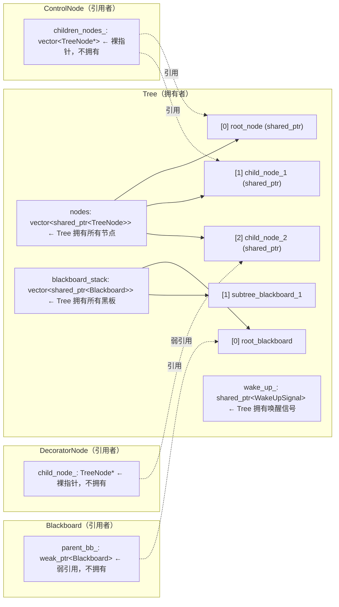
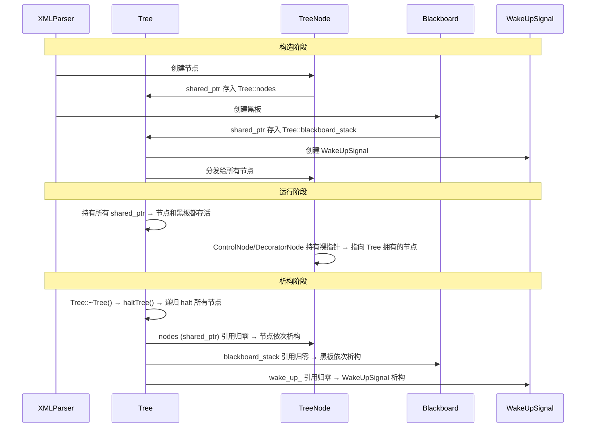

## 1. 内存所有权模型

### 1.1 所有权关系图




### 1.2 为什么用裸指针而非 shared_ptr

**ControlNode::children_nodes_ 使用 `vector<TreeNode*>`**：
- 子节点的所有权由 `Tree::nodes` 管理
- ControlNode 只是**引用**子节点，不需要拥有
- 避免 `shared_ptr` 的引用计数开销（每次 tick 都涉及指针传递）
- 树是有向结构，不存在循环引用风险

**DecoratorNode::child_node_ 使用 `TreeNode*`**：
- 同理，装饰节点只是引用子节点

**Blackboard::parent_bb_ 使用 `weak_ptr`**：
- 黑板栈中 `shared_ptr` 保持黑板存活
- 子黑板引用父黑板用 `weak_ptr`，防止循环引用
- `storage_` 中的 `shared_ptr<Entry>` 可能指向父黑板的 Entry

### 1.3 生命周期顺序



### 1.4 悬挂指针风险

裸指针的有效性依赖于 **Tree 的生命周期覆盖所有节点的使用期**。以下情况可能导致悬挂指针：

```cpp
// 危险：节点引用了已销毁的树
TreeNode* leaked_node;
{
    auto tree = factory.createTreeFromText(xml);
    leaked_node = tree.rootNode()->children()[0];
}  // tree 析构，所有节点被销毁

leaked_node->executeTick();  // ❌ 悬挂指针！
```

控制节点（ControlNode，如 Sequence、Fallback）或装饰节点（DecoratorNode）在逻辑上是子节点的父辈，但它们之间不使用 shared_ptr 相互持有，而是使用裸指针（TreeNode*）去指向 Tree 内部拥有的节点。

如果父节点也用 shared_ptr 持有子节点，那么在复杂的嵌套子树中极易引发循环引用（Circular Dependency），导致内存无法释放。使用裸指针既安全（因为 Tree 保证了节点的存活），又极大地提高了指针跳转和 Tick 遍历的性能。


**解决方案**：始终通过 `Tree` 对象访问节点，不要持有裸指针逃逸 `Tree` 的作用域。


## 2.对象关系图

```mermaid
flowchart TD
    subgraph BehaviorTreeFactory["BehaviorTreeFactory"]
        F1["builders_: map&lt;string, NodeBuilder&gt;"]
        F2["manifests_: map&lt;string, TreeNodeManifest&gt;"]
        F3["builtin_IDs_: set&lt;string&gt;"]
        F4["parser_: shared_ptr&lt;XMLParser&gt;"]
        F5["createTreeFromText(xml)"]
        F6["createTreeFromFile(path)"]
        F7["registerNodeType&lt;T&gt;(ID) → builders_[ID] = builder"]
        F8["registerFromPlugin(path) → dlopen → func(*this)"]
    end
    
    subgraph Tree["Tree"]
        T1["nodes[0] → shared_ptr&lt;SequenceNode&gt;"]
        T2["nodes[1] → shared_ptr&lt;ActionA&gt;"]
        T3["nodes[2] → shared_ptr&lt;ActionB&gt;"]
        T4["nodes[3] → shared_ptr&lt;ActionC&gt;"]
        T5["children_[0], children_[1], children_[2]"]
        
        T6["blackboard_stack[0] → shared_ptr&lt;Blackboard&gt; (root)"]
        T7["blackboard_stack[1] → shared_ptr&lt;Blackboard&gt; (subtree)"]
        T8["parent_bb_: weak_ptr → [0]"]
        
        T9["wake_up_ → shared_ptr&lt;WakeUpSignal&gt;"]
        T10["每个 TreeNode 持有 wake_up_ 的 shared_ptr"]
        
        T11["tickRoot() → nodes[0]-&gt;executeTick()"]
        T12["sleep() → wake_up_-&gt;waitFor()"]
        T13["~Tree() → haltTree()"]
    end
    
    subgraph TreeNode_Internal["TreeNode 内部"]
        N1["name_: 'root_sequence'"]
        N2["uid_: 1 (全局唯一)"]
        N3["status_: IDLE / RUNNING / SUCCESS / FAILURE"]
        N4["state_mutex_: 保护 status_ 的读写"]
        N5["state_condition_variable_: waitValidStatus() 阻塞等待"]
        N6["state_change_signal_: Signal → Logger 订阅"]
        N7["config_:"]
        N8["  blackboard: shared_ptr&lt;Blackboard&gt;"]
        N9["  input_ports: map&lt;string, string&gt; (端口重映射)"]
        N10["  output_ports: map&lt;string, string&gt;"]
        N11["wake_up_: shared_ptr&lt;WakeUpSignal&gt;"]
        N12["pre_condition_callback_: 可选的前置回调"]
        N13["post_condition_callback_: 可选的后置回调"]
    end
    
    F5 --> T1
    T1 --> T2
    T1 --> T3
    T1 --> T4
    T5 --> T2
    T5 --> T3
    T5 --> T4
    T7 --> T8
    T8 --> T6
    T10 -- "每个 TreeNode 持有" --> N11
```


**BehaviorTreeFactory**：控制反转与插件机制工厂类（Factory）的核心职责是负责节点的注册与生命周期管理，避免了业务代码与具体节点类的强耦合：
- 类型擦除与依赖注入：builders_ 存储了所有节点的构造器（通常是 Lambda 表达式或函数指针）。当通过 XML 解析树结构时，工厂利用 manifests_（节点元数据）校验端口合法性，并通过 builders_ 动态实例化节点。
- 动态扩展性：registerFromPlugin 实现了 C++ 的动态库热插拔。工厂通过 dlopen 加载 .so/.dll 插件，调用约定好的导出函数并将自身指针 *this 传给插件，插件便能反向向工厂注册新的自定义节点。

**Tree 与 TreeNode 内存模型：谁拥有谁？**
- Tree 是绝对的所有者：行为树在运行时，所有的节点实例都平铺保存在 Tree 对象的 nodes（std::vector<std::shared_ptr<TreeNode>>）中。这意味着节点的生命周期由 Tree 统一管控，而不是由父节点去 new 子节点。
- 组合模式的引用：控制节点（如 SequenceNode）虽然逻辑上拥有子节点，但它的 children_ 数组内部实际存储的是裸指针（TreeNode*）。这种设计规避了循环引用（Circular Dependency），并保证了高效的寻址速度。

**Blackboard（黑板）的树状层级隔离机制**
- 局部变量隔离：当行为树调用一个子树时，为了防止子树的同名变量污染主树，系统会为子树单独开辟一个 blackboard_stack[1]。
- 弱引用链条：子树黑板持有一个指向父树黑板的弱指针 parent_bb_ (std::weak_ptr)。
- 端口重映射：当子节点读取数据时，它首先在当前子树黑板查找。如果节点配置了端口重映射（input_ports），则会顺着 parent_bb_ 指针向上追溯到父黑板查找。这完美模拟了编程语言中的作用域（Scope）和函数形参传递。

**异步控制与非阻塞休眠（WakeUpSignal 核心原理）** \
这是整个架构最关键的性能设计，做到高频 Tick 而不榨干 CPU：
- 共享信号量：在 Tree 初始化时，它会创建一个统一的 WakeUpSignal 实例，并且行为树中的每一个 TreeNode 都持有一个指向它的 std::shared_ptr。
- 条件变量阻塞：当树被 Tick 时，如果有异步节点（如 AsyncActionNode）返回了 RUNNING 状态，主线程不能盲目死循环，而是会调用 tree.sleep(10ms)。其底层是通过 wake_up_->waitFor(10ms) 让出 CPU 执行权。
- 状态变更即时唤醒：一旦后台的工作线程完成了任务，异步节点会触发 setStatus(SUCCESS)。在改变状态的同时，节点会立刻调用 wake_up_->emitStateChanged()，这会瞬间唤醒处于阻塞中的主线程，使其立刻跳过 10ms 的剩余休眠时间，进入下一轮 tickRoot()。

**状态切面与 Logger 观测者模式**
- 解耦的信号槽：TreeNode 内部维护了一个 state_change_signal_。
- 全方位监控：无论是标准的日志打印、实时可视化界面（如 Groot）、还是控制台调试器（Logger），都只需要充当**观察者（Observer）**订阅这个信号。一旦节点状态发生碰撞（如 RUNNING → SUCCESS），所有绑定的 Logger 回调会同步触发，从而在不干扰主行为逻辑的前提下完成数据统计和图像绘制。
