BehaviorTree.CPP 的首要设计目标来自 MOOD2Be 项目（RobMoSys 欧洲 Horizon2020 计划资助），其核心原则是：

> **将组件开发者（Component Developer）与行为设计者（Behavior Designer）的角色彻底分离。**

这意味着：
- **组件开发者**（C++ 工程师）负责实现可复用的 `TreeNode`——每个节点是一个自包含的构建块，有明确的输入/输出接口（端口），不依赖具体业务上下文。
- **行为设计者**（机器人工程师、游戏设计师）只需通过 XML 组合已有节点来编排行为，**完全不需要阅读或修改 C++ 代码**。
- 复杂行为通过**子树组合**构建，而非继承或硬编码。

这一原则直接驱动了以下所有设计决策：

| 设计决策 | 驱动力 |
|---------|--------|
| 端口系统（强类型 InputPort/OutputPort） | 让节点接口自描述，行为设计者无需读源码 |
| XML 树定义（运行时加载） | 行为可以在不重新编译的情况下修改 |
| 黑板作用域隔离 | 子树可独立复用，不产生命名冲突 |
| 插件系统 | 节点库可独立分发，无需源码 |
| TreeNodesModel XML 段 | Groot 可视化工具可自动发现节点接口 |


## 1.为什么选择行为树而非状态机

有限状态机（FSM）在简单场景下直观，但随着状态数量增长会遇到**状态爆炸问题**：

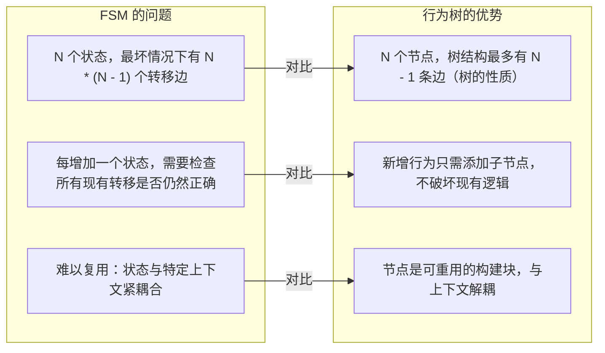

具体而言，行为树解决了 FSM 的三个痛点：

**1. 可扩展性**：在 FSM 中添加"如果 A 失败则尝试 B，如果 B 也失败则尝试 C"需要 O(N²) 个转移；在行为树中只需一个 Fallback 节点。

**2. 可读性**：行为树的层次结构直接映射到任务的层次分解——"做 X，然后做 Y，如果失败则做 Z"直接对应树的形状。

**3. 并发与响应性**：FSM 天然是串行的；行为树的 `ParallelNode` 和 `ReactiveSequence` 天然支持并发执行和条件中断，无需额外的状态机并发状态。

## 2.为什么 tick 返回状态而非 void
行为树与事件驱动系统的关键区别：

```cpp
// 行为树：tick 返回状态，父节点据此决策
NodeStatus status = child->executeTick();  // SUCCESS/FAILURE/RUNNING

// 事件驱动：触发后不关心结果，靠回调处理
child->trigger();  // 然后等待回调...
```

**设计意图**：返回值让控制流**显式**且**可组合**。Sequence 节点看到 FAILURE 就中断，Fallback 节点看到 SUCCESS 就停止——父节点的控制逻辑完全由子节点返回值驱动，没有隐藏的状态。

`RUNNING` 状态的引入是为了支持**异步操作**：当一个动作需要多帧才能完成时，它返回 RUNNING 告诉父节点"我还在工作，下次再来问我"，这样树可以每帧 tick 一次，实现非阻塞的协作式调度。

## 3.为什么有 executeTick() 和 tick() 两个方法

这是一个**模板方法模式**（Template Method Pattern）的应用：

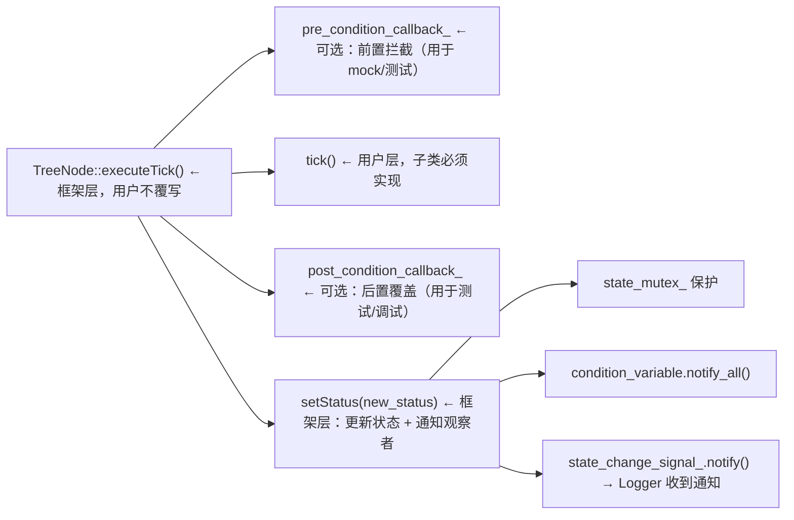

**设计意图**：
- `tick()` 是用户唯一需要关心的——返回业务结果即可
- `executeTick()` 负责所有"脏活"：状态管理、线程安全、观察者通知、回调钩子
- `pre/post_condition_callback_` 允许在不修改节点代码的情况下注入测试桩或调试逻辑
- `setStatus()` 是唯一的状态写入点，确保状态变化总是触发通知


## 4.为什么用黑板而不是直接传参
**问题**：如果节点直接持有其他节点的指针来传递数据，节点之间就会形成紧耦合，无法独立复用。

**解决方案**：黑板是一个**共享的键值存储**，节点通过端口名（而非直接引用）读写数据：

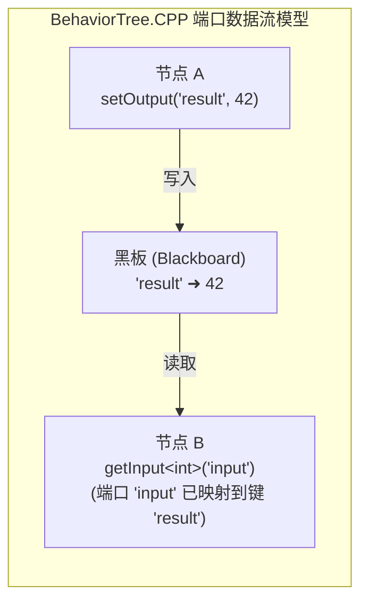

**设计意图**：
- 节点不知道彼此的存在——只知道自己的端口名
- 端口连接关系在 XML 中声明，不在 C++ 中硬编码
- 同一个节点可以在不同的树中复用，连接到不同的数据源


## 5.为什么子树需要黑板作用域隔离
**问题**：如果所有节点共享同一个黑板，大型树中会出现"命名污染"——不同子树使用相同的键名会互相覆盖。

**解决方案**：每个子树有自己的黑板作用域，通过**端口重映射**与父黑板通信：

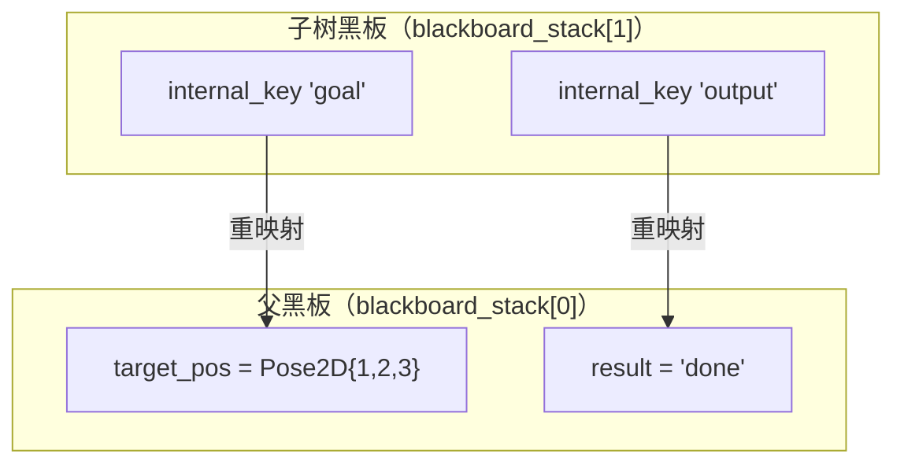

**设计意图**：
- 子树内部使用**局部命名**，不担心与外部冲突
- 子树可以独立测试——不需要父黑板存在
- 同一个子树可以在多个父树中复用，每次映射到不同的键
- `enableAutoRemapping(true)` 允许同名键自动穿透，简化简单场景


## 6.为什么 XML 而不是 C++ 硬编码树

**问题**：如果用 C++ 代码构建树：
```cpp
// C++ 硬编码 — 修改行为需要重新编译
auto seq = std::make_shared<SequenceNode>("root");
seq->addChild(std::make_shared<CheckBattery>("battery"));
seq->addChild(std::make_shared<MoveBase>("move"));
```

每次调整行为逻辑都需要重新编译、重新部署。对于机器人应用，这意味着每次修改任务逻辑都要走完整的编译-部署-测试流程。

**XML 方案的优势**：
- **运行时加载**：修改 XML 后只需重新加载文件，不需要重新编译
- **可视化编辑**：Groot 等工具可以直接编辑 XML，非程序员也能参与行为设计
- **版本控制友好**：XML 是文本格式，diff 清晰
- **角色分离**：C++ 工程师写节点，行为设计者写 XML

**代价**：XML 解析有运行时开销（但只在树创建时发生一次，不影响 tick 性能）。

## 7.为什么需要三种异步模式
三种异步节点对应三种不同的使用场景，不是冗余设计：


**StatefulActionNode**
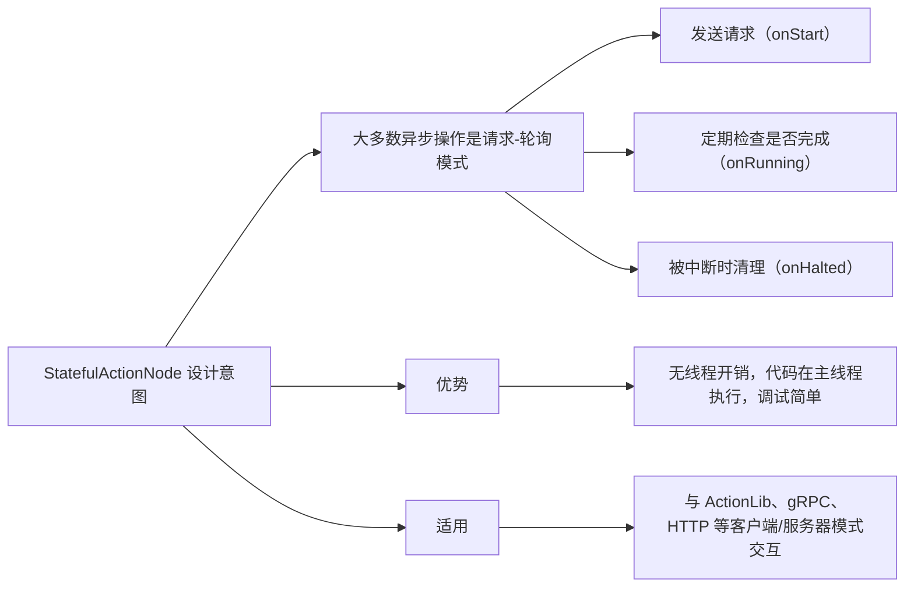

**CoroActionNode（协程，特定场景）**
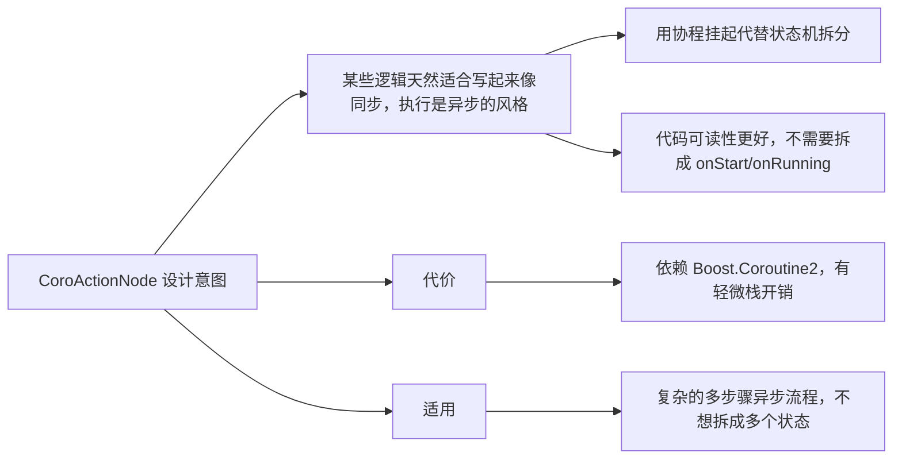

**AsyncActionNode（线程，遗留兼容）**
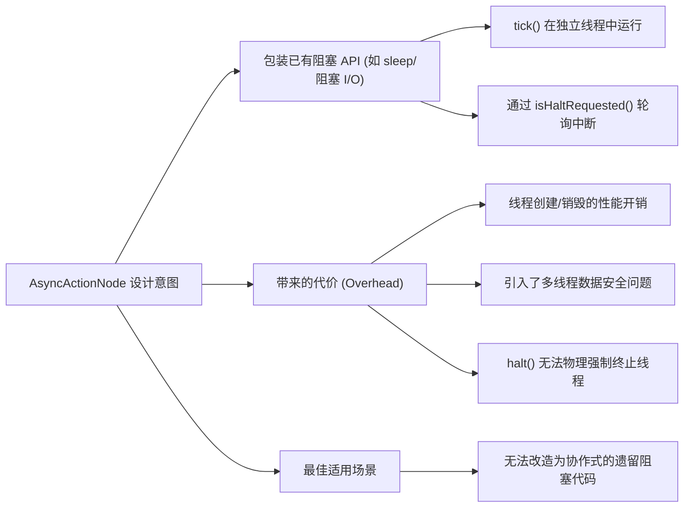

## 8.为什么用观察者模式做日志
**问题**：如果在每个节点的 `tick()` 里写日志，会污染业务逻辑，且难以统一格式。

**解决方案**：`Signal<T>` + `StatusChangeLogger`：

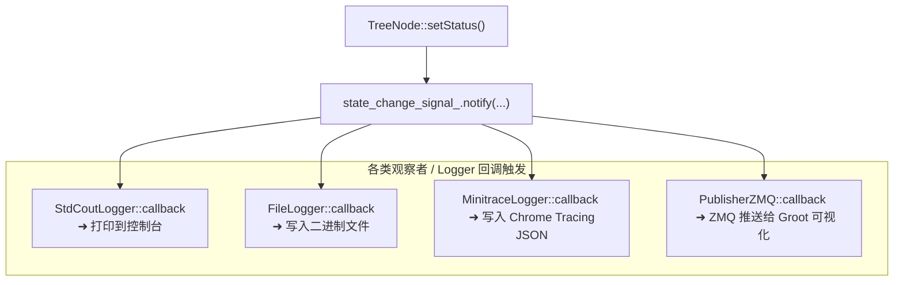

**设计意图**：
- **零侵入**：节点代码完全不知道日志的存在
- **可插拔**：添加/移除日志器只需创建/销毁对象
- **RAII 生命周期**：Logger 析构时自动取消订阅（`shared_ptr<CallableFunction>` 的 weak_ptr 机制）
- **多日志器并存**：可以同时开控制台日志和文件日志，互不影响

## 9.为什么 Any 用三种基础类型而非 std::variant
`Any` 类没有使用 `std::variant<int, double, string, ...>` 或 `std::any`，而是将所有数值统一存储为三种基础类型：

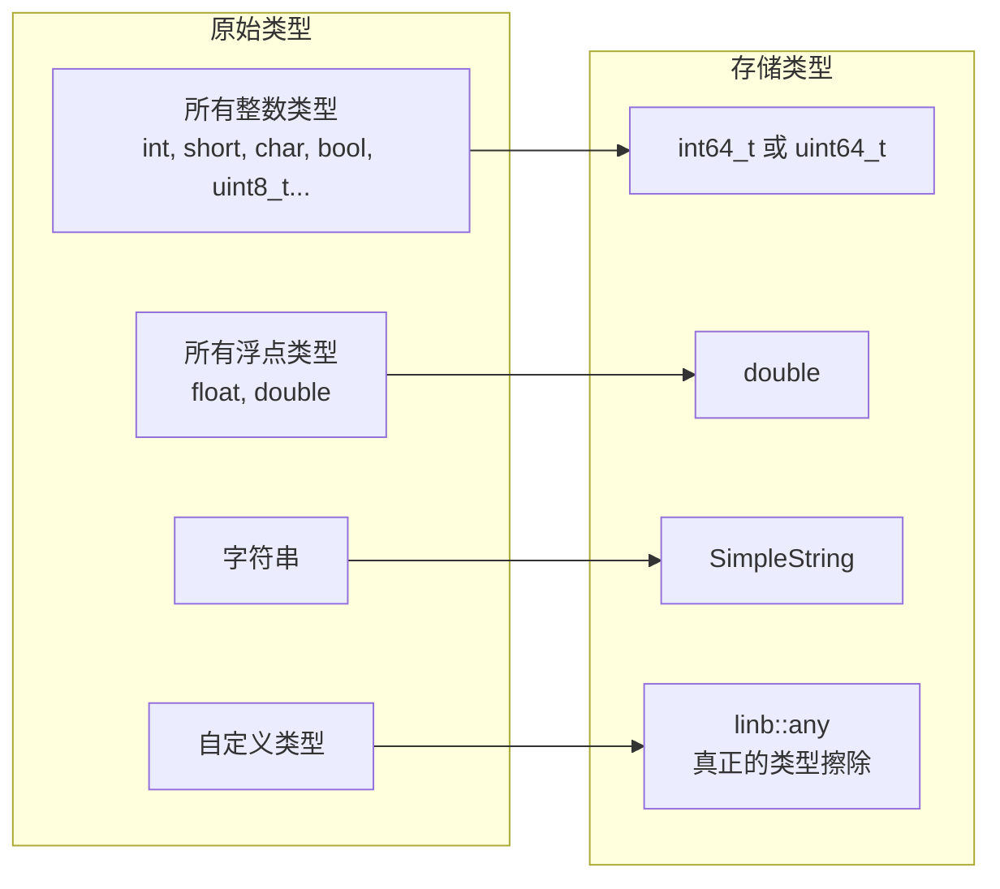
**设计意图**：
- **减少类型变体**：如果存储原始类型，`int` 和 `int32_t` 是不同类型，`float` 和 `double` 也是，会导致大量无意义的类型不匹配错误
- **安全的数值转换**：`convertNumber<Src, Dst>()` 在转换时检查溢出和精度损失，而不是静默截断
- **`_original_type` 保留原始类型信息**：用于类型检查和错误提示，让用户看到他们实际声明的类型名

## 10.为什么用插件系统
**问题**：大型机器人系统通常由多个团队开发不同的功能模块。如果所有节点都编译进主程序，任何节点的修改都需要重新编译整个程序。

**解决方案**：`registerFromPlugin()` 动态加载共享库：

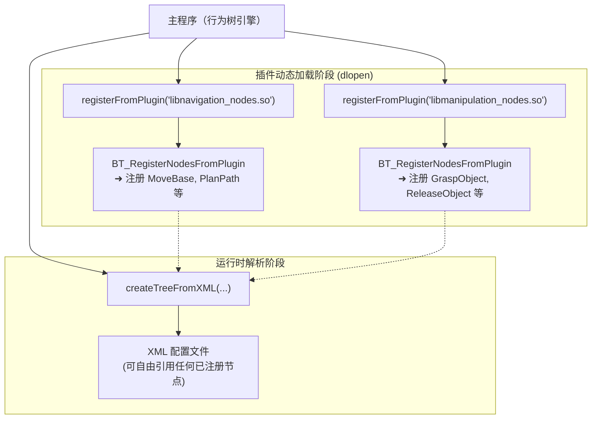

**设计意图**：
- **独立编译**：节点库可以独立编译和版本管理
- **运行时发现**：主程序不需要知道节点的实现细节
- **`extern "C"` 导出**：避免 C++ 名称修饰导致的链接问题
- **`RTLD_LOCAL`**：防止不同插件之间的符号冲突

## 11.为什么 ControlNode 存裸指针而非 shared_ptr
```cpp
class ControlNode : public TreeNode
{
    std::vector<TreeNode*> children_nodes_;  // 裸指针，不是 shared_ptr
};
```

**设计意图**：
- **所有权清晰**：所有节点的生命周期由 `Tree::nodes`（`vector<shared_ptr<TreeNode>>`）统一管理
- **避免循环引用**：树是有向无环图，子节点不需要持有父节点的引用
- **性能**：`tick()` 是高频调用，裸指针没有引用计数的原子操作开销
- **约束**：`ControlNode` 和 `DecoratorNode` 只是**引用**子节点，不负责其生命周期——这由 `Tree` 对象统一管理

这意味着：**`Tree` 对象销毁时，所有节点一起销毁。不存在"节点比树活得更长"的情况。**

## 11.为什么 SyncActionNode 禁止返回 RUNNING
```cpp
NodeStatus SyncActionNode::executeTick()
{
    auto stat = ActionNodeBase::executeTick();
    if (stat == NodeStatus::RUNNING)
    {
        throw LogicError("SyncActionNode MUST never return RUNNING");
    }
    return stat;
}
```

**设计意图**：这是一个**契约编程**（Design by Contract）的体现：
- `SyncActionNode` 的语义是"同步动作——调用即完成"
- 如果允许返回 RUNNING，控制节点的 `while` 循环会变成忙等，破坏整个树的调度
- 在 `executeTick()` 层面检查（而非 `tick()`），即使用户忘记遵守契约，框架也会立即报错而非产生隐蔽 bug
- 这迫使开发者在需要异步行为时**显式选择** `StatefulActionNode` 或 `AsyncActionNode`

## 12.响应式节点的设计动机
**普通 Sequence 的问题**：
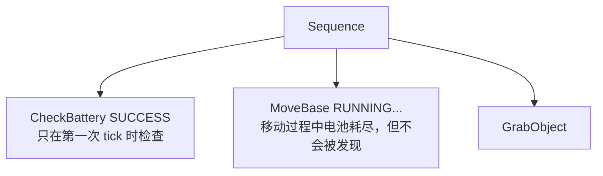

**ReactiveSequence 的解决方案**：
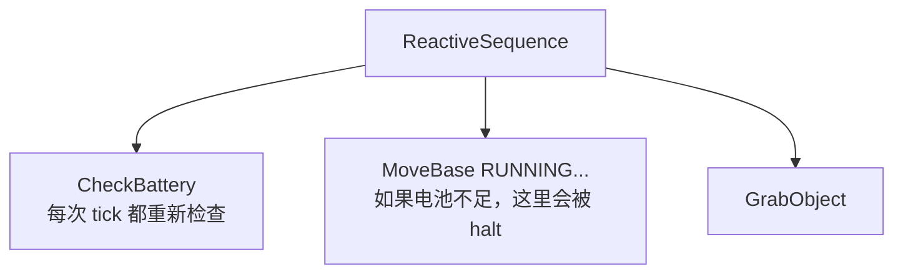

**设计意图**：真实世界的机器人需要在执行动作的同时**持续监控**安全条件。ReactiveSequence 让条件检查成为树结构的一部分，而不是嵌入在每个动作内部。

这是行为树相比 FSM 的核心优势之一：**响应性行为是架构级别的，而非代码级别的**。

## 13.halt 传播的契约设计
halt 不是简单的"停止"，而是一个有严格语义的**协议**：

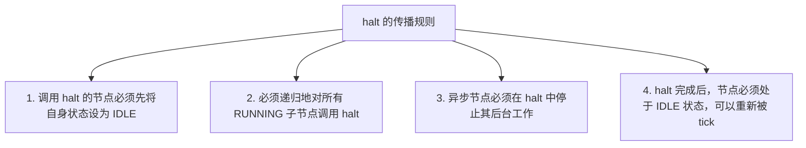

**ControlNode::halt() 的默认实现**：
```cpp
void ControlNode::halt()
{
    resetChildren();  // halt + resetStatus 所有子节点
}

void ControlNode::resetChildren()
{
    for (auto child : children_nodes_)
    {
        if (child->status() == NodeStatus::RUNNING)
            child->halt();          // 先中断正在运行的子节点
        child->resetStatus();       // 再重置为 IDLE
    }
}
```

**设计意图**：
- **资源安全**：异步节点可以在 `onHalted()` 中释放资源、取消请求
- **状态一致性**：halt 后节点回到 IDLE，可以被重新 tick，没有"半完成"状态
- **传播正确性**：从根到叶的递归 halt 确保所有后台工作都被清理
- **Tree::haltTree() 的双重保险**：先从根递归 halt，再遍历所有节点强制重置，防止有节点漏掉

## 14.Signal 的 weak_ptr 自动清理设计
```cpp
class Signal
{
    std::vector<std::weak_ptr<CallableFunction>> subscribers_;

    void notify(Args... args)
    {
        for (size_t i = 0; i < subscribers_.size();)
        {
            if (auto sub = subscribers_[i].lock())  // weak_ptr → shared_ptr
            {
                (*sub)(args...);
                i++;
            }
            else
            {
                subscribers_.erase(subscribers_.begin() + i);  // 自动清理已失效的订阅
            }
        }
    }
};
```

**设计意图**：
- Logger 析构时，其 `shared_ptr<CallableFunction>` 被销毁
- 下次 `notify()` 时，对应的 `weak_ptr` 自动检测到失效并移除
- **不需要显式的 `unsubscribe()` 调用**——RAII 自动管理
- 避免了悬挂回调（dangling callback）导致的 use-after-free

## **MOOD2Be 与 RobMoSys 的工程背景**
BehaviorTree.CPP 最初由 Eurecat（西班牙）与意大利技术研究院（IIT）联合开发，是 **MOOD2Be**（Model-Driven Development for Robotics）项目的核心组件。该项目受欧洲 Horizon2020 的 RobMoSys 计划支持，目标是：

1. **模型驱动**：行为树本身就是一个"模型"——XML 文件描述行为，C++ 实现组件，两者独立演进
2. **组件市场**：节点作为可复用组件，可以在不同项目间共享（通过插件系统）
3. **工具链集成**：Groot 可视化工具、TreeNodesModel XML 段都是为了支持工具链的自动生成和可视化编辑
4. **ROS 生态兼容**：库设计上考虑了与 ROS1/ROS2 的集成（ActionLib/Action 客户端），这也是为什么 `StatefulActionNode` 的请求/应答模式与 ROS Action 语义高度一致

理解这个背景有助于理解为什么库的设计倾向于**解耦**和**可组合性**，而不是追求最简洁的实现。

--- 

## **参考资源**
>
> - 官方文档：https://www.behaviortree.dev/
> - 社区论坛：https://discourse.behaviortree.dev/
> - GitHub：https://github.com/BehaviorTree/BehaviorTree.CPP
> - Groot 编辑器：https://github.com/BehaviorTree/Groot
> - 书籍：《Behavior Trees in Robotics and AI》(https://arxiv.org/abs/1709.00084)

---

至此，BehaviorTreeCpp 基本的一些原理也差不多了，主要是在工作中用到，有些时候无法理解其一些内部原理，因此做了一些了解,主要目的是学习一些先进的设计思路与方法，希望在工作中可以运用起来