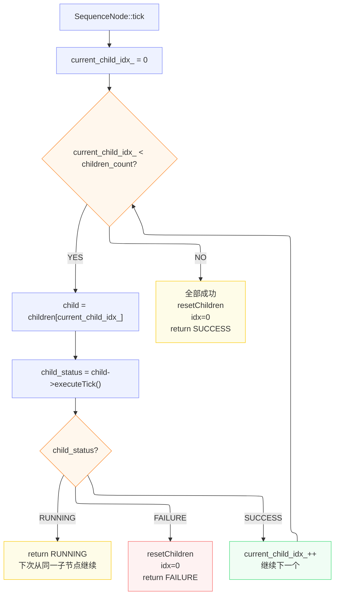

## 1.ControlNode 基类


```cpp
// control_node.h
class ControlNode : public TreeNode
{
protected:
    /// 子节点列表（按添加顺序排列）。
    ///
    /// 设计说明：
    ///   - 使用裸指针而非 unique_ptr，因为节点的所有权由 Tree 对象统一管理。
    ///     ControlNode 只是"引用"其子节点，不负责其生命周期。
    ///   - 使用 vector 而非 list/deque，因为子节点数量通常不大，
    ///     且需要随机访问（如 haltChild(i)）。
    std::vector<TreeNode*> children_nodes_;   // 子节点指针列表

public:
    /// @param name   节点实例名称
    /// @param config 节点配置（黑板指针 + 端口重映射）
    ControlNode(const std::string& name, const NodeConfiguration& config);

    virtual ~ControlNode() override = default;

    /// 向子节点列表末尾追加一个子节点。
    /// 由 XMLParser 解析 XML 时或手动构建行为树时调用。
    /// @param child 要添加的子节点指针（所有权不归本节点）
    void addChild(TreeNode* child);

    /// 获取子节点数量。
    /// @return 当前子节点的个数
    size_t childrenCount() const;

    /// 获取子节点列表的只读引用。
    /// @return 子节点指针的 const vector 引用
    const std::vector<TreeNode*>& children() const;

    /// 通过索引获取指定子节点（带越界检查）。
    /// @param index 子节点索引（0-based）
    /// @return 指向子节点的 const 指针
    /// @throws std::out_of_range 若 index 超出范围
    const TreeNode* child(size_t index) const
    {
        return children().at(index);
    }

    /// 中断执行：将所有子节点重置为 IDLE 状态。
    /// 对于仍处于 RUNNING 的子节点，会先发送 halt() 信号使其停止，
    /// 然后将状态重置为 IDLE。
    virtual void halt() override;

    /// 等同于 resetChildren()，将所有子节点状态重置为 IDLE。
    /// halt 时会先对 RUNNING 子节点发送 halt 信号。
    void haltChildren();

    /// @deprecated 已废弃：请改用 haltChildren() 或 haltChild(i)。
    /// 此方法用于中断从 first 索引开始的子节点，但由于接口设计不够清晰，
    /// 已被标记为废弃。
    [[deprecated("deprecated: please use explicitly haltChildren() or haltChild(i)")]] void
    haltChildren(size_t first);

    /// 中断并重置索引为 i 的子节点。
    /// 若子节点处于 RUNNING 状态，先发送 halt() 信号，然后重置为 IDLE。
    /// @param i 子节点索引（0-based）
    void haltChild(size_t i);

    /// 返回 NodeType::CONTROL，用于运行时类型识别。
    /// final 关键字确保所有控制子类的类型标识一致。
    virtual NodeType type() const override final
    {
        return NodeType::CONTROL;
    }

    /// 将所有子节点状态重置为 IDLE。
    /// 对仍处于 RUNNING 状态的子节点，同时发送 halt() 信号使其停止。
    /// 通常在控制节点自身被 halt 或需要重新开始执行时调用。
    void resetChildren();
};
```
**设计要点**：
- `children_nodes_` 存储裸指针，不负责子节点的生命周期（由 `Tree` 统一管理）
- `halt()` 递归传播：先对 RUNNING 子节点调用 `halt()`，再 `resetStatus()` 到 IDLE


**resetChildren()**
1. 遍历所有子节点，先对处于 RUNNING 状态的子节点发送 halt() 中断信号，
2. 再统一把它们的状态重置为 IDLE；
3. 这一步必须保证：被中断的子节点能够清理自己的运行时资源（线程、协程、计时器等）。

```cpp
void ControlNode::resetChildren()
{
  for (auto child: children_nodes_)
    {
        // 先对仍在 RUNNING 的子节点发送中断信号
        if (child->status() == NodeStatus::RUNNING)
        {
            child->halt();
        }
        // 无论原来是什么状态，都重置为 IDLE
        child->resetStatus();
    }
}
```


**haltChild(i)**
- 中断单个子节点：仅当该子节点处于 RUNNING 时才调用 halt()，随后重置为 IDLE；
- Sequence 子类在找到 SUCCESS 子节点后，常调用此方法中断后续子节点。
 ```cpp
void ControlNode::haltChild(size_t i)
{
  auto child = children_nodes_[i];
  if (child->status() == NodeStatus::RUNNING)
  {
    child->halt();
  }
  child->resetStatus();
}
```

## 2.SequenceNode：顺序执行的实现

```cpp
// sequence_node.cpp
NodeStatus SequenceNode::tick()
{
    const size_t children_count = children_nodes_.size();

    // 将自身状态设为 RUNNING，表示正在执行中
    setStatus(NodeStatus::RUNNING);

    // 从上次执行到的位置开始，依次 tick 每个子节点
    while (current_child_idx_ < children_count)
    {
        TreeNode* current_child_node = children_nodes_[current_child_idx_];
        const NodeStatus child_status = current_child_node->executeTick();

        switch (child_status)
        {
            // 子节点仍在运行中：Sequence 也返回 RUNNING，保持当前索引不变
            case NodeStatus::RUNNING: {
                return child_status;     // 子节点运行中，返回 RUNNING
            }
            case NodeStatus::FAILURE: {
                resetChildren();         // 重置所有子节点
                current_child_idx_ = 0;  // 回到起点
                return child_status;     // 返回 FAILURE
            }
            case NodeStatus::SUCCESS: {
                current_child_idx_++;    // 推进到下一个子节点
            }
            break;

            // 子节点不应返回 IDLE（这是内部状态，不应暴露给父节点）
            case NodeStatus::IDLE: {
                throw LogicError("A child node must never return IDLE");
            }
        }
    }

    // 所有子节点都返回了 SUCCESS，循环正常结束
    if (current_child_idx_ == children_count)
    {
        resetChildren();
        current_child_idx_ = 0;
    }
    return NodeStatus::SUCCESS;
}
```

**执行流程图**：


**关键细节**：
- `current_child_idx_` 是成员变量，跨 tick 持久化
- RUNNING 时直接返回，**不重置索引**，下次 tick 从同一子节点继续
- FAILURE 时调用 `resetChildren()` 重置所有子节点（包括已成功执行的）
- SUCCESS 时索引递增，while 循环继续检查下一个子节点

## 3.FallbackNode：回退执行
```cpp
// fallback_node.cpp
NodeStatus FallbackNode::tick()
{
    const size_t children_count = children_nodes_.size();
    setStatus(NodeStatus::RUNNING);

    while (current_child_idx_ < children_count)
    {
        TreeNode* current_child_node = children_nodes_[current_child_idx_];
        const NodeStatus child_status = current_child_node->executeTick();

        switch (child_status)
        {
            case NodeStatus::RUNNING:
                return child_status;

            case NodeStatus::SUCCESS:         // 与 Sequence 相反！
                resetChildren();
                current_child_idx_ = 0;
                return child_status;          // 任一成功即返回

            case NodeStatus::FAILURE:         // 与 Sequence 相反！
                current_child_idx_++;         // 失败则尝试下一个
                break;
        }
    }

    if (current_child_idx_ == children_count)
    {
        resetChildren();
        current_child_idx_ = 0;
    }
    return NodeStatus::FAILURE;  // 全部失败
}
```

**对比 Sequence 和 Fallback**：两者结构完全对称，只是 SUCCESS/FAILURE 的处理逻辑互换。

## 4.ReactiveSequence：响应式序列

```cpp
// reactive_sequence.cpp
NodeStatus ReactiveSequence::tick()
{
    size_t success_count = 0;
    // 如果节点之前处于 IDLE 状态，重置 running_child_ 索引
    if (status() == NodeStatus::IDLE)
    {
        running_child_ = -1;
    }
    // 将自身状态设为 RUNNING
    setStatus(NodeStatus::RUNNING);

    // 关键区别：每次 tick 都从第一个子节点开始遍历
    for (size_t index = 0; index < childrenCount(); index++)
    {
        TreeNode* current_child_node = children_nodes_[index];
        const NodeStatus child_status = current_child_node->executeTick();

        switch (child_status)
        {
            case NodeStatus::RUNNING: {
                // 将其他子节点 halt，使它们回到 IDLE 状态
                // 这样下次 tick 时，前面的子节点会从干净状态重新开始
                for (size_t i = 0; i < childrenCount(); i++)
                {
                    if (i != index)
                    {
                        haltChild(i);
                    }
                }
                // 检查是否有多个子节点同时返回 RUNNING
                if (running_child_ == -1)
                {
                    running_child_ = int(index);
                }
                // 如果之前已有另一个子节点在 RUNNING，且启用了异常检测，则抛出错误
                else if (throw_if_multiple_running && running_child_ != int(index))
                {
                    throw LogicError("only a single child can return RUNNING");
                }
                return NodeStatus::RUNNING;
            }
            // 子节点返回 FAILURE：重置所有子节点，立即返回 FAILURE
            // 与普通 Sequence 不同，这里不需要关心索引，因为每次都从头开始
            case NodeStatus::FAILURE: {
                resetChildren();
                return NodeStatus::FAILURE;
            }

            // 子节点返回 SUCCESS：累加成功计数，继续执行下一个子节点
            case NodeStatus::SUCCESS: {
                success_count++;
            }
            break;
        }
    }

     // 所有子节点都返回了 SUCCESS
    if (success_count == childrenCount())
    {
        resetChildren();
        return NodeStatus::SUCCESS;
    }

    // 理论上不应该走到这里（除非有逻辑错误）
    return NodeStatus::RUNNING;
}
```

**与普通 Sequence 的核心区别**：

| 维度 | SequenceNode | ReactiveSequence |
|------|-------------|-----------------|
| 遍历方式 | `while` + `current_child_idx_` | `for` 从 0 开始 |
| RUNNING 处理 | 记住索引，下次从 RUNNING 子节点继续 | 每次从头开始，非 RUNNING 子节点被 halt |
| 条件检查 | 已成功的条件不会重新检查 | 每次 tick 都重新检查所有条件 |
| 多 RUNNING | 不涉及 | 默认只允许一个 RUNNING 子节点 |


## 5.ParallelNode：并发执行

tick()：执行并行节点的核心逻辑
流程：
  1. 如果从端口读取参数，先获取 success_threshold_ 和 failure_threshold_
  2. 检查子节点数量是否足够满足阈值要求
  3. 遍历所有子节点：
     - 已在 skip_list_ 中的子节点直接读取状态，不重复执行
     - 未在 skip_list_ 中的子节点执行 executeTick()
  4. 统计成功/失败数量，达到任一阈值则立即返回对应结果
  5. 遍历完所有子节点后，若两个阈值都未达到，返回 RUNNING

```cpp
// parallel_node.cpp
NodeStatus ParallelNode::tick()
{
      // 如果需要从端口读取阈值参数，先获取
    if (read_parameter_from_ports_)
    {
        if (!getInput(THRESHOLD_SUCCESS, success_threshold_))
        {
            throw RuntimeError("Missing parameter [", THRESHOLD_SUCCESS, "] in ParallelNode");
        }

        if (!getInput(THRESHOLD_FAILURE, failure_threshold_))
        {
            throw RuntimeError("Missing parameter [", THRESHOLD_FAILURE, "] in ParallelNode");
        }
    }

    // 已成功和已失败的子节点计数器
    size_t success_count = 0;
    size_t failure_count = 0;
    const size_t children_count = children_nodes_.size();

    // 遍历所有子节点，逐一执行或读取状态
    for (unsigned int i = 0; i < children_count; i++)
    {
        TreeNode* child_node = children_nodes_[i];

        // 检查当前子节点是否已经完成过（在 skip_list_ 中）
        bool in_skip_list = (skip_list_.count(i) != 0);

        NodeStatus child_status;
        if (in_skip_list)
        {
            child_status = child_node->status();  // 已完成的子节点不再 tick
        }
        else
        {
            // 未完成的子节点：执行 tick
            child_status = child_node->executeTick();
        }

        switch (child_status)
        {
            // 子节点成功：加入跳过列表，累加成功计数
            case NodeStatus::SUCCESS:
                skip_list_.insert(i);    // 加入跳过列表
                success_count++;

                // 成功数量达到阈值：清空跳过列表，重置所有子节点，返回 SUCCESS
                if (success_count == successThreshold())
                {
                    skip_list_.clear();
                    resetChildren();
                    return NodeStatus::SUCCESS;
                }
                break;

            // 子节点失败：加入跳过列表，累加失败计数
            case NodeStatus::FAILURE:
                skip_list_.insert(i);
                failure_count++;
                // 失败数超过容限，或失败数已达阈值
                if ((failure_count > children_count - successThreshold()) ||
                    (failure_count == failureThreshold()))
                {
                    skip_list_.clear();
                    resetChildren();
                    return NodeStatus::FAILURE;
                }
                break;

            // 子节点仍在运行中：不做额外处理，继续遍历其他子节点
            case NodeStatus::RUNNING:
                break;  // 继续 tick 下一个
        }
    }

    // 所有子节点遍历完毕，但成功和失败阈值都未达到，返回 RUNNING
    return NodeStatus::RUNNING;
}
```

**设计要点**：
- `skip_list_`：记录已完成的子节点索引，避免重复 tick
- 阈值判定：成功数达到 `success_threshold_` 就成功，失败数达到 `failure_threshold_` 就失败
- 负数阈值：`-1` 表示"所有子节点"，通过 `children_count + threshold + 1` 换算

