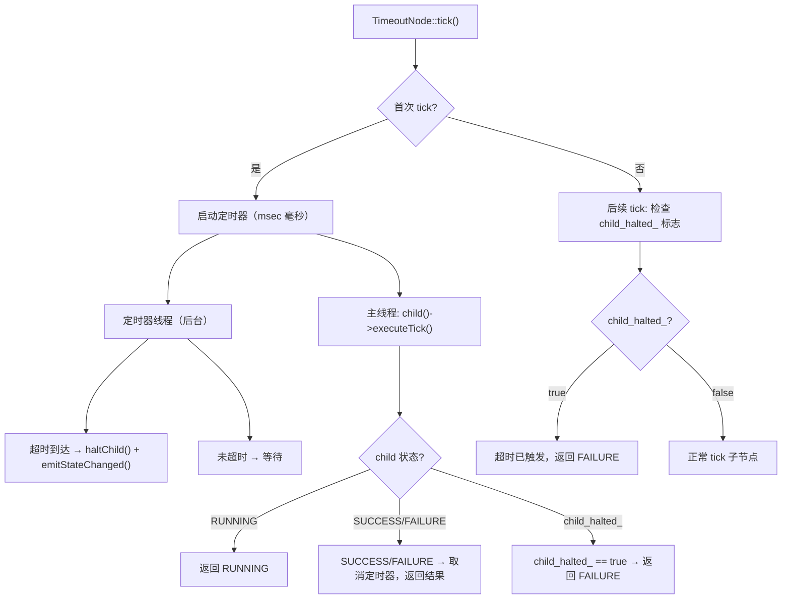

## 1.DecoratorNode 基类
```cpp
/// DecoratorNode 是所有装饰节点的基类，恰好持有一个子节点，
/// 可在子节点 tick 前后对其返回状态进行变换（取反、重试、超时等）。
class DecoratorNode : public TreeNode
{
    TreeNode* child_node_;     // 恰好一个子节点

    /// @param name   节点实例名称
    /// @param config 节点配置（黑板指针 + 端口重映射）
    DecoratorNode(const std::string& name, const NodeConfiguration& config);

    virtual ~DecoratorNode() override = default;

    /// 设置唯一子节点（由 XMLParser 或手动构建时调用，只能调用一次）。
    /// @param child 子节点指针（所有权不归本节点）
    void setChild(TreeNode* child)
    {
        if (child_node_)   // 严格限制：只能有一个子节点
            throw BehaviorTreeException("Decorator already has a child");
        child_node_ = child;
    }

    /// 获取子节点的 const 指针。
    /// @return 指向唯一子节点的 const 指针
    const TreeNode* child() const;

    /// 获取子节点的可变指针（仅框架内部使用）。
    /// @return 指向唯一子节点的可变指针
    TreeNode* child();

    /// 中断执行：将子节点重置为 IDLE。
    /// 同时对 RUNNING 子节点发 halt 信号使其停止。
    virtual void halt() override;

    /// 等同于 resetChild()，halt 子节点并重置其状态。
    void haltChild();

    /// 返回 NodeType::DECORATOR，用于运行时类型识别。
    virtual NodeType type() const override
    {
        return NodeType::DECORATOR;
    }

    /// 覆写基类 executeTick()：在调用子节点的 executeTick() 前后执行装饰逻辑。
    /// 子类通常不需要覆写此方法，而是覆写 tick() 来实现装饰变换。
    /// @return 经过装饰变换后的节点状态
    NodeStatus executeTick() override;

    /// 将子节点状态重置为 IDLE。
    /// 若子节点处于 RUNNING，先发 halt() 信号再重置。
    void resetChild();
};
```

关键设计：
1. 装饰节点只允许绑定一个子节点，重复调用 setChild() 会抛 BehaviorTreeException；
2. DecoratorNode::executeTick() 在调用基类 executeTick() 之后，会检查子节点是否已终止（SUCCESS / FAILURE），若是则自动重置子节点为 IDLE，保证下次 tick 时子节点能够重新开始；

## 2.DecoratorNode::executeTick 的覆写

```cpp
// decorator_node.cpp
NodeStatus DecoratorNode::executeTick()
{
    // 1. 调用基类的 executeTick()（执行 tick() 方法）
    NodeStatus status = TreeNode::executeTick();

    // 2. 自动重置已完成的子节点
    NodeStatus child_status = child()->status();
    if (child_status == NodeStatus::SUCCESS || child_status == NodeStatus::FAILURE)
    {
        child()->resetStatus();   // 子节点完成后自动重置为 IDLE
    }
    return status;
}
```

**这是装饰节点与控制节点的重要区别**：
- 控制节点手动管理子节点的重置（通过 `resetChildren()`）
- 装饰节点在 `executeTick()` 中**自动重置**已完成的子节点

## 3.halt 的传播

```cpp
void DecoratorNode::halt()
{
    resetChild();   // 先中断子节点，再重置
}

void DecoratorNode::resetChild()
{
    if (!child_node_) return;

    if (child_node_->status() == NodeStatus::RUNNING)
    {
        child_node_->halt();       // 先对 RUNNING 子节点发送中断
    }
    child_node_->resetStatus();    // 再重置为 IDLE
}
```

## 4.内置装饰节点实现示例

**InverterNode**（反转器）：
```cpp
NodeStatus InverterNode::tick()
{
    setStatus(NodeStatus::RUNNING);
    NodeStatus child_status = child()->executeTick();

    if (child_status == NodeStatus::SUCCESS)
        return NodeStatus::FAILURE;     // SUCCESS → FAILURE
    if (child_status == NodeStatus::FAILURE)
        return NodeStatus::SUCCESS;     // FAILURE → SUCCESS
    return NodeStatus::RUNNING;         // RUNNING 不变
}
```

**RetryNode**（重试）：
```cpp
// tick()：执行重试节点的核心逻辑
// 流程：在重试次数未耗尽的循环中
//   - 子节点 SUCCESS → 重置计数，返回 SUCCESS
//   - 子节点 FAILURE → 计数加一，重置子节点，继续循环
//   - 子节点 RUNNING → 返回 RUNNING
//   - 循环结束（达到最大次数）→ 返回 FAILURE
NodeStatus RetryNode::tick()
{
    // 如果需要从端口读取参数，先获取最大重试次数
    if (read_parameter_from_ports_)
    {
        if (!getInput(NUM_ATTEMPTS, max_attempts_))
        {
            throw RuntimeError("Missing parameter [", NUM_ATTEMPTS, "] in RetryNode");
        }
    }

    setStatus(NodeStatus::RUNNING);

    // 重试循环：try_count_ < max_attempts_ 时继续
    // max_attempts_ == -1 时为无限重试，直到子节点成功
    while (try_count_ < max_attempts_ || max_attempts_ == -1)
    {
        NodeStatus child_state = child_node_->executeTick();
        switch (child_state)
        {
            // 子节点成功：重置计数并返回 SUCCESS
            case NodeStatus::SUCCESS: {
                try_count_ = 0;
                resetChild();
                return (NodeStatus::SUCCESS);
            }

            // 子节点失败：计数器加一，重置子节点状态，继续下一次重试
            case NodeStatus::FAILURE: {
                try_count_++;
                resetChild();
            }
            break;

            // 子节点仍在运行：返回 RUNNING，等待下次 tick 继续
            case NodeStatus::RUNNING: {
                return NodeStatus::RUNNING;
            }

            // 子节点不应返回 IDLE
            default: {
                throw LogicError("A child node must never return IDLE");
            }
        }
    }

    // 达到最大重试次数仍未成功，返回 FAILURE
    try_count_ = 0;
    return NodeStatus::FAILURE;
}
```

**TimeoutNode 的内部机制**

TimeoutNode 使用独立的定时器线程实现超时中断：




## 5.自定义装饰节点

编写自定义装饰节点时，需要理解 `DecoratorNode` 的自动重置行为：

```cpp
// 自定义装饰器：仅当黑板中某个值为 true 时才执行子节点
class ConditionalGuard : public BT::DecoratorNode
{
public:
    ConditionalGuard(const std::string& name, const BT::NodeConfiguration& config)
      : BT::DecoratorNode(name, config) {}

    static BT::PortsList providedPorts()
    {
        return { BT::InputPort<std::string>("flag") };
    }

    BT::NodeStatus tick() override
    {
        std::string flag_key;
        if (!getInput("flag", flag_key))
            throw RuntimeError("missing 'flag' parameter");

        // 检查黑板中的值
        bool flag = false;
        config().blackboard->get(flag_key, flag);

        if (flag)
        {
            // 条件满足，执行子节点
            return child()->executeTick();
        }
        else
        {
            // 条件不满足，中断子节点并返回 FAILURE
            if (child()->status() == NodeStatus::RUNNING)
            {
                haltChild();
            }
            return NodeStatus::FAILURE;
        }
    }
};
```

**关键规则**：
- `executeTick()` 的基类实现会**自动重置**已完成的子节点（SUCCESS/FAILURE → IDLE）
- 只需关注 `tick()` 逻辑，不需要手动管理子节点状态
- `halt()` 的基类实现会调用 `resetChild()`，通常不需要覆写

自定义修饰节点在设计上采用了代理模式（Proxy Pattern）。
- 单子节点约束：普通的组合节点（如 Sequence/Selector）拥有一个 std::vector<Node*> 的子节点列表；而修饰节点基类（如 BT.CPP 中的 DecoratorNode）在底层通常只有一个明确的私有指针：Node* child_node_。
- 控制权包装：行为树的根节点在遍历树时，无法直接访问修饰节点内部的子节点。所有的 Tick 信号必须先到达修饰节点，由修饰节点决定是否、何时以及如何将 Tick 信号下发。

```
 父节点 Tick 信号 ──> [ 阶段一：前置过滤 ] (检查黑板条件/冷却时间)
                             │
                             ├─ 條件不满足 ──> 返回 FAILURE/SUCCESS (直接阻断)
                             └─ 条件满足   ──> [ 阶段二：派发并透传 ]
                                                       │
                                               child_->executeTick()
                                                       │
 [ 最终状态返回 ] <── [ 阶段三：后置改写 ] <───────────┘ (拿到子节点返回值)
                   (反转/计次重试/修改状态)
```