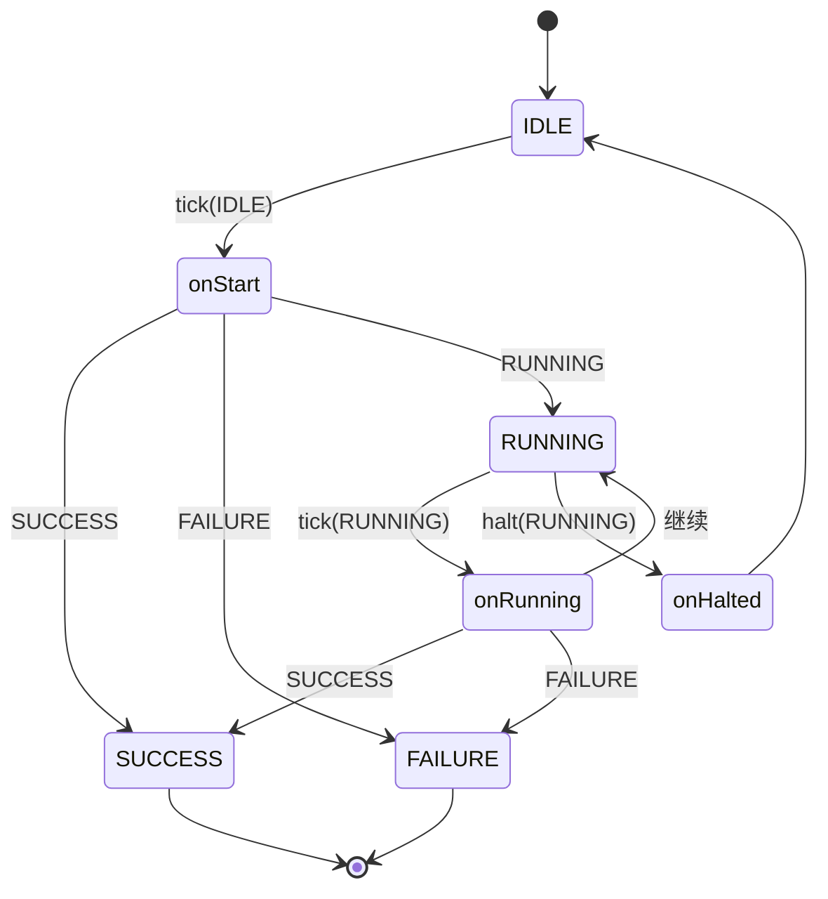
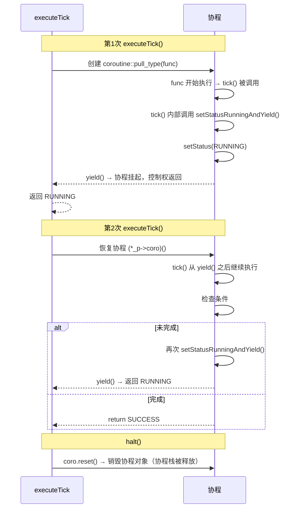

## 1.StatefulActionNode
```cpp
class StatefulActionNode : public ActionNodeBase
{
public:
    /// @param name   节点实例名称
    /// @param config 节点配置
    StatefulActionNode(const std::string& name, const NodeConfiguration& config) :
    ActionNodeBase(name, config)
    {}

    /// 内部状态机调度逻辑，不要覆写此方法。
    /// final 关键字确保状态机语义不被破坏。
    NodeStatus tick() override final;

    /// 内部 halt 调度逻辑，不要覆写此方法。
    /// 会自动调用 onHalted() 并重置状态。
    void halt() override final;

    /// 首次被 tick 时调用。
    /// 执行初始化操作（如发送异步请求、启动后台任务）。
    /// @return RUNNING 表示操作正在进行，后续 tick 将调用 onRunning()
    ///         SUCCESS/FAILURE 表示操作立即完成
    virtual NodeStatus onStart() = 0;

    /// RUNNING 状态下每次 tick 时调用。
    /// 执行轮询或增量计算（如检查异步操作结果）。
    /// @return RUNNING 表示操作仍在进行
    ///         SUCCESS/FAILURE 表示操作完成
    virtual NodeStatus onRunning() = 0;

    /// 当 halt() 被调用且节点处于 RUNNING 状态时调用。
    /// 执行清理操作（如取消请求、释放资源）。
    /// 调用后节点自动重置为 IDLE 状态。
    virtual void onHalted() = 0;
};
```


```cpp
NodeStatus StatefulActionNode::tick()
{
    const NodeStatus initial_status = status();

    // IDLE → 调用 onStart()，开始执行动作
    if (initial_status == NodeStatus::IDLE)
    {
        NodeStatus new_status = onStart();
    if (new_status == NodeStatus::IDLE)
    {
        throw std::logic_error("StatefulActionNode::onStart() must not return IDLE");
    }
    return new_status;
    }
    //------------------------------------------
    // RUNNING → 调用 onRunning()，继续轮询动作状态
    if (initial_status == NodeStatus::RUNNING)
    {
        NodeStatus new_status = onRunning();
        if (new_status == NodeStatus::IDLE)
        {
            throw std::logic_error("StatefulActionNode::onRunning() must not return "
                                    "IDLE");
        }
        return new_status;
    }
    //------------------------------------------
    return initial_status;
}
```

```cpp
void StatefulActionNode::halt()
{
  // 仅在 RUNNING 时调用 onHalted() 做清理
  if (status() == NodeStatus::RUNNING)
  {
    onHalted();
  }
}
```


**状态机**：


**注意**：`tick()` 和 `halt()` 都被标记为 `final`，用户**不能**覆写它们。用户只能实现 `onStart()`、`onRunning()`、`onHalted()` 三个虚函数。这是框架强制执行的调度逻辑。

## 2.AsyncActionNode：线程模式

```cpp
class AsyncActionNode : public ActionNodeBase
{
public:
    /// @param name   节点实例名称
    /// @param config 节点配置
    AsyncActionNode(const std::string& name, const NodeConfiguration& config) :
    ActionNodeBase(name, config)
    {}

    /// 检查是否已收到 halt 请求。
    /// 在 tick() 的循环中周期性调用此方法，以便及时响应中断。
    /// @return true 表示 halt() 已被调用，应尽快停止执行
    bool isHaltRequested() const
    {
    return halt_requested_.load();
    }

    /// 启动新线程执行 tick()，主线程立即返回 RUNNING。
    /// final 关键字确保线程启动逻辑不被意外覆写。
    /// @return 首次调用返回 RUNNING；后续调用等待线程完成
    virtual NodeStatus executeTick() override final;

    /// 设置 halt 标志并等待后台线程结束。
    /// 子类可覆写此方法做清理，但必须调用基类实现。
    virtual void halt() override;

    private:
    /// 后台线程中捕获的异常指针，用于在主线程重新抛出。
    std::exception_ptr exptr_;

    /// halt 请求标志（原子变量，保证线程安全）。
    /// tick() 在后台线程中读取，halt() 在主线程中写入。
    std::atomic_bool halt_requested_;

    /// 后台线程的 future 句柄，用于等待线程完成。
    std::future<void> thread_handle_;

    /// 保护线程启动/停止的互斥量，防止并发调用 executeTick()。
    std::mutex mutex_;
};
```

```cpp
NodeStatus BT::AsyncActionNode::executeTick()
{
    using lock_type = std::unique_lock<std::mutex>;
    // 若节点处于 IDLE，向工作线程发送启动信号
    if (status() == NodeStatus::IDLE)
    {
        setStatus(NodeStatus::RUNNING);
        halt_requested_ = false;
        // 在独立线程中执行 tick()
        thread_handle_ = std::async(std::launch::async, [this]() {
            try
            {
                auto status = tick();
                if (!isHaltRequested())
                {
                    setStatus(status);    // 线程安全地设置状态
                }
            }
            catch (std::exception&)
            {
                std::cerr << "\nUncaught exception from the method tick(): ["
                            << registrationName() << "/" << name() << "]\n"
                            << std::endl;
                // 原子地保存异常指针并将状态设为 IDLE
                lock_type l(mutex_);
                exptr_ = std::current_exception();
                setStatus(BT::NodeStatus::IDLE);
            }
            emitStateChanged();    // 通知树：异步操作完成
        });
    }

    // 主线程检查是否有未处理的异常
    lock_type l(mutex_);
    if (exptr_)
    {
        // 标准 exception_ptr 不定义移动语义，手动复制后重置
        const auto exptr_copy = exptr_;
        exptr_ = nullptr;
        std::rethrow_exception(exptr_copy);
    }
    return status();
}
```

```cpp
void AsyncActionNode::halt()
{
    halt_requested_.store(true);    // 设置原子标志

    if (thread_handle_.valid())
    {
        thread_handle_.wait();      // 等待工作线程完成
    }
    thread_handle_ = {};
}
```

**关键设计**：
- 使用 `std::async(std::launch::async)` 确保在**新线程**中执行
- `halt_requested_` 是 `std::atomic_bool`，工作线程通过 `isHaltRequested()` 轮询检查
- 异常通过 `std::exception_ptr` 跨线程传递，在主线程重新抛出
- `halt()` 调用 `thread_handle_.wait()` **阻塞等待**工作线程退出
- 工作线程完成后调用 `emitStateChanged()` 唤醒等待中的树

AsyncActionNode 和 Sequence/Selector 组合逻辑：
- Sequence：异步节点 RUNNING 时整个序列卡住，直到动作完成才走下一个子节点
- Selector：异步 RUNNING 时不会切换其他子节点

## 3.CoroActionNode：协程模式

核心工作原理单线程异步：
- 它不需要启动独立的新线程。
- 主动挂起与恢复：在节点内部，执行到耗时操作时会通过关键字（如 co_await 或 yield）主动将控制权交还给行为树主线程，此时节点返回 RUNNING。
- 断点续传：下一次行为树 tick() 进来时，代码会从上一次挂起的地方（断点）继续向下执行，直到返回 SUCCESS 或 FAILURE。

```cpp
class CoroActionNode : public ActionNodeBase
{
public:
    /// @param name   节点实例名称
    /// @param config 节点配置
    CoroActionNode(const std::string& name, const NodeConfiguration& config);
    virtual ~CoroActionNode() override;

    /// 调用此方法返回 RUNNING 并暂时"挂起"当前动作（让出控制权）。
    /// 下次 tick 时，协程将从此调用点恢复执行。
    /// 只能在 tick() 方法内部调用。
    void setStatusRunningAndYield();

    /// 触发协程引擎执行 tick()。
    /// final 关键字确保协程调度逻辑不被意外覆写。
    /// @return 协程执行结果（SUCCESS/FAILURE/RUNNING）
    virtual NodeStatus executeTick() override final;

    /** 可覆写此方法，但记得调用基类实现。
        *
        * halt() 会销毁协程上下文，下次 tick 时会重新创建。
        * 子类若需做额外清理，必须在最后调用 CoroActionNode::halt()。
        *
        * 示例：
        *
        *     void MyAction::halt()
        *     {
        *         // 做自定义清理
        *         CoroActionNode::halt();
        *     }
        */
    void halt() override;

protected:
    /// Pimpl 惯用法（Pointer to Implementation），隐藏协程实现细节。
    /// 这样可以在不暴露 Boost.Coroutine2 头文件的情况下使用协程，
    /// 减少编译依赖和头文件暴露。
    struct Pimpl;
    std::unique_ptr<Pimpl> _p;
};
```

```cpp
// action_node.cpp
struct CoroActionNode::Pimpl
{
    std::unique_ptr<coroutine<void>::pull_type> coro;
    std::function<void(coroutine<void>::push_type& yield)> func;
    coroutine<void>::push_type* yield_ptr;
};

CoroActionNode::CoroActionNode(const std::string& name, const NodeConfiguration& config)
    : ActionNodeBase(name, config), _p(new Pimpl)
{
    // 将 tick() 包装为协程体
    _p->func = [this](coroutine<void>::push_type& yield) {
        _p->yield_ptr = &yield;
        setStatus(tick());   // tick() 内部可调用 setStatusRunningAndYield()
    };
}

void CoroActionNode::setStatusRunningAndYield()
{
    setStatus(NodeStatus::RUNNING);
    (*_p->yield_ptr)();   // 挂起协程，将控制权交还给调用者
}

NodeStatus CoroActionNode::executeTick()
{
    // 首次执行：创建协程
    if (!(_p->coro) || !(*_p->coro))
    {
        _p->coro.reset(new coroutine<void>::pull_type(_p->func));
        return status();
    }
    // 后续执行：恢复协程
    if (status() == NodeStatus::RUNNING && (bool)_p->coro)
    {
        (*_p->coro)();
    }
    return status();
}

void CoroActionNode::halt()
{
    _p->coro.reset();   // 销毁协程（栈自动清理）
}
```

**协程执行模型**：


**示例：**
```cpp
class CoroNavigate : public BT::CoroActionNode {
public:
    CoroNavigate(const std::string& name, const BT::NodeConfiguration& config)
    : CoroActionNode(name, config) {}

    BT::NodeStatus tick() override {
    sendRequest();
    setStatusRunningAndYield();  // 挂起，等待响应

    while (!isResponseReady()) {
        setStatusRunningAndYield();  // 继续等待
    }
    return processResponse();
    }
};
```

## 4.三种模式对比

| 维度 | StatefulActionNode | AsyncActionNode | CoroActionNode |
|------|-------------------|----------------|----------------|
| **调度方式** | 主线程轮询 | 独立线程 | 主线程协程 |
| **状态保存** | 类成员变量 | 类成员变量 | 协程栈帧 |
| **线程安全** | 不需要 | 需要（原子变量 + mutex） | 不需要 |
| **halt 实现** | 调用 onHalted() | 设标志 + wait() | 销毁协程 |
| **异常传播** | 直接 | exception_ptr 跨线程 | 直接 |
| **资源开销** | 低 | 高（线程栈 ~8MB） | 低 |
| **代码风格** | 三段式回调 | 同步循环 | 看似同步 |

