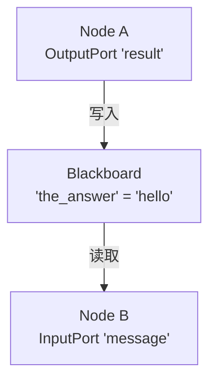
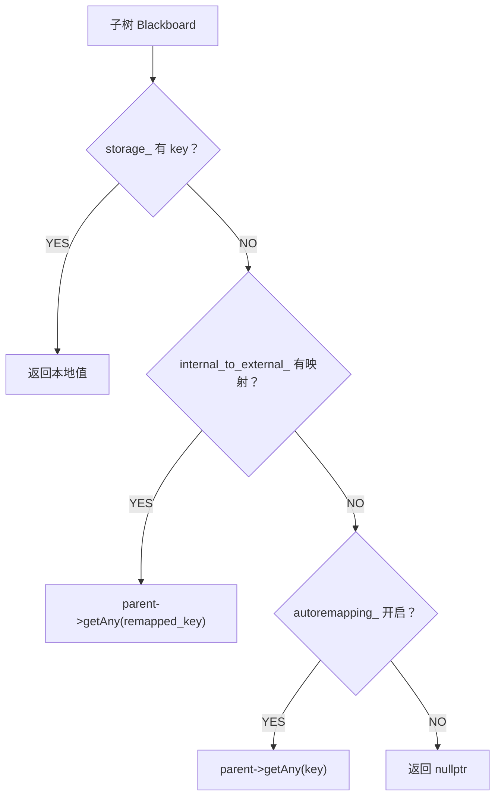
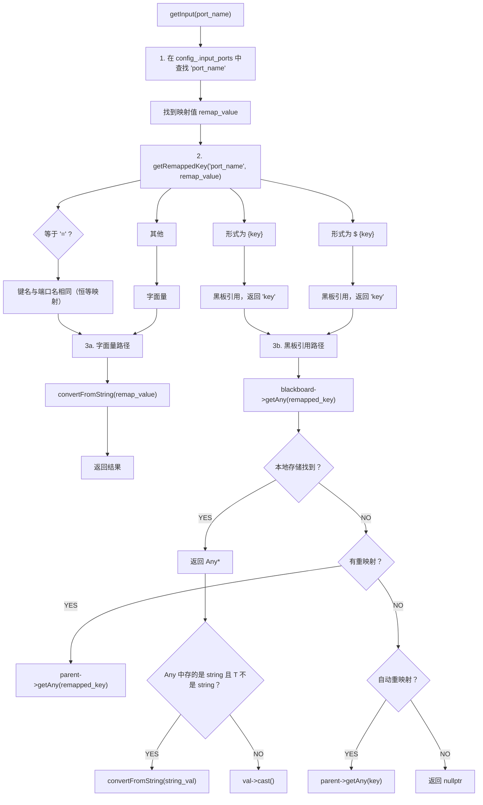

每个子树拥有自己的黑板作用域，子树端口通过父子黑板之间的重映射进行通信。
黑板的存取操作是线程安全的。



- **Blackboard（黑板）**：键值存储，所有节点共享
- **InputPort（输入端口）**：从黑板读取数据，类似函数参数
- **OutputPort（输出端口）**：向黑板写入数据，类似返回值

## 1.黑板系统

Blackboard 是行为树节点之间交换带类型数据的共享存储机制。

### 1.1 Blackboard 类结构
```cpp
class Blackboard
{
public:
  typedef std::shared_ptr<Blackboard> Ptr;

protected:
  /// 构造函数设为 protected，强制使用 Blackboard::create() 工厂方法创建实例。
  ///
  /// 设计原因：
  ///   Blackboard 必须以 shared_ptr 形式使用（因为 parent_bb_ 是 weak_ptr），
  ///   将构造函数设为 protected 可以防止用户意外地以栈对象或 unique_ptr 创建。
  ///
  /// @param parent 父黑板指针（空指针表示顶层黑板）
  Blackboard(Blackboard::Ptr parent) : parent_bb_(parent)
  {}

public:
    /**
     * @brief create 静态工厂方法，创建黑板实例。
     *
     * 可选择传入父黑板，形成层级结构（子树场景）。
     * 父黑板以 weak_ptr 形式持有，避免循环引用导致内存泄漏。
     *
     * @param parent 父黑板指针（默认为空，表示顶层黑板）
     * @return 新创建的黑板实例（shared_ptr）
     */
    static Blackboard::Ptr create(Blackboard::Ptr parent = {});

    template <typename T>
    void set(const std::string& key, const T& value);

    template <typename T>
    T get(const std::string& key) const;

    const Any* getAny(const std::string& key) const;

    /// 添加子树端口重映射。
    ///
    /// 将子树内部的键名（internal）映射到外部父黑板的键名（external）。
    /// 当子树中的节点访问 internal 键时，实际会读写父黑板的 external 键。
    ///
    /// @param internal 子树内部的键名
    /// @param external 父黑板中的键名
    void addSubtreeRemapping(StringView internal, StringView external);

    /// 启用或禁用自动重映射。
    ///
    /// 当启用自动重映射时，若在当前黑板中找不到某个键，
    /// 会自动在父黑板中查找（逐级向上查找，直到顶层）。
    /// 默认关闭，需要显式启用。
    ///
    /// @param remapping true 启用，false 禁用
    void enableAutoRemapping(bool remapping);

    /// 黑板条目：存储实际值和端口元数据。
    ///
    /// 每个黑板键对应一个 Entry，包含：
    ///   - value：实际的类型擦除值（Any 类型）
    ///   - port_info：端口的元数据（方向、声明类型、描述、默认值）
    ///
    /// 设计说明：
    ///   Entry 以 shared_ptr 形式存储在 storage_ 中，
    ///   这样可以高效地传递和共享条目引用。
    struct Entry
    {
        Any value;              ///< 类型擦除的实际值
        const PortInfo port_info; ///< 端口元数据（const 保证创建后不可更改）

        /// 构造函数：仅设置端口元数据，值为空。
        /// @param info 端口元数据
        Entry(const PortInfo& info) : port_info(info)
        {}

        /// 构造函数：同时设置值和端口元数据。
        /// @param other_any 初始值
        /// @param info      端口元数据
        Entry(Any&& other_any, const PortInfo& info) :
            value(std::move(other_any)), port_info(info)
        {}
    };

private:
    /// 创建条目的内部实现（实际执行 storage_ 的插入操作）。
    /// 由 createEntry() 和 set() 调用。
    /// @param key  键名
    /// @param info 端口元数据
    /// @return 新创建的条目指针
    std::shared_ptr<Entry> createEntryImpl(const std::string& key, const PortInfo& info);

    /// 保护 storage_ 和 internal_to_external_ 结构修改的互斥量。
    mutable std::mutex mutex_;

    /// 保护单个条目读写的互斥量。
    ///
    /// 与 mutex_ 分离的设计：
    ///   - mutex_ 在添加/删除条目时短暂持有
    ///   - entry_mutex_ 在读取/写入条目值时持有
    ///   两者分离减少了锁竞争，提高了并发性能。
    mutable std::mutex entry_mutex_;

    /// 黑板的核心存储：键名 -> 条目（shared_ptr）。
    /// 使用 shared_ptr 便于在多处引用同一条目。
    std::unordered_map<std::string, std::shared_ptr<Entry>> storage_;

    /// 父黑板的弱引用（weak_ptr）。
    ///
    /// 使用 weak_ptr 而非 shared_ptr 避免循环引用：
    ///   父黑板不持有子黑板的引用，但子黑板持有父黑板的弱引用。
    ///   当父黑板被销毁时，子黑板的 parent_bb_ 自动失效。
    std::weak_ptr<Blackboard> parent_bb_;

    /// 子树端口重映射表：内部键名 -> 外部键名。
    /// 当子树中的节点访问 internal_key 时，实际访问父黑板的 external_key。
    std::unordered_map<std::string, std::string> internal_to_external_;

    /// 自动重映射开关。
    /// 启用时，在当前黑板找不到键会自动在父黑板中查找。
    bool autoremapping_ = false;
};
```

黑板的作用：
   - 作为键值存储，节点通过 input_port / output_port 与黑板交互；
   - 支持父子黑板层级（子树有自己的黑板，可向上层查找/重映射键）；
   - 支持手动重映射（internal_to_external_）和自动重映射（autoremapping_）；
   - 保证线程安全：所有访问均通过 mutex 加锁，因为异步节点可能在工作线程中
   - 读写黑板，而主线程或日志器也在读取。


### 1.2 getAny：跨黑板查找的递归链

```cpp
/*----------------------------------------------------------------------------------------
 * getAny(key)
 *  - 在加锁前提下，按 key 查找对应的 Any 条目；
 *  - 查找策略（按优先级）：
 *    1) 本地 storage_ 中找到 → 返回条目指针；
 *    2) 在 internal_to_external_ 中有手动映射 → 递归到父黑板按重映射键查找；
 *    3) autoremapping_ 为真 → 递归到父黑板按同名查找；
 *    4) 都找不到 → 返回 nullptr。
 *  - 父黑板通过弱引用 parent_bb_.lock() 获取，保证生命周期安全。
 *----------------------------------------------------------------------------------------*/
const Any *Blackboard::getAny(const std::string &key) const
{
    std::unique_lock<std::mutex> lock(mutex_);

    // 1. 先在本地存储中查找
    auto it = storage_.find(key);
    if(it == storage_.end())
    {
        // 2.键不在本黑板中，尝试通过重映射表查找
        auto remapping_it = internal_to_external_.find(key);
        if (remapping_it != internal_to_external_.end())
        {
            // 存在手动重映射，递归到父黑板查找重映射后的键
            const auto& remapped_key = remapping_it->second;
            if (auto parent = parent_bb_.lock())
            {
                return parent->getAny(remapped_key);
            }
        }
        else if(autoremapping_)
        {
            // 3.自动重映射模式：直接用同名键在父黑板中查找
            if(auto parent = parent_bb_.lock()) {
                return parent->getAny(key);
            }
        }
        return nullptr;
    }
    return &(it->second->value);
}
```

**跨黑板查找流程**：


### 1.3 createEntryImpl：条目创建与递归

```cpp
/*----------------------------------------------------------------------------------------
 * createEntryImpl(key, info)
 *  - 内部实现：创建或获取指定键的 Entry；
 *  - 加锁保护 storage_；
 *  - 流程：
 *    1) 若 storage_ 中已有该键：
 *       - 若两次声明的端口都是"强类型"且类型不一致，抛出 LogicError（类型安全约束）；
 *       - 否则返回已有的 Entry；
 *    2) 若 internal_to_external_ 中有该键的映射 → 递归到父黑板按映射键创建/获取；
 *    3) 若 autoremapping_ 开启 → 递归到父黑板按同名创建/获取；
 *    4) 否则在本黑板新建一个 Entry 并插入 storage_；
 *  - 最终总是把得到的 entry 记录到本黑板的 storage_ 中，加速后续访问。
 *----------------------------------------------------------------------------------------*/
std::shared_ptr<Blackboard::Entry>
Blackboard::createEntryImpl(const std::string &key, const PortInfo& info)
{
    std::unique_lock<std::mutex> lock(mutex_);
    // 此函数在重映射时可能被递归调用（沿黑板树向上查找或创建条目）

    // 先检查是否已存在
    auto storage_it = storage_.find(key);
    if(storage_it != storage_.end())
    {
        const auto& prev_info = storage_it->second->port_info;
        // 强类型端口不允许改变已声明的类型
        if (prev_info.type() != info.type() &&
            prev_info.isStronglyTyped() &&
            info.isStronglyTyped())
        {
            throw LogicError("Blackboard: once declared, the type of a port "
                            "shall not change. Previously declared type [",
                            BT::demangle(prev_info.type()), "] != new type [",
                            BT::demangle(info.type()), "]");
        }
        return storage_it->second;
    }

    std::shared_ptr<Entry> entry;

    // 检查手动重映射表：有映射则在父黑板中递归创建/获取条目
    auto remapping_it = internal_to_external_.find(key);
    if (remapping_it != internal_to_external_.end())
    {
        const auto& remapped_key = remapping_it->second;
        if (auto parent = parent_bb_.lock())
        {
            entry = parent->createEntryImpl(remapped_key, info);
        }
    }
    else if(autoremapping_)
    {
        // 自动重映射：同名键在父黑板中创建
        if (auto parent = parent_bb_.lock())
        {
            entry = parent->createEntryImpl(key, info);
        }
    }
    else // 无重映射，也不在父黑板中，在本黑板本地创建
    {
        entry = std::make_shared<Entry>(info);
    }
    storage_.insert( {key, entry} );
    return entry;
}
```

**关键设计**：
- 条目可能在父黑板中创建，子黑板存储的是 `shared_ptr` 引用
- 这意味着子树对重映射键的修改会**直接影响**父黑板的值
- 强类型端口不允许类型变更（`isStronglyTyped()` 检查）

### 1.4 set 的类型安全

```cpp
/*
@brief set 更新或创建指定键的条目值。
*
* 详细流程：
*   1. 加锁（entry_mutex_ + mutex_）
*   2. 在 storage_ 中查找键：
*      a. 若不存在：创建新条目（类型由 value 推导）
*      b. 若存在：检查类型兼容性
*         - 类型匹配：直接更新值
*         - 类型不匹配但可通过字符串转换：尝试转换后更新
*         - 完全不兼容：抛出 LogicError 异常
*
* 类型安全保证：
*   一旦某个键被声明为特定类型（通过 createEntry 或首次 set），
*   后续写入不同类型的值会抛出异常。这防止了运行时的类型错误。
*
* @tparam T 值的类型
* @param key   键名
* @param value 要写入的值
* @throws LogicError 若类型不兼容
*/
template <typename T>
void set(const std::string& key, const T& value)
{
    std::unique_lock<std::mutex> lock_entry(entry_mutex_);
    std::unique_lock<std::mutex> lock(mutex_);

    auto it = storage_.find(key);
    if (it != storage_.end())
    {
        const PortInfo& port_info = it->second->port_info;
        const auto previous_type = port_info.type();

        // 类型不匹配检查
        if (previous_type && *previous_type != typeid(T))
        {
            bool mismatching = true;
            if (std::is_constructible<std::string, T>::value)
            {
                // 尝试通过字符串解析转换
                Any any_from_string = port_info.parseString(value);
                if (!any_from_string.empty())
                {
                    mismatching = false;
                }
            }
            if (mismatching)
                throw LogicError("port type shall not change");
        }
    }
    // ...
}
```

### 1.5线程安全设计

黑板使用**双锁设计**：
- `mutex_`：保护 `storage_` 的增删查
- `entry_mutex_`：保护条目的原子读写（`set` 操作时使用）

`entryMutex()` 公开给 `getInput()`，确保读取黑板值时的原子性。


## 2.端口系统

### 2.1 getInput 的完整实现
这是端口系统中最复杂的函数，包含了**三层解析**：

```cpp
/**
 * @brief getInput 的模板实现：从输入端口读取值。
 *
 * 详细流程：
 *   1. 在 config_.input_ports 中查找 key，找不到则返回错误
 *   2. 调用 getRemappedKey() 判断映射值是否为黑板指针
 *   3. 若不是黑板指针（字面量值），直接调用 convertFromString<T>() 解析
 *   4. 若是黑板指针：
 *      a. 从黑板中获取 Any 类型的值
 *      b. 若黑板中存储的是 string 而 T 不是 string，
 *         调用 convertFromString<T>() 进行二次解析
 *      c. 否则直接 cast 为目标类型
 *
 * @tparam T 期望的目标类型
 * @param key         端口标识符
 * @param destination 输出参数
 * @return Result 成功时为空，失败时包含错误描述
 */
template <typename T>
Result TreeNode::getInput(const std::string& key, T& destination) const
{
    // 第1层：查找端口重映射
    auto remap_it = config_.input_ports.find(key);
    if (remap_it == config_.input_ports.end())
        return error("input_ports does not contain key");

    // 第2层：判断是字面量还是黑板引用
    auto remapped_res = getRemappedKey(key, remap_it->second);

    if (!remapped_res)
    {
        // 不是黑板指针 → 视为字面量字符串，直接转换
        destination = convertFromString<T>(remap_it->second);
        return {};
    }

    // 第3层：从黑板读取
    const auto& remapped_key = remapped_res.value();

    if (!config_.blackboard)
        return error("BB is invalid");

    std::unique_lock<std::mutex> entry_lock(config_.blackboard->entryMutex());
    const Any* val = config_.blackboard->getAny(remapped_key);

    if (!val)
        return error("unable to find port");

    if (val->empty())
        return error("port not initialized");

    // 自动类型转换：黑板中存的是 string，但 T 不是 string
    if (!std::is_same<T, std::string>::value && val->type() == typeid(std::string))
    {
        destination = convertFromString<T>(val->cast<std::string>());
    }
    else
    {
        destination = val->cast<T>();   // 直接类型转换
    }
    return {};
}
```



### 2.2 setOutput 的实现

```cpp
/**
 * @brief setOutput 的模板实现：将值写入输出端口。
 *
 * 详细流程：
 *   1. 检查黑板是否有效
 *   2. 在 config_.output_ports 中查找 key
 *   3. 解析映射值，获取实际的黑板键名
 *      - "="：使用端口名作为键名
 *      - "{key}"：去除花括号得到键名
 *   4. 调用 blackboard->set() 写入值
 *
 * @tparam T 值的类型
 * @param key   端口标识符
 * @param value 要写入的值
 * @return Result 成功时为空，失败时包含错误描述
 */
template <typename T>
Result TreeNode::setOutput(const std::string& key, const T& value)
{
    if (!config_.blackboard)
        return error("BB is invalid");
    
    // 在输出端口映射表中查找 key
    auto remap_it = config_.output_ports.find(key);
    if (remap_it == config_.output_ports.end())
        return error("output_ports does not contain key");

    // 解析重映射，获取实际的黑板键名
    StringView remapped_key = remap_it->second;
    // "=" 表示端口名与黑板键名相同
    if (remapped_key == "=")
        remapped_key = key;
    if (isBlackboardPointer(remapped_key))
        // "{key}" 格式，去除花括号
        remapped_key = stripBlackboardPointer(remapped_key);

    // 写入黑板
    config_.blackboard->set(static_cast<std::string>(remapped_key), value);
    return {};
}
```

### 2.3 黑板指针格式识别

```cpp
/*----------------------------------------------------------------------------------------
 * isBlackboardPointer(str)
 *  - 判断字符串是否表示"黑板指针"，支持两种写法：
 *      * {key}    ：普通黑板引用；
 *      * ${key}   ：带 $ 前缀的黑板引用（用于某些需要显式标记的上下文）。
 *  - 长度校验：至少 3 字符（如 "{a}"）或 4 字符（如 "${a}"）才算合法。
 *----------------------------------------------------------------------------------------*/
bool TreeNode::isBlackboardPointer(StringView str)
{
    const auto size = str.size();
    if (size >= 3 && str.back() == '}')
    {
        if (str[0] == '{')                    // {key}
            return true;
        if (size >= 4 && str[0] == '$' && str[1] == '{')  // ${key}
            return true;
    }
    return false;
}

/*----------------------------------------------------------------------------------------
 * stripBlackboardPointer(str)
 *  - 剥掉 { } 或 ${ } 包裹，返回真正的黑板键名；
 *  - 若不是黑板指针格式则返回空 StringView。
 *----------------------------------------------------------------------------------------*/
StringView TreeNode::stripBlackboardPointer(StringView str)
{
    const auto size = str.size();
    if (size >= 3 && str.back() == '}')
    {
        if (str[0] == '{')
            return str.substr(1, size - 2);     // {key} → key
        if (str[0] == '$' && str[1] == '{')
            return str.substr(2, size - 3);     // ${key} → key
    }
    return {};
}
```

### 2.4 assignDefaultRemapping

```cpp
/**
 * @brief assignDefaultRemapping 为节点配置填充默认的端口重映射。
 *
 * 遍历 T::providedPorts() 返回的端口列表，为每个端口设置默认映射：
 *   - INPUT / INOUT 端口：config.input_ports[port_name] = "="
 *   - OUTPUT / INOUT 端口：config.output_ports[port_name] = "="
 *
 * "=" 表示端口名与黑板键名相同（即不做重映射）。
 *
 * 使用场景：
 *   BehaviorTreeFactory 在创建节点实例时，若 XML 中未指定端口映射，
 *   则调用此函数填充默认值。
 *
 * SFINAE 说明：
 *   此函数通过 getProvidedPorts<T>() 获取端口列表。
 *   若 T 没有 providedPorts() 静态方法，getProvidedPorts() 会返回空列表，
 *   不会产生编译错误（SFINAE 原理）。
 *
 * @tparam T 节点类型，需有 static PortsList providedPorts() 方法（可选）
 * @param config 待填充的节点配置
 */
template <typename T>
void assignDefaultRemapping(NodeConfiguration& config)
{
    for (const auto& it : getProvidedPorts<T>())
    {
        const auto& port_name = it.first;
        const auto direction = it.second.direction();
        if (direction != PortDirection::OUTPUT)
        {
            config.input_ports[port_name] = "=";   // 恒等映射
        }
        if (direction != PortDirection::INPUT)
        {
            config.output_ports[port_name] = "=";
        }
    }
}
```

当用户不指定端口映射时，默认使用 `"="` 表示端口名与黑板键名相同。
