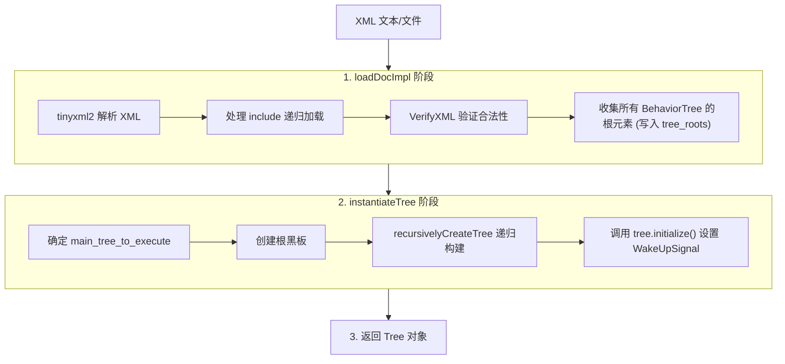
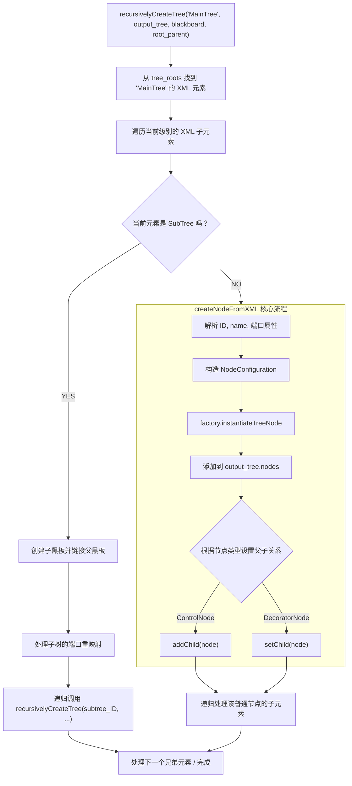

## 1.BehaviorTreeFactory：节点注册与构建机制

BehaviorTreeFactory 的私有成员：

```cpp
class  BehaviorTreeFactory{

private:
  std::unordered_map<std::string, NodeBuilder> builders_;           ///< 节点 ID -> 构建函数映射
  std::unordered_map<std::string, TreeNodeManifest> manifests_;     ///< 节点 ID -> 元数据映射
  std::set<std::string> builtin_IDs_;                               ///< 内置节点 ID 集合（如 Sequence, Fallback）
  std::unordered_map<std::string, Any> behavior_tree_definitions_; ///< 已注册的树定义（XML 内容），键为树 ID

  std::shared_ptr<BT::Parser> parser_; ///< XML 解析器实例（Pimpl 模式）
};
```

### 1.1 构造函数：内置节点注册
```cpp
/**
 * @brief BehaviorTreeFactory 是运行时创建 TreeNode 实例的工厂。
*/

BehaviorTreeFactory::BehaviorTreeFactory()
{
    parser_ = std::make_shared<XMLParser>(*this);

    // 控制节点
    registerNodeType<FallbackNode>("Fallback");
    registerNodeType<SequenceNode>("Sequence");
    registerNodeType<SequenceStarNode>("SequenceStar");
    registerNodeType<ParallelNode>("Parallel");
    registerNodeType<ReactiveSequence>("ReactiveSequence");
    registerNodeType<ReactiveFallback>("ReactiveFallback");
    registerNodeType<IfThenElseNode>("IfThenElse");
    registerNodeType<WhileDoElseNode>("WhileDoElse");

    // 装饰节点
    registerNodeType<InverterNode>("Inverter");
    registerNodeType<RetryNode>("RetryUntilSuccessful");
    registerNodeType<RepeatNode>("Repeat");
    registerNodeType<TimeoutNode<>>("Timeout");
    registerNodeType<DelayNode>("Delay");
    registerNodeType<ForceSuccessNode>("ForceSuccess");
    registerNodeType<ForceFailureNode>("ForceFailure");

    // 内置动作
    registerNodeType<AlwaysSuccessNode>("AlwaysSuccess");
    registerNodeType<AlwaysFailureNode>("AlwaysFailure");
    registerNodeType<SetBlackboard>("SetBlackboard");

    // 子树
    registerNodeType<SubtreeNode>("SubTree");
    registerNodeType<SubtreePlusNode>("SubTreePlus");

    // ... Switch 节点、前置条件等

    // 记录内置节点 ID（不可被 unregister）
    for (const auto& it : builders_)
    {
        builtin_IDs_.insert(it.first);
    }
}
```

注册完成后把所有内置 ID 收集到 builtin_IDs_，用于后续区分"内置 vs 用户自定义"。

### 1.2 registerNodeType 的编译期魔法

```cpp
// 仅接受继承自 ActionNodeBase、DecoratorNode、ControlNode 或 ConditionNode 的类。
template <typename T>
void registerNodeType(const std::string& ID)
{
    // 1. 编译期检查：T 必须继承自 TreeNode
    static_assert(std::is_base_of<TreeNode, T>::value,
                  "T must inherit from TreeNode");

    // 2. 编译期推断节点类型
    NodeType type = getType<T>();  // 通过 std::is_base_of 判断

    // 3. 获取端口列表
    PortsList ports = getProvidedPorts<T>();

    // 4. 创建 NodeBuilder（构建函数）
    NodeBuilder builder = CreateBuilder<T>();

    // 5. 创建 manifest（元数据）
    TreeNodeManifest manifest = {type, ID, ports, {}};

    // 6. 注册到 builders_ 和 manifests_
    registerBuilder(manifest, builder);
}
```

### 1.3 CreateBuilder：构建函数的生成

```cpp
// 有默认构造 + 有参数构造 → 根据 config 是否为空选择
template <typename T>
NodeBuilder CreateBuilder(/* both constructors available */)
{
    return [](const std::string& name, const NodeConfiguration& config) {
        if (config.input_ports.empty() && config.output_ports.empty())
        {
            return std::make_unique<T>(name);         // 使用默认构造
        }
        return std::make_unique<T>(name, config);     // 使用参数构造
    };
}

// 仅有参数构造
template <typename T>
NodeBuilder CreateBuilder(/* only params constructor */)
{
    return [](const std::string& name, const NodeConfiguration& params) {
        return std::unique_ptr<TreeNode>(new T(name, params));
    };
}
```

**SFINAE 机制**：使用 `std::is_constructible` 在编译期判断 T 有哪些构造函数，选择对应的 Builder。

    SFINAE 是 C++ 模板元编程中极度核心的概念。它的全称是 Substitution Failure Is Not An Error，翻译过来就是：“匹配失败不是编译错误”。

    简单来说，当编译器在面对重载的模板函数时，如果尝试把某个类型代入一个模板却发现不合适、不匹配，编译器不会直接报错中断编译，而是会默默地把这个不合适的模板从候选名单中剔除，继续去寻找其他更合适的模板。

### 1.4 instantiateTreeNode：节点实例化

```cpp
/**
 * @brief instantiateTreeNode 创建已注册节点类型的实例。
 *
 * @param name     此节点实例的名称
 * @param ID       注册时使用的 ID
 * @param config   传递给 TreeNode 构造函数的配置信息
 * @return         新创建的节点
*/
std::unique_ptr<TreeNode> BehaviorTreeFactory::instantiateTreeNode(
    const std::string& name, const std::string& ID,
    const NodeConfiguration& config) const
{
    auto it = builders_.find(ID);
    if (it == builders_.end())
        throw RuntimeError("ID not registered");

    // 调用 NodeBuilder 创建节点
    std::unique_ptr<TreeNode> node = it->second(name, config);
    node->setRegistrationID(ID);
    return node;
}
```

- 根据 ID 在 builders_ 中查找构造器，实例化节点；
- ID 未注册时，打印所有已注册 ID 后抛 RuntimeError，便于快速定位拼写错误；
- 实例化后立即 setRegistrationID(ID)，让节点能查到自己的注册名（用于日志、调试）。

### 1.5 name 与 ID 的区别

| ID（注册名） | name（实例名） |
| :--- | :--- |
| 在 `factory.registerNodeType` 中指定的名称 | 在 XML 中通过 `name` 属性设置 |
| 代表节点的“类型” | 若不指定则默认等于 ID |
| 同一个 ID 可以有多个实例 | 代表节点的“实例” |
| 例如: `"MoveBase"` | 在同一棵树中应当唯一 例如: `"move_to_kitchen"`  |


## 2.XML 解析与树的实例化流程

### 2.1 整体流程



### 2.2 XML 验证：VerifyXML

```cpp
void VerifyXML(const std::string& xml_text,
               const std::unordered_map<std::string, BT::NodeType>& registered_nodes)
{
    // 1. 检查 <root> 根元素存在
    // 2. 检查 <TreeNodesModel> 段（可选）
    // 3. 递归检查每个节点：
    //    ├── <Decorator> 必须有 1 个子节点 + ID 属性
    //    ├── <Action> 必须没有子节点 + ID 属性
    //    ├── <Condition> 必须没有子节点 + ID 属性
    //    ├── <Control> 至少 1 个子节点 + ID 属性
    //    ├── <SubTree> 不能有子节点 + ID 属性
    //    ├── <BehaviorTree> 恰好 1 个子节点
    //    └── 自定义标签必须在 registered_nodes 中找到
}
```

### 2.3 递归构建树：recursivelyCreateTree

```cpp
/*----------------------------------------------------------------------------------------
 * Pimpl::recursivelyCreateTree(tree_ID, output_tree, blackboard, root_parent)
 *  - 根据 tree_ID 找到对应的 <BehaviorTree> 根元素，递归构造整棵树；
 *  - 核心递归 lambda recursiveStep 处理三种节点类型：
 *      a) SubtreeNode    ：默认创建独立子黑板；若 __shared_blackboard="true" 则共享父黑板；
 *      b) SubtreePlusNode：默认创建独立子黑板，支持 __autoremap 与显式 {key} 重映射；
 *      c) 其他节点       ：递归处理其子元素。
 *  - 子树隔离策略：
 *      * 默认：创建新的子黑板，把 <SubTree> 上的非保留属性作为"内部键 → 外部键"映射；
 *      * __shared_blackboard="true"：不创建子黑板，直接用父黑板（不推荐，但向后兼容）；
 *      * SubTreePlus 的 __autoremap="true"：开启自动重映射，子黑板中未找到的键按同名
 *        向上追溯父黑板。
 *----------------------------------------------------------------------------------------*/
void BT::XMLParser::Pimpl::recursivelyCreateTree(const std::string& tree_ID,
                                                 Tree& output_tree,
                                                 Blackboard::Ptr blackboard,
                                                 const TreeNode::Ptr& root_parent);
```



### 2.4 SubTree 的黑板创建


```cpp
// 当遇到 <SubTree ID="xxx"> 时
if (element_name == "SubTree" || element_name == "SubTreePlus")
{
    // 创建新的子黑板，父黑板为当前黑板
    auto child_blackboard = Blackboard::create(blackboard);

    // 设置端口重映射
    for (const auto& attr : xml_attributes)
    {
        // SubTree 的特殊处理：实例名直接使用 ID 属性（即被引用子树的名字）
        if (attr.first == "ID") continue;

        // 子树的端口属性 → 重映射表
        child_blackboard->addSubtreeRemapping(attr.first, attr.second);
    }

    // 将子黑板推入树的黑板栈
    output_tree.blackboard_stack.push_back(child_blackboard);

    // 递归构建子树
    recursivelyCreateTree(subtree_ID, output_tree,
                          child_blackboard, parent_node);
}
```

**黑板栈**：`blackboard_stack[0]` 是根黑板，每个 SubTree 增加一层。


### 2.5 三种端口值格式详解

XML 中传递端口值

```xml
<root main_tree_to_execute="MainTree">
    <BehaviorTree ID="MainTree">
        <Sequence>
            <!-- 方式1：字面量 -->
            <SaySomething message="hello" />

            <!-- 方式2：黑板键（用花括号） -->
            <SaySomething message="{the_answer}" />

            <!-- 方式3：输出到黑板 -->
            <CalculateGoal goal="{GoalPosition}" />
            <PrintTarget  target="{GoalPosition}" />
        </Sequence>
    </BehaviorTree>
</root>
```


XML 中端口属性支持三种值格式，理解它们的区别至关重要：

```xml
<!-- 格式1：字面量（Literal） -->
<!-- 值直接传递给节点，不经过黑板 -->
<SaySomething message="hello world" />
<!-- 内部处理：convertFromString<std::string>("hello world") -->

<!-- 格式2：黑板键引用（Blackboard Pointer） -->
<!-- 从黑板中读取值，键名为花括号内的字符串 -->
<SaySomething message="{greeting}" />
<!-- 内部处理：blackboard->get<std::string>("greeting") -->

<!-- 格式3：恒等映射（Identity Mapping） -->
<!-- 端口名即为黑板键名，端口 "message" 映射到黑板键 "message" -->
<!-- 在 C++ 注册时默认使用此格式 -->
<SaySomething message="=" />
<!-- 等价于 <SaySomething message="{message}" /> -->
```

**在 C++ 中**，不指定 XML 属性时的默认行为是恒等映射：
```cpp
// 假设 providedPorts 中定义了 InputPort<string>("message")
// XML 中 <SaySomething/> 不指定 message 属性
// 等价于 <SaySomething message="="/>
// 即从黑板读取键 "message" 的值
```