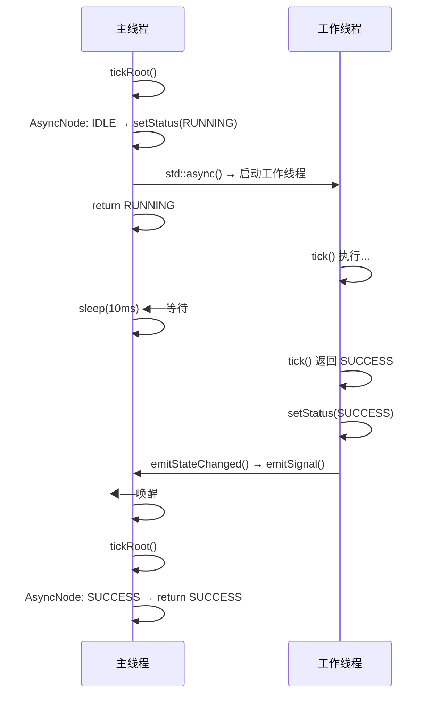

## 1 Tree 对象与生命周期管理

### 1.1 Tree 类结构

```cpp
/**
 * @brief Tree 是行为树的运行时对象。
 * 此对象离开作用域时，整棵树会被销毁。
 *
 * 执行树的方式：
 *
 *    NodeStatus status = my_tree.tickRoot();
 */

class Tree
{
public:
    std::vector<TreeNode::Ptr> nodes;              ///< 树中所有节点（第一个为根节点）
    std::vector<Blackboard::Ptr> blackboard_stack;  ///< 黑板栈，每个子树作用域一个
    std::unordered_map<std::string, TreeNodeManifest> manifests;    ///< 注册的节点元数据

    // non-copyable, movable
    Tree(const Tree&) = delete;
    Tree(Tree&& other) = default;

    /// 初始化树：为所有节点设置 WakeUpSignal，以支持异步唤醒机制
    void initialize()
    {
        wake_up_ = std::make_shared<WakeUpSignal>();
        for (auto& node : nodes)
        {
            node->setWakeUpInstance(wake_up_);
        }
    }
    /// 停止整棵树：向根节点发送 halt 并递归传播到所有子节点
    void haltTree()
    {
        if (!rootNode())
        {
            return;
        }
        // the halt should propagate to all the node if the nodes
        // have been implemented correctly
        rootNode()->halt();
        rootNode()->setStatus(NodeStatus::IDLE);

        //but, just in case.... this should be no-op
        auto visitor = [](BT::TreeNode* node) {
            node->halt();
            node->setStatus(BT::NodeStatus::IDLE);
        };
        BT::applyRecursiveVisitor(rootNode(), visitor);
    }

    /// @brief 获取树的根节点指针。
    /// @return 返回根节点指针，若树为空则返回 nullptr
    TreeNode* rootNode() const
    {
        return nodes.empty() ? nullptr : nodes.front().get();
    }

    /**
    * @brief tickRoot 向根节点发送 tick 信号，信号将传播到整棵树。
    */
    NodeStatus tickRoot();

        /**
    * @brief tickRootWhileRunning 循环调用 tickRoot()，直到状态不再是 RUNNING。
    *
    * @param sleep_time 两次循环之间的最大休眠时间。
    *
    * @return 只会返回 SUCCESS 或 FAILURE。
    */
    NodeStatus tickRootWhileRunning(std::chrono::milliseconds sleep_time = 10ms);

    /// @brief 休眠指定时间；可被 TreeNode::emitStateChanged() 提前唤醒。
    ///
    /// 内部使用 WakeUpSignal::waitFor() 实现条件变量等待，
    /// 当任意节点状态变化时会调用 WakeUpSignal::emitSignal() 提前结束休眠。
    /// @param timeout 最大休眠时长
    void sleep(std::chrono::system_clock::duration timeout);


    /// @brief 获取根黑板（blackboard_stack 中的第一个黑板）
    /// @return 根黑板的 shared_ptr，若无黑板则返回 nullptr
    Blackboard::Ptr rootBlackboard();

    ~Tree();   // 析构时调用 haltTree()

private:
    std::shared_ptr<WakeUpSignal> wake_up_;
};
```

### 1.2 节点所有权

- `Tree::nodes` 是 `vector<shared_ptr<TreeNode>>`，拥有所有节点的所有权
- `ControlNode::children_nodes_` 和 `DecoratorNode::child_node_` 存储裸指针
- 节点的生命周期由 `Tree` 管理，`Tree` 析构时所有节点被销毁

### 1.3 initialize：设置 WakeUpSignal

```cpp
// 初始化树：为所有节点设置 WakeUpSignal，以支持异步唤醒机制
void Tree::initialize()
{
    wake_up_ = std::make_shared<WakeUpSignal>();
    for (auto& node : nodes)
    {
        node->setWakeUpInstance(wake_up_);   // 所有节点共享同一个 WakeUpSignal
    }
}
```

### 1.4 haltTree：安全停止

```cpp
void Tree::haltTree()
{
    if (!rootNode()) return;

    // 1. 从根节点开始 halt（正常传播）
    rootNode()->halt();
    rootNode()->setStatus(NodeStatus::IDLE);

    // 2. 安全兜底：递归确保所有节点都被重置
    auto visitor = [](BT::TreeNode* node) {
        node->halt();
        node->setStatus(BT::NodeStatus::IDLE);
    };
    BT::applyRecursiveVisitor(rootNode(), visitor);
}
```

### 1.5 析构函数

```cpp
Tree::~Tree()
{
    haltTree();   // 析构前确保所有节点被正确中断
}
// Tree 析构 → nodes (shared_ptr) 引用计数归零 → 所有节点析构
//           → blackboard_stack (shared_ptr) 引用计数归零 → 所有黑板析构
```

## 2 WakeUpSignal：异步唤醒机制

### 2.1 WakeUpSignal 实现

```cpp
/// @class WakeUpSignal
/// @brief 线程安全的唤醒信号，用于协调行为树执行线程与异步节点。
///
/// 内部使用 mutex + condition_variable 实现。
/// 典型使用场景：Tree::sleep() 等待节点状态变化通知。
class WakeUpSignal
{
public:
    /// @brief 等待信号或超时。
    ///
    /// 阻塞当前线程，直到收到信号（emitSignal）或超时。
    /// 无论因何原因返回，都会自动重置 ready_ 标志。
    /// @param tm 最大等待时间
    /// @return true 表示收到信号被唤醒，false 表示超时
    bool waitFor(std::chrono::system_clock::duration tm)
    {
        std::unique_lock<std::mutex> lk(mutex_);
        auto res = cv_.wait_for(lk, tm, [this]{
            return ready_;
        });
        ready_ = false;
        return res;    // true = 被唤醒，false = 超时
    }

    /// @brief 发射唤醒信号，唤醒所有等待此信号的线程。
    ///
    /// 设置 ready_ 标志后通过 condition_variable::notify_all() 通知等待线程。
    void emitSignal()
    {
        {
            std::lock_guard<std::mutex> lk(mutex_);
            ready_ = true;
        }
        cv_.notify_all();
    }

private:
    std::mutex mutex_;              ///< 保护 ready_ 标志的互斥锁
    std::condition_variable cv_;    ///< 条件变量，用于等待/通知机制
    bool ready_ = false;            ///< 信号就绪标志，true 表示有信号待处理
};
```

### 2.2 在 Tree 中的使用

```cpp
// Tree::sleep() — 等待异步节点唤醒或超时
void Tree::sleep(std::chrono::system_clock::duration timeout)
{
    wake_up_->waitFor(timeout);
}

// Tree::tickRootWhileRunning() — 主循环
NodeStatus tickRootWhileRunning(std::chrono::milliseconds sleep_time)
{
    NodeStatus status = tickRoot();
    while (status == NodeStatus::RUNNING)
    {
        this->sleep(sleep_time);   // 休眠等待
        status = tickRoot();       // 被唤醒后再次 tick
    }
    return status;
}
```

### 2.3 触发唤醒的时机

```cpp
// AsyncActionNode 工作线程完成时
thread_handle_ = std::async(std::launch::async, [this]() {
    auto status = tick();
    setStatus(status);
    emitStateChanged();    // ← 这里触发唤醒
});

// TreeNode::emitStateChanged()
void TreeNode::emitStateChanged()
{
    if (wake_up_)
    {
        wake_up_->emitSignal();   // 唤醒等待中的 Tree::sleep()
    }
}
```

**时序图**：


