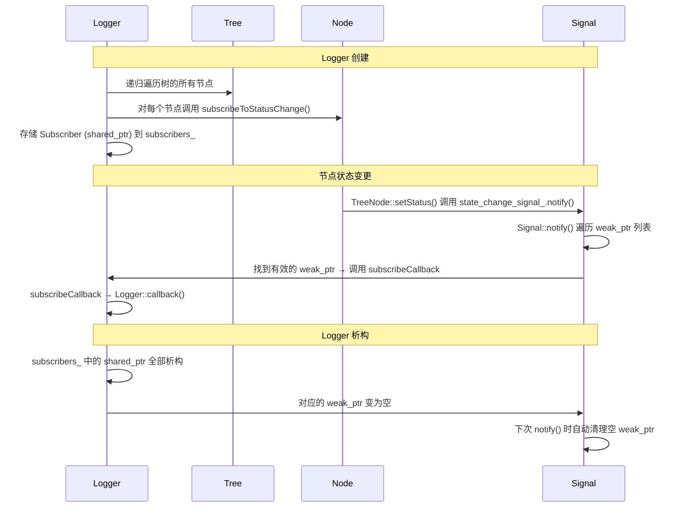
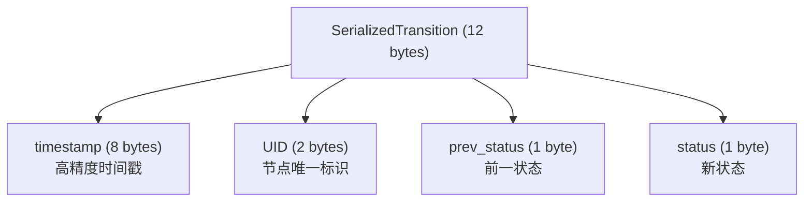

## 1.Signal 实现

```cpp

class Signal
{
public:
    /// @brief 回调函数类型别名
    using CallableFunction = std::function<void(CallableArgs...)>;

    /// @brief 订阅者句柄类型：shared_ptr 持有回调函数
    ///
    /// 通过 shared_ptr 的引用计数管理订阅生命周期。
    /// 当所有 shared_ptr 副本都销毁后，对应的 weak_ptr 自动失效。
    using Subscriber = std::shared_ptr<CallableFunction>;

    /// @brief 触发信号，通知所有有效订阅者。
    ///
    /// 遍历所有 weak_ptr 订阅：若 weak_ptr 仍然有效（lock() 成功），
    /// 则调用其持有的回调函数；若已失效则从列表中移除（惰性清理）。
    /// @param args 传递给回调函数的参数
    void notify(CallableArgs... args)
    {
        for (size_t i = 0; i < subscribers_.size();)
        {
            if (auto sub = subscribers_[i].lock())
            {
                (*sub)(args...);
                i++;
            }
            else
            {
                subscribers_.erase(subscribers_.begin() + i);
            }
        }
    }

    /// @brief 注册一个新的订阅者。
    ///
    /// 将回调函数包装为 shared_ptr，内部以 weak_ptr 形式存储。
    /// 返回的 Subscriber（shared_ptr）必须被调用方持有，否则订阅将立即失效。
    /// @param func 回调函数
    /// @return 订阅者句柄（shared_ptr），离开作用域时订阅自动取消
    Subscriber subscribe(CallableFunction func)
    {
        Subscriber sub = std::make_shared<CallableFunction>(std::move(func));
        subscribers_.emplace_back(sub);     // 存储为 weak_ptr
        return sub;                         // 返回 shared_ptr
    }

private:
    /// @brief 订阅者列表，使用 weak_ptr 避免阻止订阅者被销毁
    std::vector<std::weak_ptr<CallableFunction>> subscribers_;
};
```

**RAII 自动管理**：
- `subscribe()` 返回 `shared_ptr<CallableFunction>`
- `subscribers_` 存储 `weak_ptr`
- 当返回的 `shared_ptr` 析构时，`weak_ptr` 自动变为空
- `notify()` 遍历时检测空的 `weak_ptr` 并移除


## 2.Logger 系统

```cpp
/**
 * @brief 状态变更日志记录器的抽象基类。
 *
 * ## 行为语义
 * - 构造时自动订阅树中所有节点的状态变更信号
 * - 每次状态变更时触发 callback()（由子类实现具体逻辑）
 * - 对象的生命周期决定日志记录的生命周期（销毁时自动取消订阅）
 *
 * ## 子类需要实现
 * - callback()：处理每次节点状态变更（核心日志逻辑）
 * - flush()：将缓冲的日志数据刷新到目标存储
 *
 * ## 可选配置
 * - setEnabled()：动态启用/禁用日志记录
 * - setTimestampType()：设置时间戳类型（绝对/相对）
 * - enableTransitionToIdle()：是否记录节点转换到 IDLE 状态的事件
 *
 * ## 使用方法
 * @code{.cpp}
 * Tree tree = factory.createTreeFromXML(xml_text);
 * StdCoutLogger logger(tree);  // 创建后自动开始记录
 * tree.tickWhileRunning();     // 执行树，日志自动输出
 * // logger 超出作用域时自动停止记录
 * @endcode
 */
class StatusChangeLogger
{
public:
    /**
    * @brief 构造日志记录器并订阅整棵树的状态变更。
    *
    * @param root_node 树的根节点，构造时递归订阅所有子节点的状态变更信号
    */
    StatusChangeLogger(TreeNode* root_node);
    virtual ~StatusChangeLogger() = default;

    /**
    * @brief 节点状态变更回调（纯虚函数，子类必须实现）。
    *
    * @param timestamp 时间戳（根据 type_ 为绝对或相对时间）
    * @param node 状态发生变更的节点
    * @param prev_status 变更前的状态
    * @param status 变更后的新状态
    */
    virtual void callback(BT::Duration timestamp, const TreeNode& node,
                            NodeStatus prev_status, NodeStatus status) = 0;

    /**
    * @brief 将缓冲的日志数据刷新到目标存储（纯虚函数，子类必须实现）。
    *
    * 例如：文件日志刷盘、网络日志发送等。
    */
    virtual void flush() = 0;

    /**
    * @brief 动态启用/禁用日志记录。
    *
    * 禁用后 callback() 不再被调用，但不影响已订阅的信号连接。
    * 重新启用后继续记录。
    *
    * @param enabled true=启用，false=禁用
    */
    void setEnabled(bool enabled)
    {
        enabled_ = enabled;
    }

    /**
    * @brief 设置时间戳类型。
    *
    * @param type TimestampType::absolute（绝对时间）或 TimestampType::relative（相对时间）
    */
    void setTimestampType(TimestampType type)
    {
        type_ = type;
    }

    /// 获取当前是否启用日志记录
    bool enabled() const
    {
        return enabled_;
    }

    /// 是否记录节点转换到 IDLE 状态的事件（默认 true）
    bool showsTransitionToIdle() const
    {
        return show_transition_to_idle_;
    }

    /// 设置是否记录 IDLE 转换事件
    void enableTransitionToIdle(bool enable)
    {
        show_transition_to_idle_ = enable;
    }

private:
    bool enabled_;                 ///< 是否启用日志记录
    bool show_transition_to_idle_; ///< 是否记录 IDLE 转换事件
    /// 订阅句柄列表（RAII：析构时自动取消所有订阅）
    std::vector<TreeNode::StatusChangeSubscriber> subscribers_;
    TimestampType type_;           ///< 时间戳类型（绝对/相对）
    BT::TimePoint first_timestamp_;  ///< 首次状态变更的时间点（用于相对时间戳计算）
};
```




### 2.1 多种类型日志

**1.StdCoutLogger（控制台日志）**

打印所有节点的状态变化到控制台：

```cpp
auto tree = factory.createTreeFromText(xml_text);

// 添加控制台日志
StdCoutLogger logger_cout(tree);

tree.tickRootWhileRunning();
```

StdCoutLogger 输出格式为：`[时间戳]: 节点名称    前状态 -> 新状态`

```
[1.234]: root_sequence              IDLE -> RUNNING
[1.234]: battery_ok                 IDLE -> SUCCESS
[1.234]: open_gripper               IDLE -> SUCCESS
[1.234]: approach_object            IDLE -> RUNNING
[2.345]: approach_object            RUNNING -> SUCCESS
[2.345]: close_gripper              IDLE -> SUCCESS
[2.345]: root_sequence              RUNNING -> SUCCESS
```

> **注意**：StdCoutLogger 使用原子引用计数确保全局只有一个实例。创建第二个实例会抛出异常。

**2.FileLogger**

保存状态变化到二进制文件，可用 `bt_log_cat` 工具查看：

```cpp
FileLogger logger_file(tree, "bt_trace.fbl");
```

FileLogger 将状态变化序列化为 12 字节的紧凑二进制记录：



使用 `bt_log_cat` 工具查看：
```bash
./tools/bt_log_cat bt_trace.fbl
```

**3.MinitraceLogger（Chrome Tracing）**

生成 Chrome 浏览器可视化的 JSON 文件：

```cpp
MinitraceLogger logger_minitrace(tree, "bt_trace.json");
```

然后在 Chrome 浏览器中打开 `chrome://tracing`，加载 `bt_trace.json`。

**4.PublisherZMQ（实时可视化）**

通过 ZeroMQ 推送状态变化，配合 Groot 可视化工具使用：

```cpp
#include "behaviortree_cpp_v3/loggers/bt_zmq_publisher.h"

PublisherZMQ publisher_zmq(tree);
```

**Groot 使用步骤**：
1. 安装 Groot：https://github.com/BehaviorTree/Groot
2. 在代码中添加 `PublisherZMQ`
3. 启动 Groot，选择 "Monitor" 模式
4. Groot 会自动连接到 ZeroMQ 端口（默认 1666/1667）


### 2.2 自定义 Logger
继承 `StatusChangeLogger` 即可创建自定义日志：

```cpp
class MyLogger : public BT::StatusChangeLogger
{
public:
    MyLogger(BT::TreeNode* root_node) : BT::StatusChangeLogger(root_node)
    {
        // 构造函数中自动订阅所有节点
        setTimestampType(BT::TimestampType::relative);  // 使用相对时间戳
    }

    void callback(BT::Duration timestamp, const BT::TreeNode& node,
                  BT::NodeStatus prev_status, BT::NodeStatus status) override
    {
        // 自定义日志逻辑
        auto ms = std::chrono::duration_cast<std::chrono::milliseconds>(timestamp);
        std::cout << "[" << ms.count() << "ms] "
                  << node.name() << ": "
                  << BT::toStr(prev_status) << " -> "
                  << BT::toStr(status) << std::endl;
    }

    void flush() override
    {
        // 刷新缓冲的日志数据
    }
};

// 使用
auto tree = factory.createTreeFromText(xml_text);
MyLogger my_logger(tree.rootNode());
tree.tickRootWhileRunning();
```

