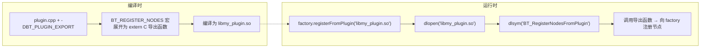
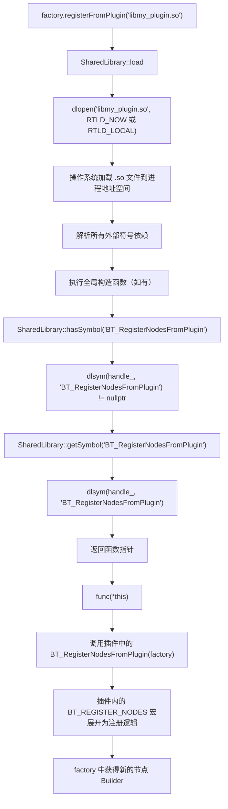

## 1.插件系统

### 1.1 插件宏定义

```cpp
// bt_factory.h
#define BT_REGISTER_NODES(factory) \
    BTCPP_EXPORT void BT_RegisterNodesFromPlugin(BT::BehaviorTreeFactory& factory)

// 平台相关的导出声明
#if defined(_WIN32)
    #define BTCPP_EXPORT extern "C" __declspec(dllexport)
#else
    #define BTCPP_EXPORT extern "C" __attribute__((visibility("default")))
#endif

/// @brief 插件入口函数的符号名称，用于 dlsym() 动态查找插件注册函数。
/// 插件共享库必须导出名为 "BT_RegisterNodesFromPlugin" 的函数。
constexpr const char* PLUGIN_SYMBOL = "BT_RegisterNodesFromPlugin";
```

### 1.2 插件加载流程

```cpp
/*----------------------------------------------------------------------------------------
 * registerFromPlugin(file_path)
 *  - 加载动态库 file_path；
 *  - 查找约定的入口符号 PLUGIN_SYMBOL（"BT_RegisterNodesFromPlugin"）；
 *  - 调用该函数把插件内的节点注册到当前 factory；
 *  - 若找不到入口符号，仅打印错误信息（不抛异常），便于批量加载插件时不中断流程。
 *----------------------------------------------------------------------------------------*/
void BehaviorTreeFactory::registerFromPlugin(const std::string& file_path)
{
    BT::SharedLibrary loader;
    loader.load(file_path);     // dlopen() / LoadLibrary()

    typedef void (*Func)(BehaviorTreeFactory&);

    if (loader.hasSymbol(PLUGIN_SYMBOL))
    {
        // dlsym() 获取函数指针
        Func func = (Func)loader.getSymbol(PLUGIN_SYMBOL);
        func(*this);            // 调用插件的注册函数
    }
    else
    {
        std::cout << "ERROR: can't find symbol [" << PLUGIN_SYMBOL << "]" << std::endl;
    }
}
```

### 1.3 SharedLibrary 封装

```cpp
/*----------------------------------------------------------------------------------------
 * load(path, flags)
 *  - 加锁后通过 dlopen() 加载指定路径的动态库；
 *  - flags 参数目前被忽略，硬编码使用 RTLD_NOW | RTLD_GLOBAL：
 *      * RTLD_NOW    ：加载时立即解析全部符号，便于尽早发现链接错误；
 *      * RTLD_GLOBAL ：该库导出的符号对后续加载的库可见，便于插件之间互相引用；
 *  - 若 _handle 已非空，说明库被重复加载，抛出 RuntimeError（与 Windows 版本行为略有
 *    差异：Windows 版本不做此检查，会直接覆盖）；
 *  - 若 dlopen 失败，使用 dlerror() 获取详细错误信息（例如 "undefined symbol"）后抛异常。
 *----------------------------------------------------------------------------------------*/
void SharedLibrary::load(const std::string& filename)
{
    handle_ = dlopen(filename.c_str(), RTLD_NOW | RTLD_LOCAL);
    if (!handle_)
        throw RuntimeError("dlopen failed: ", dlerror());
}

bool SharedLibrary::hasSymbol(const std::string& symbol)
{
    return dlsym(handle_, symbol.c_str()) != nullptr;
}

void* SharedLibrary::getSymbol(const std::string& symbol)
{
    return dlsym(handle_, symbol.c_str());
}
```

**dlopen 标志**：
- `RTLD_NOW`：立即解析所有符号（而非延迟解析）
- `RTLD_LOCAL`：符号不对外可见（避免与其他库冲突）

### 1.4 完整的插件使用链



## 2.跨平台动态库加载

### 2.1 加载链完整流程



### 2.2 符号导出的平台差异

```cpp
#if defined(_WIN32)
    #define BTCPP_EXPORT extern "C" __declspec(dllexport)
#else
    #define BTCPP_EXPORT extern "C" __attribute__((visibility("default")))
#endif
```

- **Windows**：`__declspec(dllexport)` 将符号加入导出表
- **Linux/macOS**：`__attribute__((visibility("default")))` + `extern "C"` 确保符号可见且不被 C++ name mangling

`extern "C"` 的作用：防止编译器对函数名进行 C++ 名称修饰（name mangling），确保 `dlsym` 能用简单的字符串查找找到符号。


## 3.相关函数

```cpp
#include <dlfcn.h>

// 以指定模式打开指定的动态连接库文件，并返回一个句柄给调用进程。
// flag中必须设置以下的mode：
// RTLD_LAZY 暂缓决定，等有需要时再解出符号 
// RTLD_NOW 立即决定，返回前解除所有未决定的符号。
void *dlopen(const char *filename, int flag);

// 当动态链接库操作函数执行失败时，可以返回出错信息，返回值为NULL时，表示没有错误信息。
char *dlerror(void);

// handle是由dlopen打开动态链接库后返回的指针，symbol就是要求获取的函数的名称，函数返回值是void*,指向函数的地址，供调用使用。
void *dlsym(void *handle, const char *symbol);

// 将该.so的引用计数减一，当引用计数为0时，将它从系统中卸载。
int dlclose(void *handle);
```
为了使用dlopen接口，需要设置链接选项-ldl


**set(CMAKE_EXE_LINKER_FLAGS "-ldl -rdynamic")**

与C版本的区别在于，由于动态库函数通过C++编译器完成编译，需要注意命名修饰。当函数中使用不带修饰的名称"a获取函数地址时，该函数实现需要使用extern "C"进行处理。


--- 

### 3.1 -rdynamic

**-rdynamic的作用在于导出可执行文件的符号信息**

当不设置-rdynamic时也可以完成编译链接并正确运行。那么-rdynamic选项起什么作用呢？

默认情况下符号只会从共享库中导出，当链接器设置-rdynamic后，将使得ELF可执行程序能够导出符号。或许在动态加载插件中有一定用途

在使用dlopen加载动态目标时，可能需要引用一个程序自身而非其它动态目标定义的符号，即链接这个程序自身。

**因此，通过开启这个选项可以实现动态加载可执行文件。那么，在链接目标并非可执行文件时，可以不用加入链接选项-rdynamic。**

在gcc中，-rdynamic与-Wl,-E和-Wl,--export-dynamic的作用等价。

通过编译器调用链接器并指定链接选项时，需要在前面加上-Wl，避免链接选项被编译器忽略，导致链接失败。


这个在后面仔细学习一下，这里先了解一下。

参考：[使用dlopen加载动态库 ](https://www.cnblogs.com/0xzhang/p/14460925.html)
