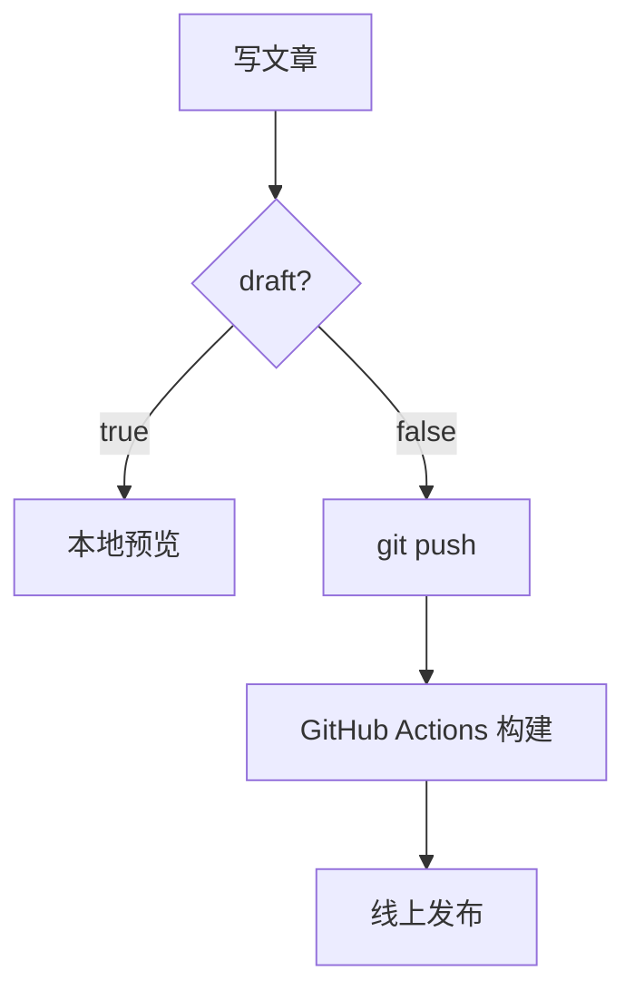
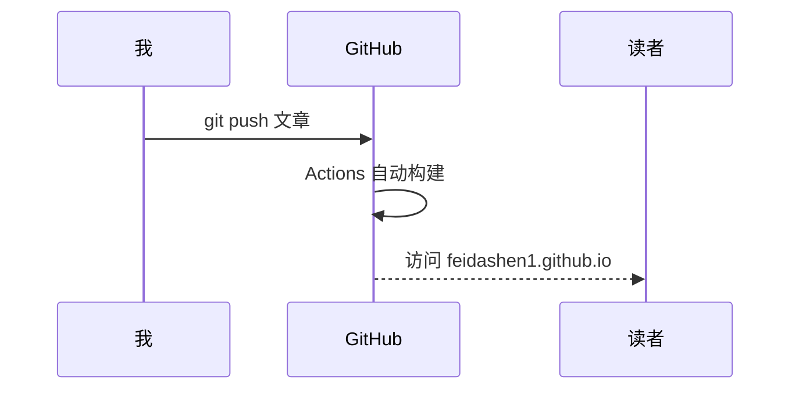

这篇文章把博客目前启用的功能尽量都用一遍。**发布后请对照下面的清单逐项检查**。

<!--more-->

## 验证清单（看到这页时请逐项核对）

- [x] 文章能正常打开
- [ ] 顶部显示**封面图**
- [ ] 右上/侧边有**目录（TOC）**且可点击跳转
- [ ] 标题下显示**阅读时长**和**字数**
- [ ] 代码块右上角有**复制按钮**，点击能复制
- [ ] 底部有**上一篇/下一篇**导航
- [ ] 底部出现**评论框**（需先按使用说明配置 Giscus，未配则不显示，正常）
- [ ] 顶部菜单「文章/归档/标签/搜索/关于」都能点开
- [ ] 右上角**深色/浅色切换**按钮工作正常
- [ ] 本文出现在**归档**页和 **标签**（测试/Hugo 等）聚合页里
- [ ] **数学公式**正确渲染（第 9 节）
- [ ] **Mermaid 图表**正确渲染成流程图（第 10 节）
- [ ] **提示框 / Callout** 显示彩色边框和图标（第 11 节）
- [ ] **点击图片**能放大查看（第 6 节）

> 上面的复选框只是展示 Markdown 任务列表渲染，打不打勾不影响功能。

## 1. 文本排版

支持 **加粗**、*斜体*、~~删除线~~、`行内代码`、[超链接](https://gohugo.io)。

中文排版测试：这是一段中文正文，用来观察行距、字体和段落间距是否舒适。English mixed in to test 中英混排 spacing。

## 2. 列表

无序列表：

- 第一项
- 第二项
  - 嵌套子项
  - 另一个子项
- 第三项

有序列表：

1. 准备
2. 执行
3. 验证

## 3. 引用与提示

> 这是一段引用（blockquote）。
>
> 引用可以有多段，常用于强调或摘录。

## 4. 代码高亮与复制按钮

行内：调用 `hugo server` 启动本地预览。

Python：

```python
def greet(name: str) -> str:
    return f"Hello, {name}!"

print(greet("Feidashen"))
```

JavaScript：

```javascript
const posts = ["a", "b", "c"];
posts.forEach((p, i) => console.log(`${i + 1}. ${p}`));
```

Bash：

```bash
make new t=我的新文章
make publish m="发布新文章"
```

## 5. 表格

| 功能 | 是否启用 | 说明 |
|------|:------:|------|
| 深色模式 | ✅ | 跟随系统，可手动切换 |
| 站内搜索 | ✅ | 基于 Fuse.js |
| RSS 订阅 | ✅ | `/index.xml` |
| 评论 | ⚙️ | 需配置 Giscus |
| 访问统计 | ⚙️ | 需配置 GA |

## 6. 图片

下面这张图来自 `static/images/test-banner.svg`，用绝对路径引用：


## 7. 脚注

Hugo 是一个用 Go 编写的静态站点生成器[^1]，以构建速度快著称[^2]。

[^1]: 静态站点生成器：把 Markdown 等源文件预先编译成纯 HTML。
[^2]: 大型站点也能在数百毫秒内完成构建。

## 8. 分隔线

上面是正文，下面用一条分隔线结束。

---

## 9. 数学公式（KaTeX）

行内公式：质能方程 $E = mc^2$，欧拉恒等式 $e^{i\pi} + 1 = 0$。

块级公式：

$$
\int_{-\infty}^{\infty} e^{-x^2}\,dx = \sqrt{\pi}
$$

$$
\frac{\partial}{\partial t}\Psi = \frac{i\hbar}{2m}\nabla^2\Psi
$$

> 数学公式需要在文章 front matter 加 `math: true` 才会渲染（本文已加）。

## 10. Mermaid 图表

流程图：



时序图：



## 11. 提示框 / Callout

用 `notice` 短代码生成彩色提示框，支持 5 种类型：


**小技巧**：用 `make new t=标题` 可以快速新建文章。



**信息**：本博客基于 Hugo + PaperMod 构建。



**注意**：发布前记得把 `draft` 改成 `false`。



**危险**：不要把含密码/令牌的文件提交到仓库！



**备注**：这段支持 *Markdown*，可以写 `代码`、[链接](https://gohugo.io) 等。


写法：

```text

**内容**支持 Markdown

```

---

如果以上每一项都正常显示，说明博客的核心功能都工作正常 🎉。
确认无误后，可以把这篇测试文章删掉（删除 `content/posts/feature-test.md` 再 `make publish`），
或者留着作为 Markdown 语法参考。
