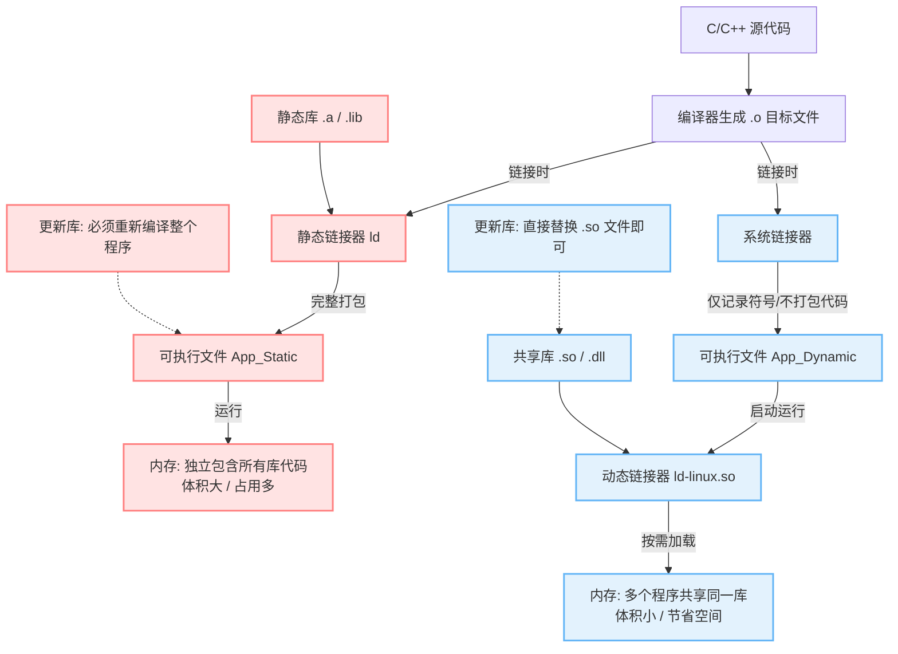
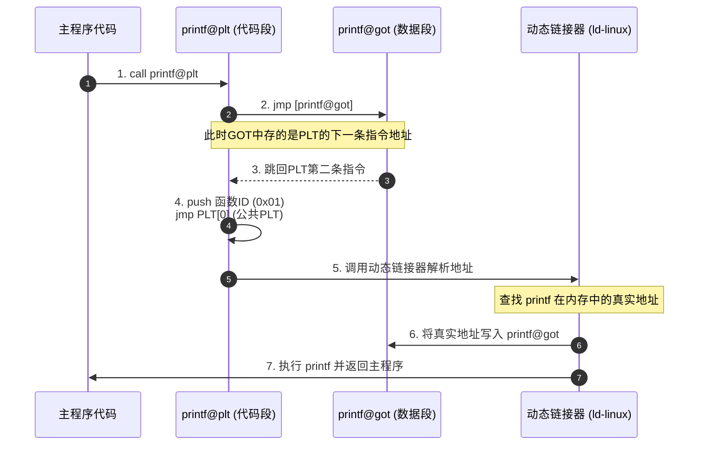
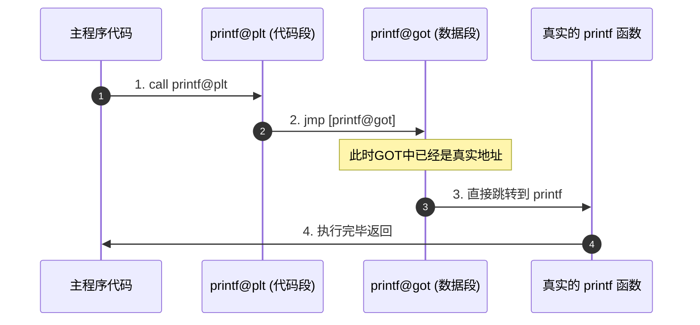
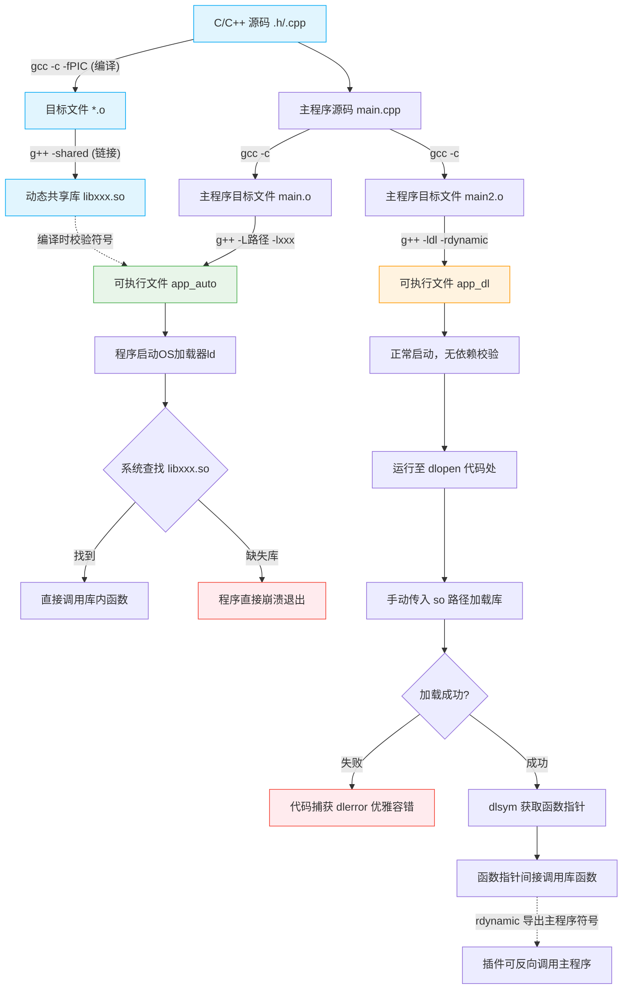

Linux 动态链接（Dynamic Linking）是一种在程序运行时而非编译时，将模块与**共享库**（如 .so 文件）进行连接的机制。这种机制能够显著减少可执行文件的体积，节省内存空间，并支持在不重新编译主程序的情况下单独更新共享库。

- 共享库（.so）：动态链接器（通常是 /lib/ld-linux.so）在程序启动时，负责将外部的共享目标文件加载到内存中。
- 地址无关代码（PIC）：动态库编译时常采用 -fPIC 选项，使其代码可以在内存的任意位置加载执行，多个程序可共享同一份物理内存中的库代码。
- 符号重定位：程序调用共享库中的函数时，动态链接器会在运行时解析符号并将调用地址重定向到实际的库函数位置。

> 

## 1.动态和静态链接

静态链接使库成为生成的可执行文件的一部分。动态链接将这些库保留为单独的文件。



- 文件体积：静态链接将 .a 库完整嵌入，生成的文件体积较大；动态链接仅在 .dynamic 段记录符号信息，文件体积非常小。
- 内存占用：若多个程序使用同一个静态库，内存中会存在多份副本；而动态库（.so）在物理内存中只有一份，多个进程通过页表映射共享。
- 更新维护：库文件代码有修改或漏洞修复时，静态链接必须重新编译部署；动态链接只需替换 .so 文件，主程序无需重新编译。


## 2.动态链接中的 PLT（程序链接表）和 GOT（全局偏移表）

在 Linux 动态链接中，为了实现地址无关代码（PIC），程序在编译时无法确定共享库函数的绝对地址。为了解决这个问题，ELF 文件引入了 PLT（Procedure Linkage Table，程序链接表） 和 GOT（Global Offset Table，全局偏移表）。

核心思想是：**代码段只读，数据段可写。通过引入一个间接跳转表（GOT），将运行时的地址修改操作限制在数据段**。

**GOT（全局偏移表）**：位于数据段。它是一个指针数组，用来存放外部全局变量和动态库函数的实际绝对地址。它是可写的地址表。负责记录真正的函数地址。*第一次调用时存的是 PLT 的地址，调用后被修改为函数真实的绝对地址。*

**PLT（程序链接表）**：位于代码段。它是一段一小撮一小撮的代码（称为 PLT 桩/stub）。程序不直接调用动态库函数，而是调用对应的 PLT 桩，再由 PLT 桩跳转到 GOT 中记录的地址。*它是只读的桩代码。负责在不知道地址时，作为跳板引导程序去找动态链接器。*

> 如果调用者使用了共享库的符号，则调用者的数据段会有一个GOT，用于记录共享库符号的地址；如果共享库A作为调用者使用了共享库B的符号，则共享库A的数据段也会有一个GOT。由于编译的时候不能知道共享库的符号地址，所以调用者通过GOT获取共享库的符号地址，运行时链接只需要修改位于数据段的GOT的内容，不需要对调用者的代码段重定位。

共享库有数据段和代码段，数据段是每个应用程序各自有一份，代码段是每个应用程序共享一份。

### 2.1 延迟绑定（Lazy Binding）

为了提升程序的启动速度，Linux 默认采用延迟绑定。这意味着：**程序启动时，并不立刻解析所有动态库函数的地址，只有在第一次调用该函数时，动态链接器才会去查找并填入它的真实地址**。


第一次调用函数时的完整流程（以调用 printf 为例）：

1. 调用 PLT：主程序执行 call printf@plt。
2. 第一次跳转：printf@plt 第一条指令是 jmp [printf@got]（跳转到 GOT 里保存的地址）。注意：此时 printf@got 里填写的并不是 printf 的真实地址，而是 printf@plt 的第二条指令地址！
3. 跳回 PLT：因为 GOT 指向了 PLT 的下一行，所以程序实际上“转了一圈”又回到了 printf@plt 的第二条指令。
4. 准备解析：PLT 压入该函数在重定位表中的索引（ID），然后跳转到 PLT[0]（公共 PLT）。
5. 触发链接器：PLT[0] 压入标识该链接库的参数，并跳转到动态链接器（_dl_runtime_resolve）的代码中。
6. 修改 GOT 表：动态链接器在内存中找到 printf 的真实绝对地址，并把这个地址覆盖写入 printf@got 中。
7. 执行并返回：执行本次 printf 调用，然后返回主程序。




第二次及以后调用函数：

1. 主程序执行 call printf@plt。
2. printf@plt 执行 jmp [printf@got]。
3. 由于 printf@got 已经指向了真实的 printf 函数，程序直接跳转到真实的函数中执行。
4. 不再有动态链接器的介入，几乎没有任何性能损耗。




## 3.动态链接的方式
在 Linux 系统中，程序使用动态链接库主要有两种方式：运行时动态链接（加载时链接） 和 动态加载（运行时手动加载）。

### 3.1 运行时动态链接（加载时链接 / Load-time Linking）

这是最常见、最传统的动态链接方式。**在编译程序时就必须指定依赖的库，系统在程序启动加载时自动完成符号解析。**

工作原理：编译时，链接器在可执行文件中留下符号表和依赖标记。程序启动时，系统的动态链接器（如 /lib/ld-linux.so）在主程序运行前，自动将所有依赖的 .so 库加载到内存中，并通过前面提到的 PLT/GOT 机制进行延迟绑定。

```bash
gcc main.c -o app -L./lib -lmath
```

代码写法：像调用普通函数一样直接调用。

特点：开发简单，对开发者透明；但如果缺少任何一个依赖的 .so 文件，程序在启动时就会直接报错报错并退出（例如：error while loading shared libraries）。

### 3.2 动态加载（运行时链接 / Run-time Loading）

这种方式在编译时不需要知道任何库的存在，也不需要链接具体的 .so。程序在运行过程中，根据代码逻辑在某个特定时刻手动去加载库、寻找函数地址。

工作原理：利用 Linux 系统提供的 dlfcn.h 接口，通过代码手动控制库的加载、符号查找和卸载。它不依赖编译期的链接配置。

```bash
gcc main.c -o app -ldl
```
特点：极具灵活性。即使 .so 文件不存在，程序依然可以正常启动，只有在执行到加载代码时才会处理。常用于插件系统、软件热更新或软件的试用版/正版功能动态解锁。

### 3.3 动态链接两种特性对比表
|对比维度|特性1：运行时动态链接（加载时）|特性2：动态加载（运行时手动）|
| ---- | ---- | ---- |
|链接发生时机|程序启动时自动加载所有依赖库|程序运行到指定代码时手动加载|
|编译期要求|必须指定库名（如 `-lmath`）|无需指定库名，只需链接 `-ldl` 接口库|
|缺失.so库表现|程序无法启动，直接报错退出|程序能正常启动，可在代码中优雅处理错误|
|函数调用方式|直接调用函数名（如 `add()`）|必须通过函数指针间接调用|
|典型应用场景|常规基础库（如 libc, libm）|插件化框架、按需加载模块、可选功能组件|


## 4.动态链接库编译

Linux 动态链接库（.so 文件）的编译和使用过程主要分为源码编译、链接打包、程序链接和运行加载四个核心步骤。

**1.生成位置无关代码 (Compile)**

首先，需要将源文件（如 math.c）编译为中间目标文件（.o）。此时必须显式使用 -fPIC 参数。

命令：gcc -fPIC -c math.c -o math.o

- 原理：-fPIC 意思是生成位置无关代码（Position Independent Code）。它让编译器使用相对地址（如借由当前 PC 寄存器进行偏移）来访问代码和数据，而不是硬编码绝对地址。这样，生成的 .so 库就可以被操作系统随机加载到任何内存地址运行。


**2.打包生成动态链接库 (Link)**

接下来，将一个或多个目标文件打包，链接成一个共享对象文件（Shared Object）。

命令：gcc -shared -o libmath.so math.o

- 参数说明：
    - shared：告知 GCC 生成的是一个可被共享的动态链接库，而不是普通的可执行文件。
    - libmath.so：Linux 下动态库的命名规范。必须以 lib 开头，以 .so 结尾，中间是库的真实名称（这里是 math）。

**3.编译主程序并链接动态库 (Application Link)**

在编译主程序（如 main.c）时，编译器需要知道动态库中开放了哪些符号（函数或变量），以生成正确的调用占位符。

命令：gcc main.c -L. -lmath -o app

- 参数说明：
    - -L.：指定链接器在当前目录（.）下寻找库文件。
    - -lmath：指定链接名为 math 的库。链接器会自动寻找 libmath.so（或静态库 libmath.a，默认优先使用动态库）。
    - 此时的结果：生成的可执行文件 app 中不包含 math.c 的实际代码，而仅仅包含一个标记：“我需要 libmath.so 中的某个函数”

**4.运行阶段的动态装载 (Runtime Run)**

当直接运行 ./app 时，操作系统会报错：error while loading shared libraries: libmath.so: cannot open shared object file。这是因为系统找不到库文件。

需要通过以下几种方式之一告知动态链接器（ld.so）库文件的位置：
- 方法一（最常用/临时测试）：export LD_LIBRARY_PATH=.:$LD_LIBRARY_PATH然后运行：./app
- 方法二（生产推荐/永久生效）：将 libmath.so 复制到系统默认路径 /usr/lib 或 /lib 下，并运行 sudo ldconfig 更新缓存。
- 方法三（编译时硬编码路径）：在第 3 步链接主程序时增加 Rpath 参数：gcc main.c -L. -lmath -Wl,-rpath=. -o app。这样程序运行时会自动在当前目录寻找库。



## 5.采用dlopen、dlsym、dlclose加载动态链接库
在 Linux C/C++ 开发中，使用 dlopen、dlsym 和 dlclose 可以实现动态库的运行时按需加载（即插件模式）。这组 API 被定义在 <dlfcn.h> 头文件中，编译主程序时必须链接 -ldl 库。

　为了使程序方便扩展，具备通用性，可以采用插件形式。采用异步事件驱动模型，保证主程序逻辑不变，将各个业务已动态链接库的形式加载进来，这就是所谓的**插件**。


### 5.1 `dlopen` — 动态库的装载与映射

`dlopen` 的核心任务是：**将磁盘上的 `.so` 文件读取到进程的虚拟内存空间中，并建立符号索引。**

#### 5.1.1 底层执行
1. **触发系统调用**：用户调用 `dlopen("libxxx.so", flag)`，内核通过 `mmap` 系统调用，将该 `.so` 文件的代码段（TEXT）和数据段（DATA）映射到当前进程的虚拟地址空间。
2. **解析依赖（Dependency Tree）**：动态链接器会读取该 `.so` 的 `ELF` 头部，检查它是否还依赖了其他的动态库。如果存在依赖，链接器会递归地把那些库也一起加载进内存。
3. **维护引用计数（Reference Count）**：Linux 内部维护了一个全局的“共享对象列表”。如果发现该 `.so` 已经被当前进程的其他模块加载过了，动态链接器**不会**重复加载代码段，而是将其引用计数（Ref Count）加 1，并直接返回已经存在的句柄（Handle）。
4. **执行初始化代码（Constructor）**：在 `dlopen` 返回之前，链接器会扫描 `.so` 中是否有被 `__attribute__((constructor))` 修饰的函数（C++ 中为全局对象的构造函数）。如果有，会**优先自动执行**这些代码。

#### 5.1.2 Flag 参数的底层差异
* **`RTLD_LAZY`（懒加载）**：只把库映射进内存。库内函数用到的**外部符号地址（GOT表）**先空着，等到程序第一次真正调用这个函数时，才去触发延迟绑定（PLT跳转），启动效率极高。
* **`RTLD_NOW`（立即绑定）**：在 `dlopen` 返回前的瞬间，链接器遍历库中的所有符号，强行把所有地址全部解析并填满。如果有任何一个符号找不到，`dlopen` 会直接宣告失败并返回 `NULL`。

### 5.2 `dlsym` — 符号表的哈希查找

`dlsym` 的核心任务是：**在内存中根据字符串名称，快速找出对应的函数或变量的绝对内存地址。**

#### 5.2.1 底层执行
1. **定位符号表**：`dlopen` 返回的 `handle` 实际上是一个指向内部结构体（在 glibc 中通常是 `struct link_map`）的指针。这个结构体里记录了该 `.so` 文件的**动态符号表（`.dynsym`）**和**字符串表（`.dynstr`）**的内存首地址。
2. **哈希加速查找**：为了防止在成千上万个函数名里做慢速的字符串比对，`.so` 文件内部包含了一个 **ELF 哈希表（或 GNU Hash 表）**。`dlsym` 会先计算你传入的函数名（如 `"add"`）的哈希值，然后直接定位到哈希桶中。
3. **符号匹配与重定位计算**：找到匹配的符号项（Symbol Entry）后，`dlsym` 会读取该符号在 `.so` 内部的**相对偏移量（Value）**。
4. **计算绝对地址**：
   $$\text{函数的绝对内存地址} = \text{该 .so 的内存起始装载基址 (Base Address)} + \text{符号的相对偏移量 (Value)}$$
   最终，`dlsym` 将这个计算好的绝对地址转成 `void*` 指针返回给用户。

### 5.3 `dlclose` — 引用计数与内存卸载

`dlclose` 的核心任务是：**解除内存映射，释放不再使用的库资源。**

#### 5.3.1 底层执行全历程
1. **递减引用计数**：调用 `dlclose(handle)` 时，动态链接器首先将该句柄对应的 `.so` 对象的内部引用计数减 1。
2. **条件卸载**：
   * 如果引用计数减 1 后 **大于 0**（说明别的模块还在用它），`dlclose` 仅仅是断开当前计数，**什么都不做**，直接返回。
   * 如果引用计数减 1 后 **等于 0**，说明没有任何人使用它了，正式启动**销毁流程**。
3. **执行析构代码（Destructor）**：在真正擦除内存前，链接器会先自动执行 `.so` 中被 `__attribute__((destructor))` 修饰的函数（C++ 中为全局对象的析构函数），用来释放库内部自己申请的全局资源。
4. **解除内存映射**：调用 `munmap` 系统调用，将该 `.so` 占用的虚拟内存页全部清空，归还给操作系统。此时，之前通过 `dlsym` 拿到的所有函数指针将彻底变为空指针（野指针），一旦误调用会直接引发 `Segmentation fault` 崩溃。


> 在 C/C++ 语言中，普通函数通常通过返回值（如 -1 或 NULL）来报错，但动态链接的错误往往非常复杂（如“依赖的另一个库找不到”、“符号未定义”等）。
> * **底层实现**：glibc 内部为每个线程维护了一个**线程局部存储（TLS, Thread Local Storage）**的全局错误字符串变量。
>* **工作原理**：当 `dlopen` 或 `dlsym` 发生内部错误时，动态链接器会把详细的错误文本写入当前线程的这个 TLS 变量中。而 `dlerror()` 被调用时，它的逻辑是：**“读取这个 TLS 字符串返回给用户，并顺手把这个全局变量清空（置为 NULL）”**。这就是为什么说 `dlerror()` 是一次性读取的原因。


## 参考文献

[静态和动态链接](https://docs.redhat.com/zh-cn/documentation/red_hat_enterprise_linux/7/html/developer_guide/gcc-using-libraries_understanding-static-dynamic-linking)

[动态链接原理 --- PLT/GOT](https://www.cnblogs.com/god-of-death/p/17963231)


