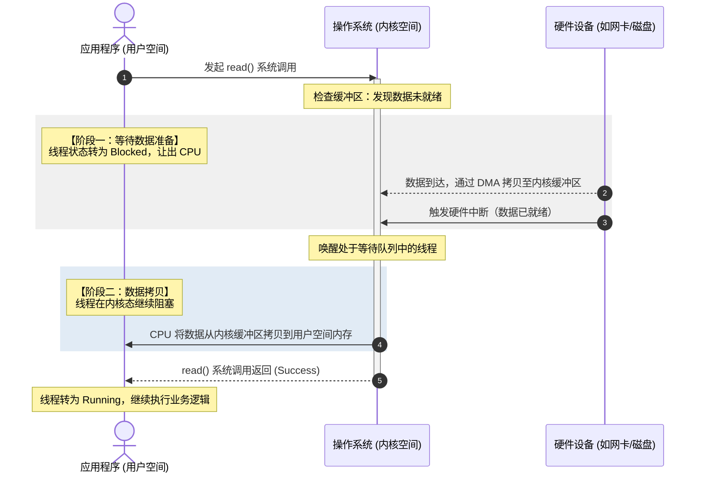
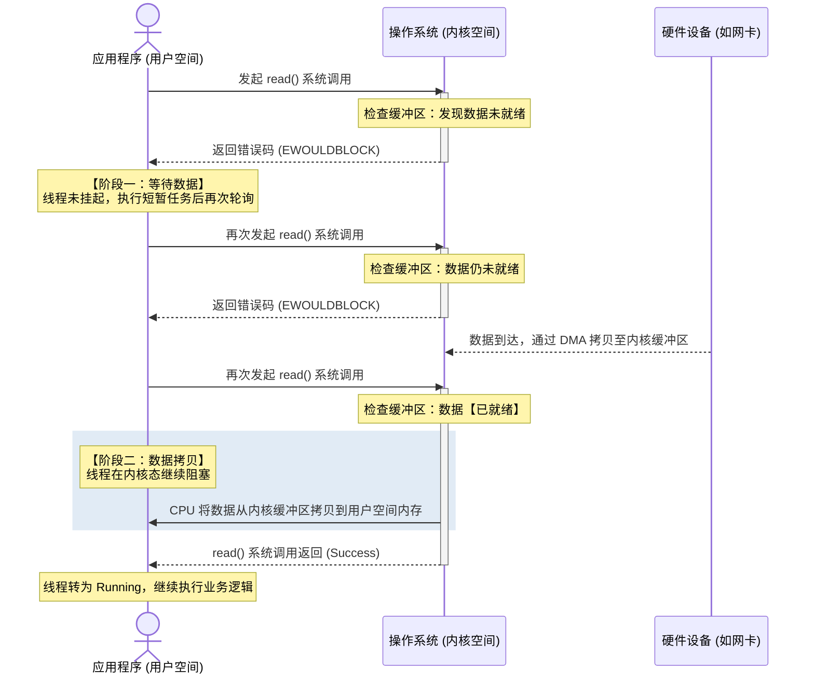
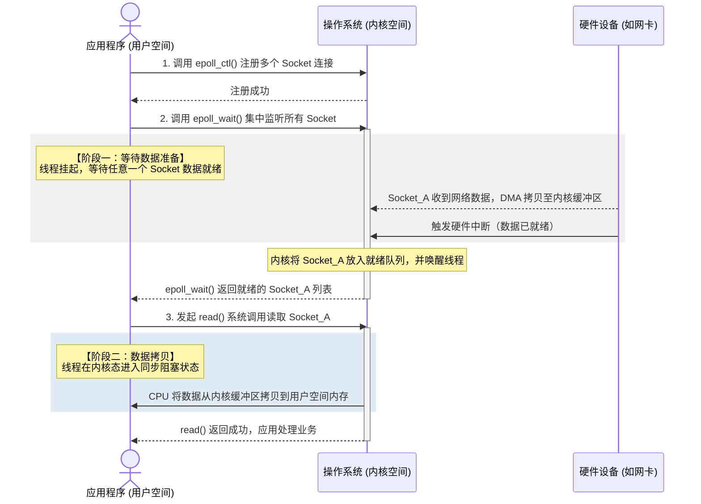
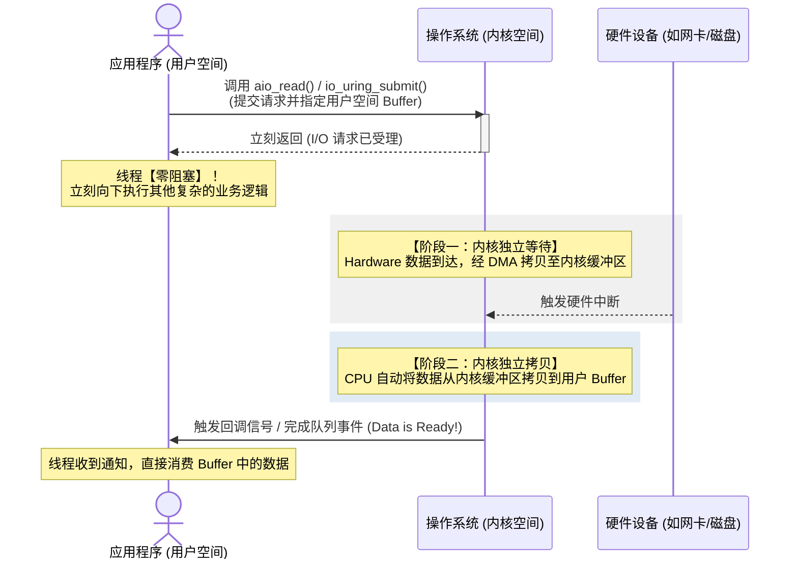
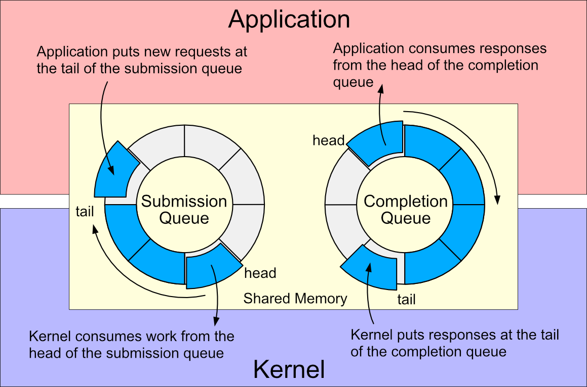
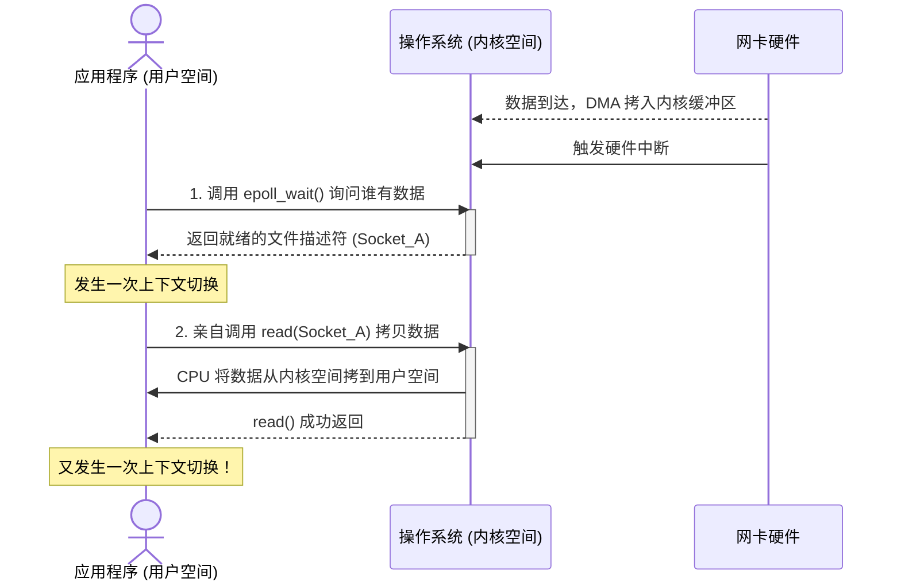
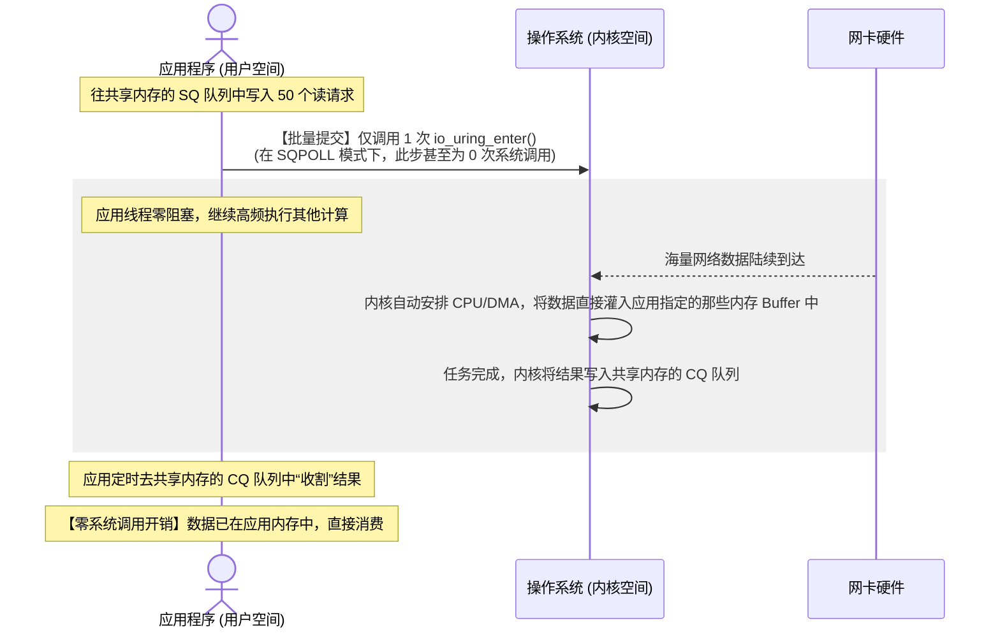

## 1.IO 基本概念

I/O（输入/输出）的基本原理是数据在计算机内存与外部设备（如磁盘、网卡、键盘）之间的传输过程。因为 CPU 速度极快，而外部设备速度极慢，整个 I/O 系统的核心设计都是为了解决速度不匹配、减少 CPU 等待。

在软件层面，应用程序如何看待和调用内核的 I/O 接口，决定了系统的并发能力，常见的IO模型包括阻塞IO、非阻塞IO、多路复用IO和异步IO：
- 阻塞 I/O（Blocking I/O）：应用进程发起请求后挂起，直到内核数据准备好且拷贝到用户空间才返回。
- 非阻塞 I/O（Non-blocking I/O）：应用进程发起请求，若内核没数据则直接返回错误（EWOULDBLOCK），进程需要不断轮询直到成功。
- I/O 多路复用（I/O Multiplexing）：利用 select / poll / epoll。一个线程同时监听多个 I/O 通道。当某个通道有数据时才去处理，是高性能网络服务器（如 Nginx、Redis）的核心。
- 信号驱动 I/O（Signal-driven I/O）：应用进程预先注册信号函数。内核数据准备好时发送信号通知进程，进程在信号处理函数中开始拷贝数据。
- 异步 I/O（Asynchronous I/O）：应用进程发起请求后直接返回去干别的事。内核自动完成数据准备和数据拷贝。全部搞定后，内核再通知进程（真正的非阻塞）。

任何 I/O 操作都逃不开这两个核心阶段：
- **阶段一：等待数据准备（Wait for data to be ready）** —— 数据从硬件（网卡/磁盘）到内核缓冲区。
- **阶段二：数据拷贝（Copy data from kernel to user）** —— 数据从内核缓冲区到用户空间。

## 2.同步与异步 IO
在所有 I/O 模型中，请求最初都是由用户程序发起的（内核不会无缘无故主动传数据给程序）。**同步与异步的本质区别，在于阶段二（数据从内核缓冲区拷贝到用户空间）是谁来完成**，以及**在这个过程中用户程序是否需要等待**。

1. 同步 I/O（包含：阻塞、非阻塞、多路复用、信号驱动）：本质：当内核通知数据准备好后，用户程序必须亲自调用系统函数（如 read），由用户线程阻塞地将数据从内核空间拷贝到用户空间。**在拷贝完成前，用户线程无法做其他事**。
2. 异步 I/O（如 Linux AIO / io_uring）：本质：用户程序发起请求后就去干别的了。**数据的拷贝完全由内核自动完成**。内核直接把数据塞进用户空间指定的内存里，全部搞定后才通知用户程序：“数据已经躺在你的内存里了，直接用吧”。

## 3.同步阻塞 IO

在数据没有彻底准备好并拷贝到用户空间之前，发起调用的线程会一直处于挂起状态，无法执行任何其他任务。

1. 发起调用：应用程序执行到 read() 或 recv() 函数。此时，程序控制权通过系统调用（System Call）从用户态（User Space）切换到内核态（Kernel Space）。
2. 阶段一：内核等待数据：内核查看接收缓冲区，发现数据还没到（例如网络对端还没发数据，或者磁盘还在寻道）。
    - 操作系统操作：操作系统为了不浪费 CPU 资源，会将当前线程的状态从“运行态（Running）”改为“睡眠态/阻塞态（Blocked/Waiting）”，并将其移入该 I/O 设备的等待队列中。此时，**该线程让出 CPU，不占用 CPU 资源**。
3. 阶段二：内核拷贝数据：当外设（如网卡）收到数据后，通过 DMA（直接内存访问） 将数据放入内核缓冲区，并通过硬件中断通知 CPU。
    - 操作系统操作：内核将该线程从等待队列中唤醒，状态改为“就绪态（Ready）”。当 CPU 再次调度该线程时，线程进入内核态继续执行：**由 CPU 负责将数据从内核缓冲区拷贝到用户空间指定的内存地址**。
4. 返回结果：拷贝完成后，系统调用返回，控制权切回用户态，read() 函数成功拿到数据并结束，应用程序继续向下执行。

### 3.1 同步阻塞 I/O 的特性分析
优点：
1. 编程模型极其简单：代码逻辑是线性的。例如 data = read(); print(data);，不需要考虑回调，不需要处理错误码，写起来极度顺畅。
2. 高并发低吞吐下的低延迟：在并发量非常低（比如就几个连接）且数据准备很快的情况下，线程一唤醒就能立刻处理，没有多路复用的上下文切换和轮询开销，响应速度最快。

缺点（高并发的致命痛点）：
1. 一个线程只能处理一个连接：因为线程在等待数据时被死死卡住。如果要做一个支持 1000 人同时在线的聊天室，服务器就必须创建 1000 个线程。
2. 资源严重浪费：线程是非常昂贵的系统资源（在 Linux 下，默认一个线程需要分配 8MB 的栈内存）。成千上万的线程会导致系统内存瞬间耗尽。
3. CPU 都在忙着“切线程”：当有大量线程被唤醒和挂起时，操作系统需要频繁进行上下文切换（Context Switch）（保存寄存器、恢复现场等）。这会导致 CPU 大量时间浪费在管理线程上，而不是真正执行业务逻辑。

## 4.同步非阻塞 IO
当应用程序发起 I/O 请求时，如果内核数据尚未准备好，内核不会阻塞该线程，而是立刻返回一个错误状态码（如 Linux 中的 EWOULDBLOCK 或 EAGAIN）。

在同步非阻塞模型中，线程在阶段一不会被操作系统挂起，而是通过“轮询（Polling）”的方式不断询问内核；但一旦数据准备好，在阶段二的数据拷贝过程中，线程依然是阻塞的。

- 阶段一（非阻塞轮询）：应用程序以非阻塞模式调用 read()。内核发现缓冲区没数据，立刻返回 EWOULDBLOCK。用户线程拿到这个返回值后，知道数据没来，可以先去干点别的事（比如更新个计数器），然后再次发起调用（即轮询）。
- 阶段二（同步拷贝）：直到某一次轮询，内核发现硬件数据已经通过 DMA 传输到了内核缓冲区。此时内核不再返回错误，而是开始拷贝数据。在 CPU 将数据从内核空间拷贝到用户空间的过程中，用户线程是卡死的（阻塞）。拷贝完成后，read() 成功返回。

### 4.1 同步非阻塞 I/O 的特性分析
优点：单线程可以管理多个连接（理論上）：由于调用 read() 不会死卡住，一个线程可以循环去读 Socket A、Socket B、Socket C。如果 A 没数据就立刻读 B，谁有数据就处理谁。

缺点（严重的性能瓶颈）：
- “忙轮询”导致 CPU 暴满（Bury Loop）：如果数据一直没来，用户线程就会在代码里写一个 while(true) 疯狂调用系统函数。这种频繁的用户态与内核态切换（Context Switch），会导致 CPU 使用率飙升到 100%，造成极大的系统资源浪费。
- 轮询空转过多：在实际高并发场景下，绝大多数的轮询调用拿到的都是 EWOULDBLOCK 错误，属于无效的无用功。

## 5.IO 多路复用
应用程序不再自己去轮询或阻塞在每个连接上，而是把成百上千个连接（文件描述符/Selectable Channel）全部丢给操作系统内核的一个专职监听器（如 select、poll、epoll）。线程只需要阻塞在这一个监听器上，一旦某个连接的数据准备好了，内核就会唤醒该线程去处理。

### 5.1 核心工作原理

阶段一集中阻塞，阶段二同步拷贝

1. 连接注册：通过 epoll_ctl 把所有需要监控的客户端连接（Socket）交给内核。
2. 阶段一（集中阻塞等待）：应用程序调用 epoll_wait。如果所有连接都没数据，线程进入挂起（阻塞）状态。此时，即使有 1 万个连接，也只需要 1 个线程在死等。
    - 唤醒与通知：当网卡收到某个连接（如 Socket_A）的数据后，内核通过中断把数据拷入内核缓冲区，并唤醒正在 epoll_wait 上死等的线程。
3. 阶段二（同步拷贝）：线程被唤醒后，拿到有数据的 Socket_A 列表，接着调用标准的 read() 系统调用。此时，在 CPU 将数据从内核空间拷贝到用户空间的过程中，线程依然是同步阻塞的。

### 5.2 select vs poll vs epoll

select函数通过监听文件描述符集合，当有描述符就绪时返回，通知应用程序进行处理 。但它有一些局限性，比如能监听的文件描述符数量有限（通常为 1024 个），每次调用select都需要将文件描述符集合从用户空间拷贝到内核空间，并且返回时需要遍历整个集合来判断哪些描述符就绪，效率较低 。

poll函数与select类似，但它**使用链表来存储文件描述符**，突破了文件描述符数量的限制，但在处理大量文件描述符时，性能仍然会随着描述符数量的增加而下降 。

epoll是select和poll的增强版，它采用事件驱动的方式，**在内核中维护一个事件表**，当有事件发生时，直接将事件通知给应用程序，而不需要遍历整个文件描述符集合 。epoll还支持水平触发（Level Triggered，LT）和边缘触发（Edge Triggered，ET）两种模式，其中边缘触发模式的效率更高，适用于高并发场景 。

| 机制 | 核心特性 | 性能特征 | 缺点与局限 |
| ---- | ---- | ---- | ---- |
| select | 历史最悠久，全平台支持 | - | 1. 每次调用均需在用户态与内核态来回拷贝全部连接集合 2. 内核仅通知有事件，线程需O(N)遍历全部连接 3. 默认最大连接数限制1024 |
| poll | 机制逻辑与select类似 | 解除1024连接上限 | 仍存在用户/内核内存反复拷贝、O(N)遍历连接的性能损耗 |
| epoll（Linux特有） | Linux专属，高性能高并发方案；内核红黑树管理fd，就绪链表存储事件 | 增删改fd效率极高；仅返回就绪fd，事件处理O(1)，并发上限高 | 仅Linux系统支持，跨平台兼容性差 |

> 在操作系统底层，select 函数之所以将最大文件描述符数量限制为 1024，并非是操作系统的硬件限制，而是由其内核源码中的数据结构宏定义以及性能权衡共同决定的。  `#define __FD_SETSIZE    1024`

## 6.异步 IO
应用程序发起 I/O 请求后，立刻返回去执行其他业务逻辑，不需要在任何阶段发生阻塞。操作系统内核会在后台独立完成“等待数据”和“将数据拷贝到用户空间”这两个阶段。当一切准备就绪，内核会直接通知应用程序

### 6.1 io_uring
Linux 内核在 5.1 版本（2019年）引入了全新的异步 I/O 框架 —— io_uring

io_uring 的核心突破在于：
1. 真正支持所有 I/O：完美支持网络 Socket、普通文件、带缓存文件等所有 I/O 场景。
2. 用户态与内核态零拷贝（无系统调用）：它在用户空间和内核空间之间共享了两个无锁环形队列（Ring Buffer）：
    - 提交队列（SQ）：用户态把 I/O 任务放进去。
    - 完成队列（CQ）：内核态把完成结果放进去。
    - 线程和内核可以通过高性能的内核内核轮询（Kernel Polling）来消费队列，在极端高并发下，甚至不需要发生一次真正的 syscall（系统调用转换），性能彻底碾压 epoll。

#### **基于 mmap 的双环（Ring Buffer）机制**

传统的 I/O 模型无论如何优化，在提交 I/O 请求和获取结果时，都必须调用系统调用（如 read / write / epoll_wait），这会产生用户态与内核态切换（Syscall Context Switch）的开销。

io_uring 的颠覆性设计在于：它在初始化时，通过 mmap 系统调用将一块物理内存同时映射到用户空间和内核空间。在这块共享内存中，维护了两个无锁的环形队列（Ring Buffer）：提交队列（Submission Queue，简称 SQ）与 完成队列（Completion Queue，简称 CQ）。

提交队列作用：应用进程是生产者，向该队列写入“工作订单”（即 SQE，Submission Queue Entry）。
- 内容：包含要执行的 I/O 类型（读、写、connect、accept）、目标 FD、用户 Buffer 地址、偏移量等。

完成队列作用：内核是生产者，完成 I/O 任务后，向该队列写入“完工报告”（即 CQE，Completion Queue Entry）。
- 内容：包含任务的执行结果（如读取的字节数、错误码）以及用户自定义的 Data 标识。

#### io_uring 的三种工作模式
根据应用如何通知内核消费 SQ，以及内核如何处理 I/O，io_uring 支持三种模式：
1. 中断驱动模式（默认模式）：应用往 SQ 写完数据后，需要调用一次 io_uring_enter() 系统调用来通知内核：“我提单了，快去干活”。虽然有系统调用，但它可以批量提交（一次系统调用提交 100 个任务），极大地摊薄了开销。
2. 轮询模式（Poll 模式）：针对高性能存储设备（如 NVMe SSD）。内核不再依赖硬件中断来通知 I/O 完成，而是通过高频轮询硬件状态来收割结果，大幅降低延迟。
3. 内核轮询模式（SQPOLL 模式 —— 终极形态）：完全零系统调用。内核会专门启动一个后台线程（io_sq_thread）来疯狂轮询 SQ 队列。应用只需要使用原子操作（Atomic）更新 SQ 的 Tail 指针，内核线程看到指针动了就会自动把任务提走执行。整个 I/O 提交和收割阶段，应用不需要发生哪怕一次系统调用（System Call）。

#### 性能架构深度对比：epoll vs io_uring
epoll 本质是状态通知（告诉你数据好了，你得自己来拿）。每处理一轮数据，都要经历 epoll_wait 阻塞、被唤醒、循环调用 read 的过程。

io_uring 本质是完工通知（工作单交上去，内核全干完，数据直接进内存）。

1. 彻底消灭系统调用开销：通过 mmap 双环设计和 SQPOLL 模式，高并发时 CPU 不再频繁在用户态和内核态之间做无谓的切换。
2. 天生的批量处理（Batching）：一个 io_uring_enter 可以投递成百上千个不同类型的 I/O 任务，而 epoll 的 read/write 必须对每个 FD 单独发起调用。
3. 真正统一了全 I/O 接口：epoll 只能高效处理网络套接字（对普通磁盘文件无效，因为文件永远是“就绪”的，会卡死在 read 阶段）；而 io_uring 完美打通了网络 I/O 与存储磁盘 I/O，具备普适的高性能。

[从青铜到王者：带你吃透IO模型](https://mp.weixin.qq.com/s?__biz=Mzg4NDQ0OTI4Ng==&mid=2247491436&idx=1&sn=7f83246a683c330ad111232d3bee8888&chksm=cfb95605f8cedf136740cfdb4c5aa69b751940b8a358a6cdf772bf379069bf193bb6adc59086&scene=178&cur_album_id=3140091333123276802&search_click_id=#rd)

[Linux I/O 神器之 io_uring](https://zhuanlan.zhihu.com/p/583298936)