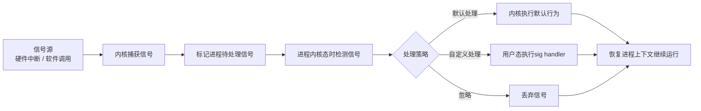
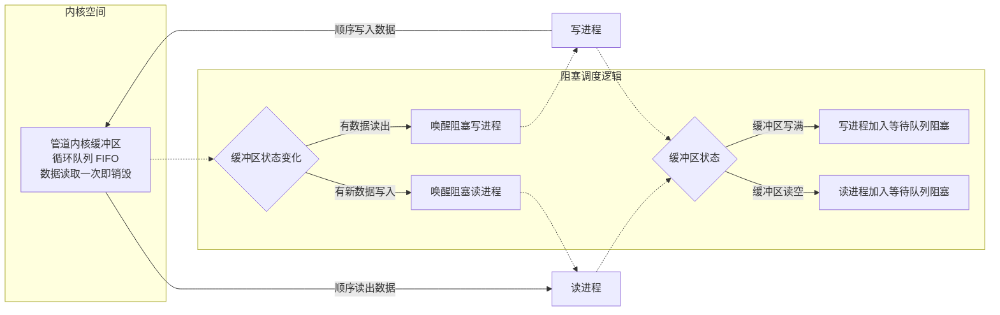
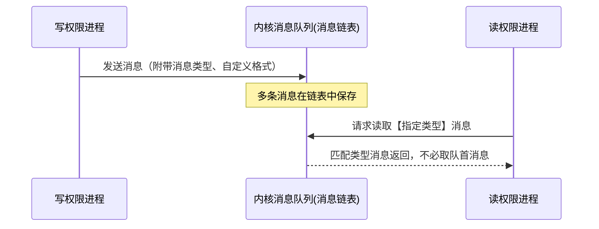

## 1.fork 执行后核心逻辑
由 fork 创建的新进程被称为子进程（child process）。该函数被**调用一次，但返回两次**。
> 在父进程中，fork返回新创建子进程的进程 ID；在子进程中，fork 返回 0；两次返回的区别是子进程的返回值是 0，而父进程的返回值则是新进程（子进程）的进程 id。

### 1.1 fork 返回值设计原因

1、父进程返回子进程 PID

1. 一个父进程**能够创建很多个子进程**。
2. Linux 没有提供 API，可以一次性查询出自己全部子进程编号。
3. 所以每次调用 `fork()` 创建成功，立刻把子进程 PID 返回给父进程；
父进程拿到 pid，后续就可以：`waitpid()` 回收子进程、发送信号、管控各个子任务。

举例：父进程循环 fork‑出 3 个子进程，三次返回会带回三个不同 pid，用来区分管理。

2、子进程固定返回 0

① PID=0 已经被系统占用

操作系统的交换进程（idle 空闲进程）固定占用 PID 0；
普通用户子进程永远不可能分配到编号 0，所以 0 可以拿来当作特殊标记。

② 子进程获取进程 ID 十分便捷

- `getpid()`：拿到自己的 pid
- `getppid()`：拿到父进程 pid

子进程不需要 fork 返回值告知身份，随时可以调用函数查询。
 
### 1.2 内存与执行

fork之后，操作系统会复制一个与父进程完全相同的子进程，虽说是父子关系，但是在操作系统看来，他们更像兄弟关系，这2个进程**共享代码空间，但是数据空间是互相独立的**。

子进程数据空间中的内容是父进程的完整拷贝，**指令指针也完全相同**，子进程拥有父进程当前运行到的位置（两进程的程序计数器pc值相同，也就是说，**子进程是从fork返回处开始执行的**），但有一点不同，如果fork成功，子进程中fork的返回值是0，父进程中fork的返回值是子进程的进程号，如果fork不成功，父进程会返回错误。

## 2.信号
信号是Linux系统中用于进程之间通信或操作的一种机制，信号可以在任何时候发送给某一进程，而无须知道该进程的状态。如果该进程并未处于执行状态，则该信号就由内核保存起来，知道该进程恢复执行并传递给他为止。如果一个信号被进程设置为阻塞，则该信号的传递被延迟，直到其阻塞被取消时才被传递给进程。

信号之间依靠他们的值来区分，但是通常在程序中使用信号的名字来表示一个信号。在Linux系统中，这些信号和以他们的名称命名的常量被定义在`/usr/includebitssignum.h`文件中。通常程序中直接包含<signal.h>就好

信号是在软件层次上对中断机制的一种模拟，是一种异步通信方式，信号可以在用户空间进程和内核之间直接交互。内核也可以利用信号来通知用户空间的进程来通知用户空间发生了哪些系统事件。信号事件有两个来源：

1）硬件来源，例如按下了cltr+C，通常产生中断信号sigint

2）软件来源，例如使用系统调用或者命令发出信号。最常用的发送信号的系统函数是`kill`、`raise`、`setitimer`、`sigaction`、`sigqueue`函数。

一旦有信号产生，用户进程对信号产生的相应有三种方式：

1）执行默认操作，linux对每种信号都规定了默认操作。

2）捕捉信号，定义信号处理函数，当信号发生时，执行相应的处理函数。

3）忽略信号，当不希望接收到的信号对进程的执行产生影响，而让进程继续执行时，可以忽略该信号，即不对信号进程作任何处理。

## 3.管道
管道允许在进程之间按先进先出的方式传送数据，是进程间通信的一种常见方式。

管道是Linux 支持的最初Unix IPC形式之一，具有以下特点：

1) **管道是半双工的**，数据只能向一个方向流动；需要双方通信时，需要建立起两个管道；

2) 匿名管道只能用于父子进程或者兄弟进程之间（具有亲缘关系的进程）；

3) 单独构成一种独立的文件系统：管道对于管道两端的进程而言，就是一个文件，但它不是普通的文件，它不属于某种文件系统，而是自立门户，单独构成一种文件系统，并且只存在与内存中。

管道的实质是一个内核缓冲区，**进程以先进先出的方式从缓冲区存取数据**：管道一端的进程顺序地将进程数据写入缓冲区，另一端的进程则顺序地读取数据，该缓冲区可以看做一个循环队列，读和写的位置都是自动增加的，一个数据只能被读一次，读出以后再缓冲区都不复存在了。当缓冲区读空或者写满时，有一定的规则控制相应的读进程或写进程是否进入等待队列，当空的缓冲区有新数据写入或慢的缓冲区有数据读出时，就唤醒等待队列中的进程继续读写。

> 命名管道有一个名字，命名管道的名字对应于一个磁盘索引节点，有了这个文件名，任何进程有相应的权限都可以对它进行访问。
>而无名管道却不同，进程只能访问自己或祖先创建的管道，而不能访任意访问已经存在的管道

## 4.消息队列
消息队列，就是一个消息的链表，是一系列保存在内核中消息的列表。用户进程可以向消息队列添加消息，也可以向消息队列读取消息。

消息队列与管道通信相比，其优势是对每个消息指定特定的消息类型，接收的时候不需要按照队列次序，而是可以根据自定义条件接收特定类型的消息。

可以把消息看做一个记录，具有特定的格式以及特定的优先级。对消息队列有写权限的进程可以向消息队列中按照一定的规则添加新消息，对消息队列有读权限的进程可以从消息队列中读取消息。

## 5.共享内存
共享内存允许两个或多个进程共享一个给定的存储区，这一段存储区可以被两个或两个以上的进程映射至自身的地址空间中，一个进程写入共享内存的信息，可以被其他使用这个共享内存的进程，通过一个简单的内存读取读出，从而实现了进程间的通信。

采用共享内存进行通信的一个主要好处是效率高，因为进程可以直接读写内存，而不需要任何数据的拷贝，对于像管道和消息队里等通信方式，则需要再内核和用户空间进行四次的数据拷贝，而共享内存则**只拷贝两次：一次从输入文件到共享内存区，另一次从共享内存到输出文件。**

一般而言，进程之间在共享内存时，并不总是读写少量数据后就解除映射，有新的通信时在重新建立共享内存区域；而是保持共享区域，直到通信完毕为止，这样，数据内容一直保存在共享内存中，并没有写回文件。共享内存中的内容往往是在解除映射时才写回文件，因此，采用共享内存的通信方式效率非常高。

共享内存有两种实现方式：1、内存映射 2、共享内存机制

### 5.1 内存映射
内存映射 memory map机制使进程之间通过映射同一个普通文件实现共享内存，通过mmap()系统调用实现。普通文件被映射到进程地址空间后，进程可以

像访问普通内存一样对文件进行访问，不必再调用read/write等文件操作函数。

### 5.2 UNIX System V共享内存机制
IPC的共享内存指的是把所有的共享数据放在共享内存区域（IPC shared memory region），任何想要访问该数据的进程都必须在本进程的地址空间新增一块内存区域，用来映射存放共享数据的物理内存页面。

和前面的mmap系统调用通过映射一个普通文件实现共享内存不同，UNIX system V共享内存是通过映射特殊文件系统shm中的文件实现进程间的共享内存通信。

## 6.通信方式总结

| 通信方式         | 特点简述                                                     | 优点                                                         | 缺点                                                     | 适用场景                                                     |
| ---------------- | ------------------------------------------------------------ | ------------------------------------------------------------ | -------------------------------------------------------- | ------------------------------------------------------------ |
| 管道 (Pipe)      | 半双工，数据只能单向流动；只能用于具有亲缘关系的进程（如父子进程）。 | 简单，自带同步机制。| 容量有限；只能单向通信；仅限父子/兄弟进程。| 父子、兄弟亲缘进程之间简单的单向字节流数据传输             |
| 命名管道 (FIFO)  | 类似于管道，但去除了亲缘关系限制，允许无亲缘关系进程通过路径名进行通信。 | 可通过文件路径访问，支持任意进程间通信。| 长期存在于文件系统中，使用不当可能产生阻塞。| 本机互不相关进程进行数据通信，可当做本地简易消息通道       |
| 消息队列 (Message Queue) | 消息的链表，存放在内核中。进程可以向队列中添加和读取特定类型的消息。 | 克服了管道容量小、只能承载无格式字节流的缺点；支持双向通信。 | 存在用户态与内核态之间的数据拷贝开销，不适合大块数据传输。 | 多进程收发带格式的短消息、任务下发、事件通知                |
| 共享内存 (Shared Memory) | 映射一段能被多个进程访问的内存。多个进程可以直接读写同一块内存区域。 | 速度最快，省去了多次数据拷贝（用户态 ↔ 内核态）的开销。| 没有自带同步机制，需要结合信号量（Semaphore）等机制来避免并发冲突。 | 需要高速传输大块数据的本机多进程业务，如视频缓存、大数据缓冲区 |
| 信号量 (Semaphore) | 本质是一个计数器，主要用于实现进程间的互斥与同步。| 能有效协调多个进程对共享资源的访问，防止竞态条件。| 编写复杂，容易出现死锁（Deadlock）。| 配合共享内存等IPC，做资源互斥访问、进程执行顺序同步控制     |
| 套接字 (Socket)  | 不仅支持同一台主机的进程间通信，更广泛应用于不同主机网络之间的进程通信。 | 跨网络、通用性强、支持多种协议（TCP/UDP）。| 网络开销大，协议较复杂。| 跨主机网络通信、客户端‑服务器架构、网络程序进程通讯         |
| 信号 (Signal)    | 是一种异步通信机制，用于通知接收进程某个事件已经发生（如 Ctrl+C 产生的 SIGINT）。 | 简单、开销极小，能实现即时通知。| 携带的信息量极少，仅适合通知事件，不适合传输大数据。| 进程中断提醒、终止信号、异常事件异步通知                     |

