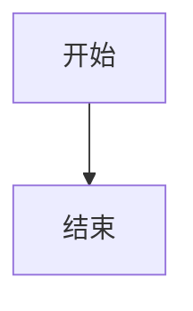

# Feidashen 博客 · 使用说明

基于 **Hugo + Stack**，托管在 **GitHub Pages**，通过 **GitHub Actions 自动部署**。
线上地址：**https://feidashen1.github.io**

---

## 目录

1. [快速开始：发一篇文章](#1-快速开始发一篇文章)
2. [项目结构](#2-项目结构)
3. [写文章详解](#3-写文章详解)
4. [Front Matter（文章头部）字段](#4-front-matter文章头部字段)
5. [本地预览](#5-本地预览)
6. [发布上线](#6-发布上线)
7. [常用定制](#7-常用定制)
8. [升级主题](#8-升级主题)
9. [常见问题排查](#9-常见问题排查)
10. [换电脑/重装后如何继续](#10-换电脑重装后如何继续)
11. [Makefile 快捷命令](#11-makefile-快捷命令)
12. [评论（Giscus）](#12-评论giscus)
13. [访问统计（Google Analytics）](#13-访问统计google-analytics)
14. [写作能力增强（公式/图表/提示框/图片放大）](#14-写作能力增强公式图表提示框图片放大)

---

## 1. 快速开始：发一篇文章

三步发布一篇新文章：

```bash
cd /home/fei/opensource/github/Feidashen1.github.io

# 1) 新建文章（按分类放子目录）
hugo new posts/C++/我的标题.md
# 或不分类：hugo new posts/我的标题.md

# 2) 编辑内容（把 draft: false 确认发布）

# 3) 发布
git add .
git commit -m "新文章：我的标题"
git push
```

push 后 1~3 分钟，文章自动出现在 https://feidashen1.github.io 。

> 想本地先看看效果？运行 `hugo server`，浏览器打开 http://localhost:1313 ，
> 边改边自动刷新，满意了再 push。

---

## 2. 项目结构

```
Feidashen1.github.io/
├── hugo.toml               # ⭐ 站点总配置（标题、菜单、主题参数）
├── content/
│   ├── posts/              # ⭐ 你的所有文章都放这里
│   │   ├── C++/            #    按分类建子目录（可选）
│   │   │   ├── 构造与析构.md
│   │   │   └── 继承与多态/  #    带图片的文章用 page bundle
│   │   │       ├── index.md
│   │   │       └── memory.png
│   │   ├── tools/
│   │   └── first-post.md
│   └── page/               # 特殊页面（搜索/归档/关于，不用动）
│       ├── search/index.md
│       └── archives/index.md
├── static/                 # 放不需要 Hugo 处理的静态文件
├── assets/css/custom.css   # 自定义样式
├── layouts/shortcodes/     # 自定义 shortcode（notice 提示框）
├── themes/stack/           # 主题（git submodule，一般不直接改）
├── .github/workflows/
│   └── hugo.yml            # 自动部署配置（不用动）
└── 使用说明.md             # 本文件
```

**你日常只需要碰 `content/posts/`（写文章）和 `hugo.toml`（改配置）。**

---

## 3. 写文章详解

### 新建文章

```bash
# 按分类放到子目录（推荐，Stack 侧边栏会自动显示分类树）
hugo new posts/C++/文章文件名.md
hugo new posts/tools/文章文件名.md

# 或不分类，直接放 posts/
hugo new posts/文章文件名.md
```

文件名建议用英文或拼音（影响网址），中文标题写在文件里的 `title` 字段。
例如 `hugo new posts/C++/hello.md`，网址就是 `/posts/c++/hello/`。

### 文章正文用 Markdown

**重要：正文标题从 `##` 开始**（`#` 留给文章 title 字段），否则目录不会显示。

````markdown
## 二级标题

正文段落，支持 **加粗**、*斜体*、`行内代码`、[链接](https://example.com)。

> 引用块

- 无序列表
1. 有序列表

```python
print("代码块，带语法高亮和复制按钮")
```

   ← 图片放同目录（page bundle）
````

### 插入图片（Page Bundle 方式）

Stack 主题要求图片作为**页面资源**（page bundle）使用，不能用 `static/` 目录。

步骤：

1. 把文章改为目录结构：
   ```
   content/posts/C++/我的文章/
   ├── index.md          ← 文章文件（原 .md 改名 index.md）
   └── photo.png         ← 图片放同目录
   ```
2. 文章里用**相对路径**引用：``

```bash
# 快速操作
mkdir -p content/posts/C++/我的文章
mv content/posts/C++/我的文章.md content/posts/C++/我的文章/index.md
# 然后把图片复制到 content/posts/C++/我的文章/ 目录
```

> **为什么不用 `static/`？** Stack 的图片处理需要获取宽高信息来实现响应式
> 布局和 PhotoSwipe 点击放大，只有 page bundle 里的图片才能被 Hugo 处理。
> `static/` 里的图片虽然能访问到，但没有宽高信息，显示可能异常。

### 不用图片的文章

如果文章不需要图片，保持普通 `.md` 文件即可，不需要 page bundle：

```
content/posts/C++/普通文章.md     ← 这样就行
```

### 「阅读更多」摘要分隔

在文章中插入 `<!--more-->`，首页列表只显示这行之前的内容作为摘要。
也可以在 front matter 用 `description` 字段指定摘要。

---

## 4. Front Matter（文章头部）字段

每篇文章顶部 `---` 之间的部分，控制文章属性：

```yaml
---
title: "文章标题"                    # 显示的标题
date: 2026-06-20T18:00:00+08:00     # 发布时间（不要设到未来！）
draft: false                         # true=草稿不发布，false=正式发布
tags: ["C++", "教程"]               # 标签
categories: ["C++"]                  # 分类（Stack 侧边栏分类树依赖此字段）
description: "一句话摘要"            # 列表/SEO 显示的摘要
image: "/path/to/cover.png"          # 封面图（可选，卡片列表会显示）
math: true                           # 启用 KaTeX 数学公式（可选）
---
```

**关键注意事项：**

| 字段 | 说明 |
|------|------|
| `draft` | **最重要**：写作时设 `true` 不会上线，写完改成 `false` 才发布 |
| `date` | **不要设到未来时间**！`buildFuture = false` 会导致未来日期的文章不构建 |
| `categories` | Stack 侧边栏的分类树靠这个字段，建议每篇都填 |
| `description` | Stack 用 `description`（不是 PaperMod 的 `summary`） |
| `image` | 封面图路径（不是 PaperMod 的 `cover.image`） |

---

## 5. 本地预览

```bash
cd /home/fei/opensource/github/Feidashen1.github.io
hugo server
```

- 打开 http://localhost:1313
- 改文件会自动刷新
- 想预览草稿（draft: true）：`hugo server -D`
- 停止：终端按 `Ctrl + C`

---

## 6. 发布上线

本博客用 **GitHub Actions 自动部署**，你只管 push 源码：

```bash
git add .
git commit -m "描述这次改了啥"
git push
```

push 后：
- 去仓库的 **Actions** 标签页能看到部署进度（绿勾=成功）
- 通常 1~3 分钟后线上更新

> 推送时若提示输入账号密码：Username 填 `Feidashen1`，Password 填你的
> **个人访问令牌（ghp_... 那串）**，不是账号密码。令牌需要勾选 `repo` + `workflow` 权限。

---

## 7. 常用定制

所有站点配置都在 **`hugo.toml`**，改完 `git push` 即可生效。

### 改博客标题 / 侧边栏

```toml
title = "你的新标题"

[params.sidebar]
  emoji    = "📝"
  subtitle = "记录技术与生活"
  avatar   = ""              # 头像路径（可选）
```

### 改导航菜单

在 `[menu]` 块里增删 `[[menu.main]]`，`weight` 控制顺序。

### 改深色/浅色模式

```toml
[params.colorScheme]
  toggle  = true         # 是否显示切换按钮
  default = "auto"       # auto=跟随系统 / light=亮 / dark=暗
```

### 改首页显示的文章分类

```toml
[params]
  mainSections = ["posts"]   # 首页显示哪些 section 的文章
```

### 自定义 CSS

编辑 `assets/css/custom.css`，Stack 会自动加载。

更多参数见 Stack 官方文档：https://stack.jimmycai.com/guide/

---

## 8. 升级主题

Stack 是 git submodule，升级到最新版：

```bash
cd /home/fei/opensource/github/Feidashen1.github.io
make upgrade
# 或手动：
git submodule update --remote --merge themes/stack
git add themes/stack
git commit -m "升级 Stack 主题"
git push
```

---

## 9. 常见问题排查

| 现象 | 原因 / 解决 |
|------|------|
| push 报 `refusing to allow ... workflow` | 令牌缺 `workflow` 权限。去 https://github.com/settings/tokens 编辑令牌勾上 `workflow`。 |
| push 提示 `Password authentication is not supported` | 别用账号密码，用个人访问令牌（PAT）当密码。 |
| 文章 push 了但线上没出现 | ① 检查 `draft` 是不是 `true`；② 检查 `date` 是否在未来时间；③ 去 Actions 看部署是否成功。 |
| Actions 报错找不到主题 | submodule 没拉取，确认 `.gitmodules` 已提交、workflow 里有 `submodules: recursive`。 |
| 本地 `hugo` 命令找不到 | Hugo 装在 `~/.local/bin/hugo`，确认它在 PATH 里，或用全路径。 |
| 网址打不开（404） | 确认仓库名是 `Feidashen1.github.io`，且 Settings→Pages→Source 选的是 **GitHub Actions**。 |
| 文章目录（TOC）为空 | 正文标题要从 `##` 开始，不能用 `#`（`#` 是文章 title 的层级）。 |
| 图片不显示或显示异常 | 图片要用 page bundle 方式（放文章同目录，相对路径引用），不能用 `static/`。 |

查看部署日志：仓库 → **Actions** 标签页 → 点最近一次运行。

---

## 10. 换电脑/重装后如何继续

```bash
# 1) 装 Hugo extended（当前版本 v0.163.0，Stack 最低要求 v0.157.0）
#    从 https://github.com/gohugoio/hugo/releases 下载 hugo_extended_*_linux-amd64.deb

# 2) 克隆仓库（注意 --recurse-submodules 把主题一起拉下来）
git clone --recurse-submodules git@github.com:Feidashen1/Feidashen1.github.io.git
# 或 HTTPS：
git clone --recurse-submodules https://github.com/Feidashen1/Feidashen1.github.io.git

# 3) 进目录，正常使用
cd Feidashen1.github.io
hugo server
```

> 如果克隆时忘了 `--recurse-submodules`，补一句：
> `git submodule update --init --recursive`

---

## 11. Makefile 快捷命令

项目根目录有 `Makefile`，把常用操作缩短成一条命令：

```bash
make help                  # 查看所有命令
make new t=我的标题        # 新建文章 content/posts/我的标题.md
make serve                 # 本地预览（含草稿）http://localhost:1313
make build                 # 本地构建检查
make publish m="更新说明"  # add + commit + push 一键发布
make upgrade               # 升级 Stack 主题
make clean                 # 清理构建产物
```

> 没装 `make` 的话：`sudo apt install make`。也可继续用原始 hugo/git 命令。

---

## 12. 评论（Giscus）

已配置好，文章底部自动显示 Giscus 评论框，读者用 GitHub 账号即可评论。

配置位置：`hugo.toml` 的 `[params.comments.giscus]`：

```toml
[params.comments]
  enabled  = true
  provider = "giscus"

  [params.comments.giscus]
    repo             = "Feidashen1/Feidashen1.github.io"
    repoID           = "R_xxxxxxxx"
    category         = "Announcements"
    categoryID       = "DIC_xxxxxxxx"
    mapping          = "pathname"
    reactionsEnabled = 1
    inputPosition    = "bottom"
    lang             = "zh-CN"
```

> 单篇关闭评论：该文 front matter 加 `comments: false`。
> 全站关闭：`[params.comments]` 里 `enabled = false`。

---

## 13. 访问统计（Google Analytics）

已配置（ID: `G-0DHLKH8LTF`），**仅线上环境注入**，本地 `hugo server` 不会加载。

配置位置：`hugo.toml`

```toml
[services.googleAnalytics]
  ID = "G-0DHLKH8LTF"
```

> ID 留空则完全不加载。想要更隐私友好的方案可换 Umami 或百度统计。

---

## 14. 写作能力增强（公式/图表/提示框/图片放大）

### 数学公式（KaTeX）

Stack **内置 KaTeX 支持**，在文章 front matter 加 `math: true`：

```yaml
---
title: "..."
math: true
---
```

正文用法：
- 行内：`$E = mc^2$`
- 块级：用 `$$ ... $$` 包起来

```markdown
行内公式 $a^2 + b^2 = c^2$，块级：

$$
\int_0^1 x^2 \, dx = \frac{1}{3}
$$
```

### Mermaid 图表

Stack **自动检测** mermaid 代码块，**不需要** `mermaid: true`，直接用：

````markdown

````

支持流程图、时序图、甘特图等，语法见 [Mermaid 文档](https://mermaid.js.org/)。

### 提示框 / Callout（notice shortcode）

用 `notice` 短代码，类型可选 `info`/`tip`/`warning`/`danger`/`note`：

```text

**小技巧**：内容支持 Markdown。

```

样式定义在 `assets/css/custom.css`，short code 在 `layouts/shortcodes/notice.html`。

### 图片点击放大（PhotoSwipe）

Stack **内置 PhotoSwipe**，文章中的图片（通过 page bundle 引用的）自动支持：
- 点击放大查看
- 支持键盘左右翻页
- 自动响应式加载不同分辨率

无需任何配置，只要用 page bundle 方式引用图片即可。

### 完整功能演示

见 `content/posts/feature-test.md`，覆盖了目录、代码高亮、表格、图片、标签、
脚注、数学公式、Mermaid 图表、提示框等功能的测试。

---

**就这些，祝写作愉快 ✍️**

— 参考文档：[Hugo 官方文档](https://gohugo.io/documentation/) · [Stack 文档](https://stack.jimmycai.com/guide/)
